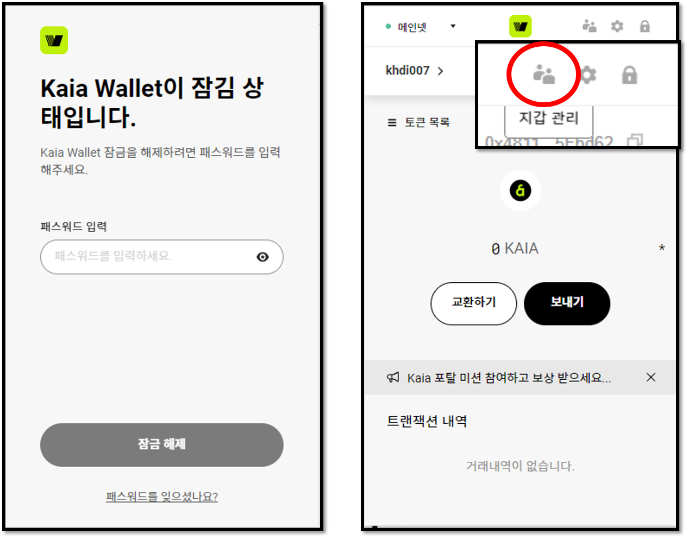
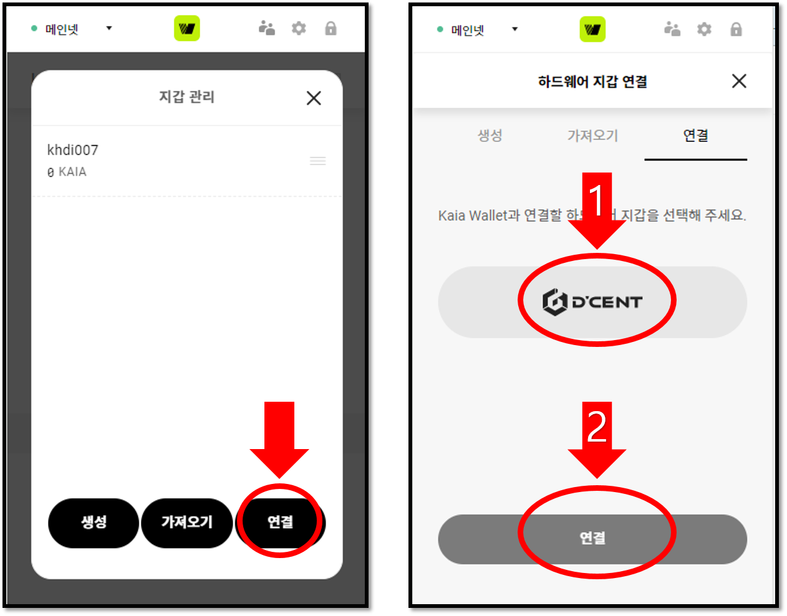
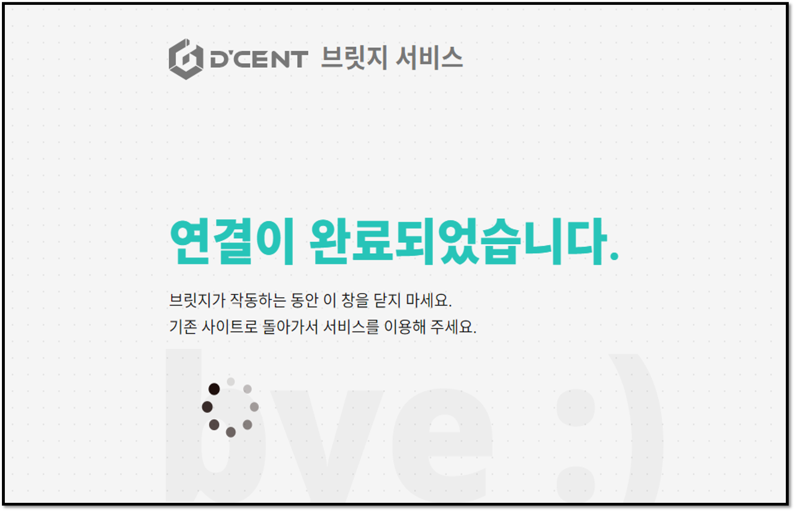
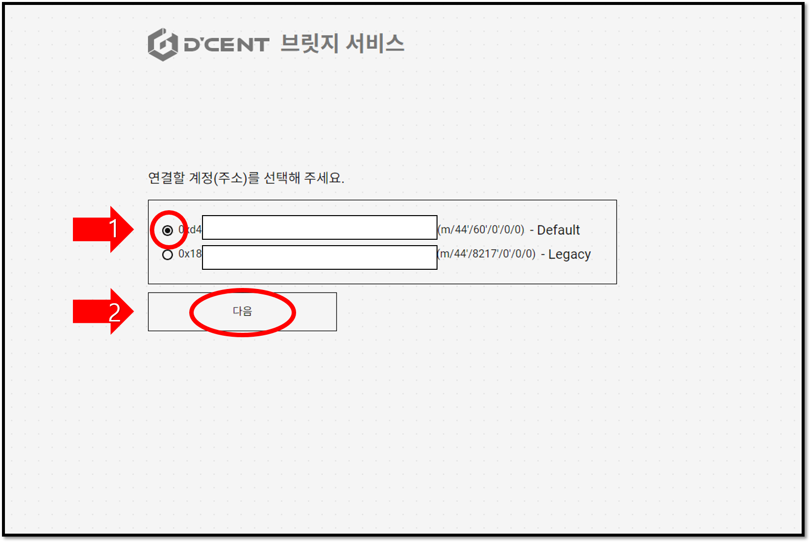
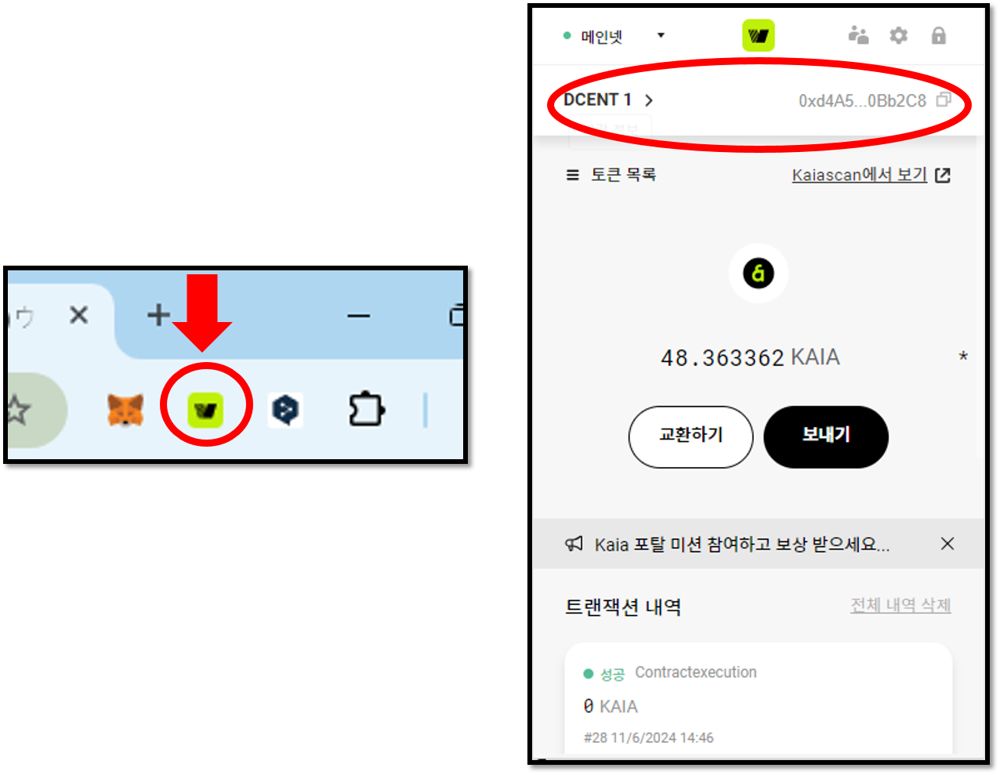

# 카이아 월렛과 연결하기

## 카이아 월렛에 디센트 지문인증형 지갑 사용하기

카이아 블록체인 전용의 카이아 월렛은 PC 브라우저 기반의 월렛 서비스입니다. 사용자는 카이아 월렛과 상호 작용하여 KAIA 및 BApp을 포함한 카이아 기반 거래를 수행할 수 있으며 소유자 확인 및 거래의 승인은 디센트 하드웨어 지갑에서 생체 인증을 통해 수행됩니다.

\[**카이아 월렛 다운로드**]\
[Download Kaia Wallet from Chrome Web Store](https://chrome.google.com/webstore/detail/kaikas/jblndlipeogpafnldhgmapagcccfchpi?h)\
[Download Kaia Wallet from Firefox Add-on Store](https://addons.mozilla.org/ko/firefox/addon/kaikas/?src=search)

### 카이아 월렛과 디센트 지문인증형 지갑 연결하는 방법 &#x20;

**Step 1)** 먼저 디센트 브릿지 프로그램을 PC에 다운로드하여 설치하시기 바랍니다. 브릿지 프로그램을 설치하면 PC의 브라우저와 하드웨어 지갑 간의 통신을 가능하게 합니다.

\[**디센트 브릿지 프로그램 다운로드**]\
[Download D’CENT bridge program](https://bridge.dcentwallet.com/v2/download)

**Step 2)** PC의 USB 포트에 디센트 지문인증형 지갑을 연결하고 지문 인증(또는 PIN 인증)을 통해 콜드월렛을 해제(unlock)합니다.

**Step 3)** 브라우저에 설치된 **카이아 월렛 아이콘**을 클릭합니다.

**Step 4)** 비밀번호를 입력하여 카이아 월렛에 접속하고 상단 메뉴에 위치한 **지갑 관리** 아이콘을 클릭합니다.

**Step 5)** 지갑 관리 화면에서 **연결** 버튼을 클릭합니다. 다음 화면에서는 **D’CENT**를 사용할 하드웨어 지갑으로 선택하고 **연결** 버튼을 눌러줍니다.

**Step 5)** PC 브라우저에서 브릿지 프로그램이 연결되었다는 페이지가 실행되면서 연결할 계정(주소)를 선택하는 화면이 나타납니다. 연결할 계정을 선택하고 **다음** 버튼을 누릅니다.

<figure><figcaption></figcaption></figure>

<figure><figcaption></figcaption></figure>


카이아 월렛에는 디센트 지문인증형 지갑의 카이아 계정을 하나만 연결할 수 있으며, 여러 개의 카이아 계정이 있어도 **제일 먼저 생성된 하나의 계정만** 연결이 가능합니다.

카이아 레거시 계정 혹은 카이아 계정이 모두 생성되어 있더라도 하나만 연결할 수 있습니다.


**Step 7)** 다시 PC의 브라우저에서 **카이아 월렛 아이콘**을 클릭하여 지갑에 재접속합니다. 재접속 후 카이아 월렛에서는 기존 계정이 아닌 **디센트 지문인증형 지갑에서 존재하는 카이아 계정 주소**를 표시해줍니다.

