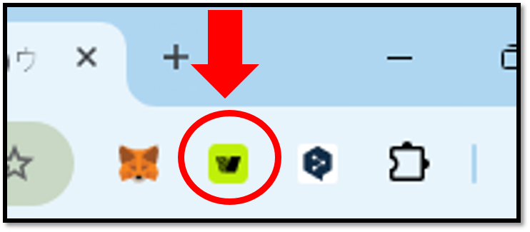

# Connect with Kaia Wallet extension

## Using Kaia Wallet extension with Biometric wallet

Kaia Wallet is a **PC browser based extension wallet** for the Kaia platform. Users will be able to interact with the Kaia Wallet to perform Kaia-based transactions including KAIA and BApps, while the owner verification and authorization are performed through biometric authentication on the D’CENT Biometric hardware wallet.

\[**Kaia Wallet is available here**]\
[Download Kaia Wallet from Chrome Web Store](https://chrome.google.com/webstore/detail/kaikas/jblndlipeogpafnldhgmapagcccfchpi?h)\
[Download Kaia Wallet from Firefox Add-on Store](https://addons.mozilla.org/ko/firefox/addon/kaikas/?src=search)

### How to connect Kaia Wallet with Biometric wallet

**1)** Download and install the D’CENT bridge program on your PC. Installing the bridge program will enable communication between the PC browser and the hardware wallet.

\[**D’CENT bridge program**]\
[Download D’CENT bridge program](https://bridge.dcentwallet.com/v2/download)

**2)** Plug in your D’CENT Biometric Wallet to the USB port on your PC and authenticate yourself to unlock the hardware wallet.

**3)** From your browser, click on the **Kaia Wallet** icon.

**4)** Unlock Kaia Wallet and click the **"Manage Accounts"** icon on the top menu.

**5)** From the Manage Accounts screen, click on **"Connect"**. In the next screen, select **"D’CENT"** as your hardware wallet and click **"Connect"**.

**6)** From your browser will display a page confirming the successful connection to the bridge program. and a screen for selecting an account (address) to connect will be displayed. Select the account you want to connect to and press the **"Next"** button.

<figure><figcaption></figcaption></figure>

<figure><figcaption></figcaption></figure>


Only one Kaia account created in the D'CENT biometric wallet can be connected to the Kaia Wallet. **Even if you have created multiple Kaia accounts in your D'CENT biometric wallet, you can only connect to the first account created.**

Furthermore, if you have both a Kaia legacy account and a Kaia account, you can only connect one.


**7)** From your browser, click on the **Kaia Wallet extension** icon again to open the wallet service. You will notice that the Kaia Wallet now displays the **Kaia account from the D’CENT Biometric Wallet.**

