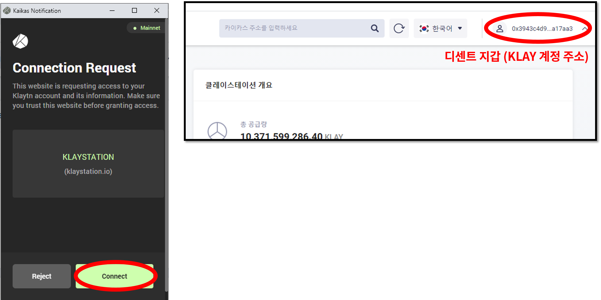
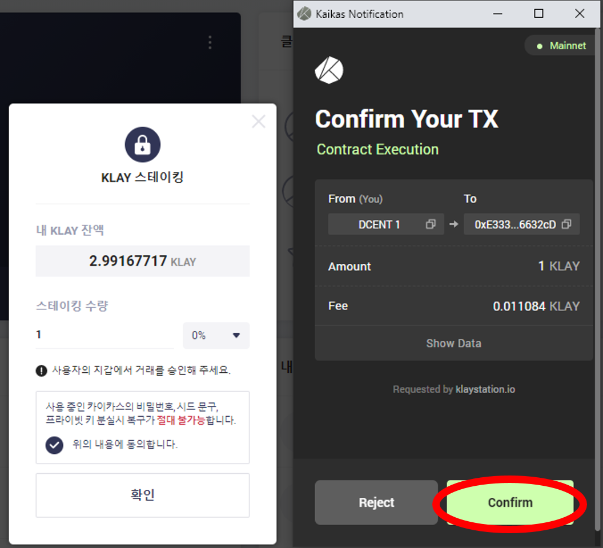

# 클레이스테이션 Staking

## 클레이스테이션은 무엇인가요?

클레이스테이션은 클레이튼 네트워크의 공식 스테이킹 툴입니다.\
KLAY 암호화폐를 소지한 모든 사용자는 클레이스테이션을 통해 자유롭게 스테이킹을 진행하여 이자를 받을 수 있습니다.&#x20;


디센트 지문인증형 지갑과 연결된 카이카스 지갑을 통해 클레이스테이션에서  KLAY 스테이킹이 가능합니다.&#x20;


### 클레이스테이션에서 스테이킹하는 방법&#x20;

**Step 1)** 먼저 카이카스 브라우저 지갑과 디센트 지문인증형 지갑을 연결합니다. 연결하는 방법은 [여기](https://userguide.dcentwallet.com/v/kr/external-service/kaikas)를 확인해주세요.

**Step 2)** 클레이스테이션 플랫폼에 접속합니다.\
[클레이스테이션 플랫폼](https://klaystation.io/dashboard)

**Step 3)** 대시보드에서 카이카스 연결하기 버튼을 눌러줍니다.

**Step 4)** 카이카스 지갑에서 **Connect** 버튼을 클릭하여 클레이스테이션에 로그인합니다.&#x20;

**Step 5)** 대시보드에서 스테이킹 버튼을 누르면 팝업창이 나타납니다. 팝업창에서 스테이킹 수량을 설정하고 **확인** 버튼을 눌러줍니다.

.png>)

**Step 6)** 카이카스 지갑에서 해당 스테이킹 거래를 진행하기 위해 **Confirm** 버튼을 눌러줍니다.

**Step 7)** 디센트 지문인증형 지갑에서 해당 스테이킹 거래를 최종적으로 승인해야합니다. 하드웨어 지갑에서 **Confirm** 버튼을 누르고 지문이나 PIN을 통해 **사용자 인증**을합니다. ****&#x20;

**Step 8)** 스테이킹이 성공적으로 완료가되면 다음과 같이 클레이스테이션에서 표시가됩니다.


클레이스테이션 대시보드에서 **언스테이킹** 버튼을 누르면 KLAY를 되돌려 받을 수 있습니다.  &#x20;


**클레이스테이션과 관련된 자세한 내용 및 운영정책은** [**여기**](https://klaystation.io/)**에서 확인이 가능합니다.**
