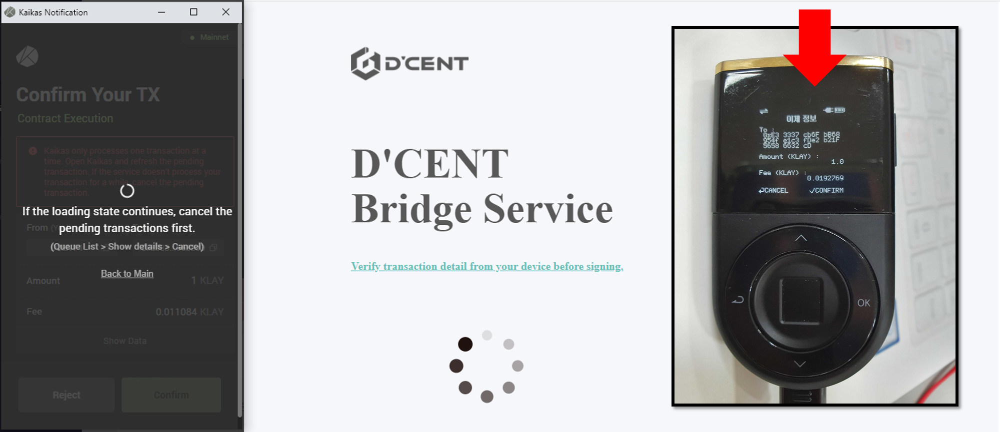
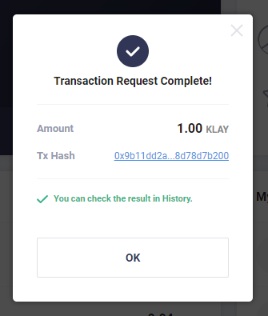

# Klaystation Staking

## What is Klaystation?

KLAYSTATION is the official staking tool based on the Klaytn Network.\
Every KLAY holders have the right to stake into Klaytn's Governance Council and earn interest using this tool.


From the Klaystation, users can stake KLAY using Kaikas wallet and D'CENT Biometric wallet.&#x20;


### How to stake from the Klaystation&#x20;

**Step 1)** First, connect Kaikas wallet and D'CENT Biometric wallet. Click [here](https://userguide.dcentwallet.com/external-service/kaikas) for instructions on how to connect the two wallets.

**Step 2)** Go to the Klaystation platform website.\
[Klaystation Platform](https://klaystation.io/dashboard)

**Step 3)** From the dashboard, click on **Connect Kaikas** button.

**Step 4)** When Kaikas wallet opens, press the **Connect** button to login to the Klaystation.&#x20;

**Step 5)** From the dashboard, press the **STAKE NOW** button and a new pop-up will open. From the pop-up, set the amount to stake and press the **Confirm** button.

**Step 6)** From the Kaikas wallet, press the **Confirm** button to proceed with the staking transaction.

**Step 7)** The final confirmation of the staking transaction must be authorized from the D'CENT Biometric wallet. From the hardware wallet, press the **Confirm** button and **authenticate yourself** using fingerprint or PIN to finalize the transaction. ****&#x20;

**Step 8)** When the staking transaction is completed successfully, you will the the following message from the Klaystation.


To unstake your KLAY from the Klaystation, press the **UNSTAKE NOW** button on the dashboard.


**For detailed information about Klaystation and its operations, please visit** [**here**](https://klaystation.io/)**.**
