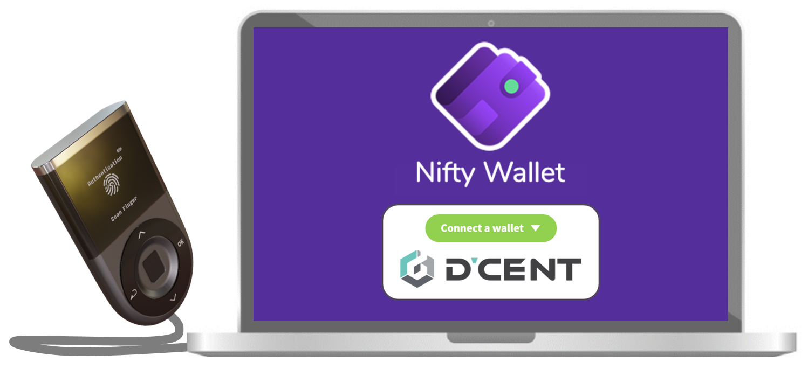

# Connect with Nifty Wallet extension

## Using Nifty Wallet extension with Biometric wallet

Nifty Wallet is an open-source wallet created by the [POA Network](https://www.poa.network/) that provides a seamless web3 wallet experience. Sites designed to work with MetaMask will also work with Nifty, and Nifty provides additional features such as out-of-the-box support for POA, xDai, RSK and other chains, as well as the ability to interact with contract methods directly from the wallet interface.

Nifty Wallet users will be able to enjoy an additional layer of security when accessing various EVM-compatible networks. While users interact with Nifty Wallet to connect with various DApps and create transactions, the ownership verification and authorization are securely performed from the D’CENT Biometric Wallet.

### How to connect D’CENT Biometric Wallet with Nifty Wallet: 

**Step 1\)** Install the Nifty Wallet extension and complete the basic setup.  
👉 [Nifty Wallet \(Chrome extension\)](https://chrome.google.com/webstore/detail/nifty-wallet/jbdaocneiiinmjbjlgalhcelgbejmnid)


Nifty Wallet and MetaMask do not function properly when both are activated at the same time as chrome extensions. To use one or the other, **right click** on the extension icon, go to **Manage Extensions**, and **toggle off/on** the application you want to use. All data will be preserved in the wallet for future access.


**Step 2\)** Download and install the latest D’CENT bridge program on your PC. This is a background program that enables the communication between the PC browser and the hardware wallet.  
👉 [Download D’CENT bridge program](https://bridge.dcentwallet.com/v2/download)

**Step 3\)** Plug in your D’CENT Biometric Wallet to the PC USB port and authenticate to unlock the device.

**Step 4\)** From the Nifty Wallet, click on the **Account** icon. Click on **Connect hardware wallet** and select **D’CENT** from the option.

**Step 5\)** From the Chrome browser, D’CENT bridge service will check for hardware wallet connection.

**Step 6\)** Back at the Nifty Wallet, click on the **Account** icon. Click on ‘**Connect hardware wallet**’ to see the list of accounts that can be viewed in the Nifty Wallet. \(Example: RBTC account in D’CENT Biometric Wallet\)

**Step 7\)** Unlock the selected account to view in Nifty Wallet.

