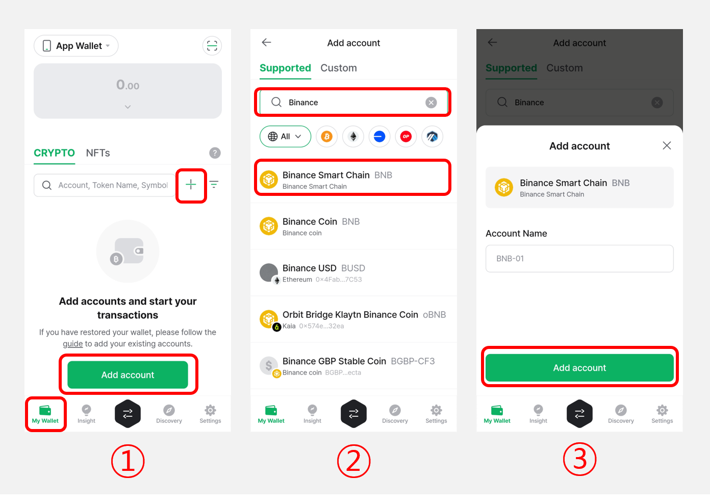
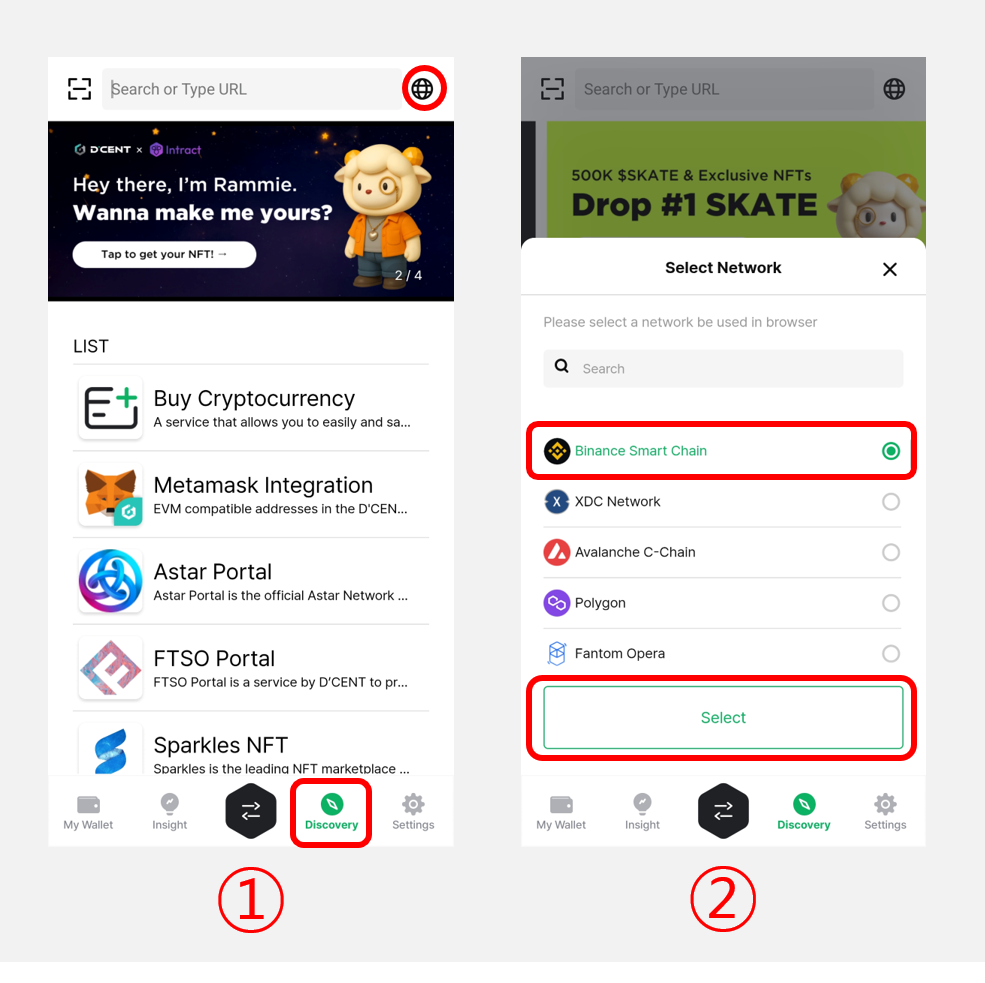
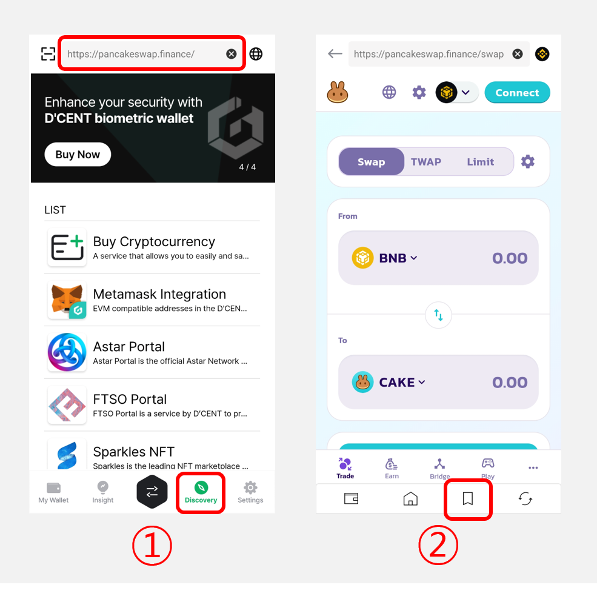
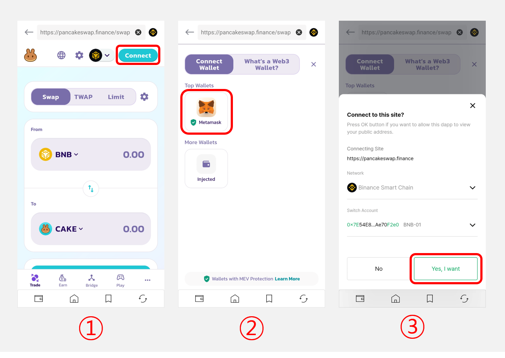

# How to use PancakeSwap

This is guidance on how to use PancakeSwap which is a DeFi service based on Binance Smart Chain (BSC). Since dapp browser (Discovery tab) of D'CENT wallet supports Binance Smart Chain, you can use PancakeSwap service through D'CENT dapp browser.


**Discovery is a browsing function that allows you to use a blockchain-based decentralized app (dapp) service. Since all dapp services (including PancakeSwap) are not operated by D'CENT, any inquiries that arise while using dapp services must be directed to each dapp service operator. In addition, there is a risk of financial loss when using the dapp service, and the user is responsible for all risks that may occur while using the service.**


## Create Binance Smart Chain account

First, create an account of Binance Smart Chain.

**1)** Click **"Add account `+`"** button in the **"My Wallet"** tab

**2)** Enter **"Binance Smart Chain"** in the search field. And select **"Binance Smart Chain (BNB)"** from the search list.

**3)** Select the **"Add accont"** button to complete account creation.

## Switch dapp browser network to Binance Smart Chain

In order to use Binance Smart Chain based dapp services, switch the network to Binance Smart Chain.

**1)** Click **"Network(🌐)"** icon in the **"Discovery"** tab.

**2)** Select **"Binance Smart Chain"** in the list.

## Move to PancakeSwap site

**1)** Enter the URL([**https://pancakeswap.finance/**](https://pancakeswap.finance/)) of PancakeSwap in the input field in the **"Discovery"** tab.

**2)** You can also use **"Bookmark"** feature to save the site as a shortcut for the next access.

## Connect Wallet

**1)** In order to connect D'CENT wallet with PancakeSwap, please click **"Connect"** button

**2)** Choose **"Metamask"** in the wallet list.

**3)** Select the **"Yes, I want"** button and connect your wallet.

D'CENT wallet's dapp browser uses the Web3 interface to interact with dapp service as same as Metamask does. This means you can choose Metamask in the list, but you are actually using D'CENT Wallet to connect with the dapp services.
