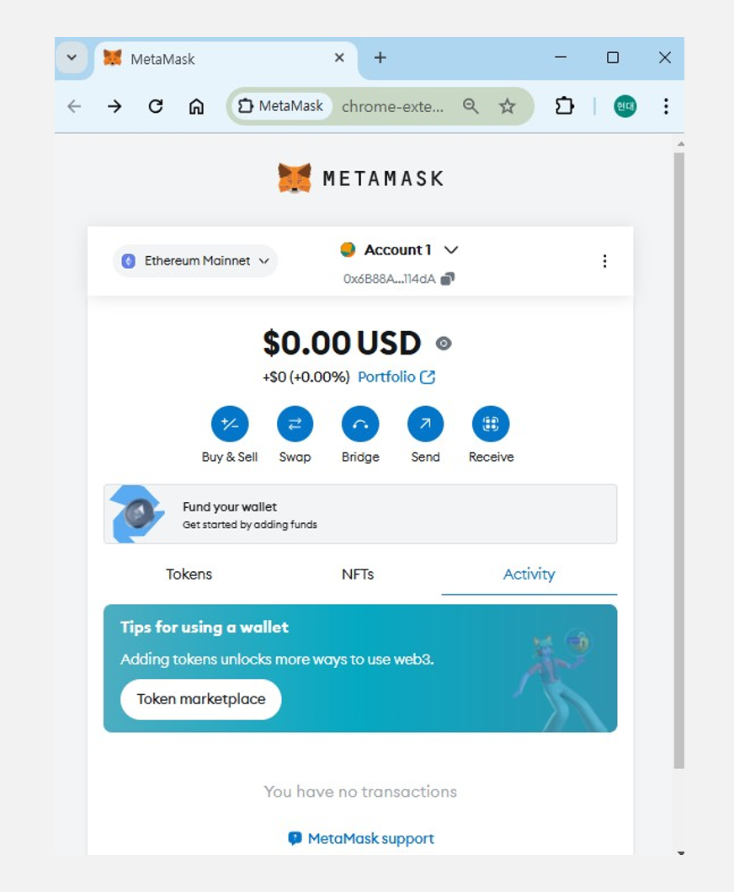
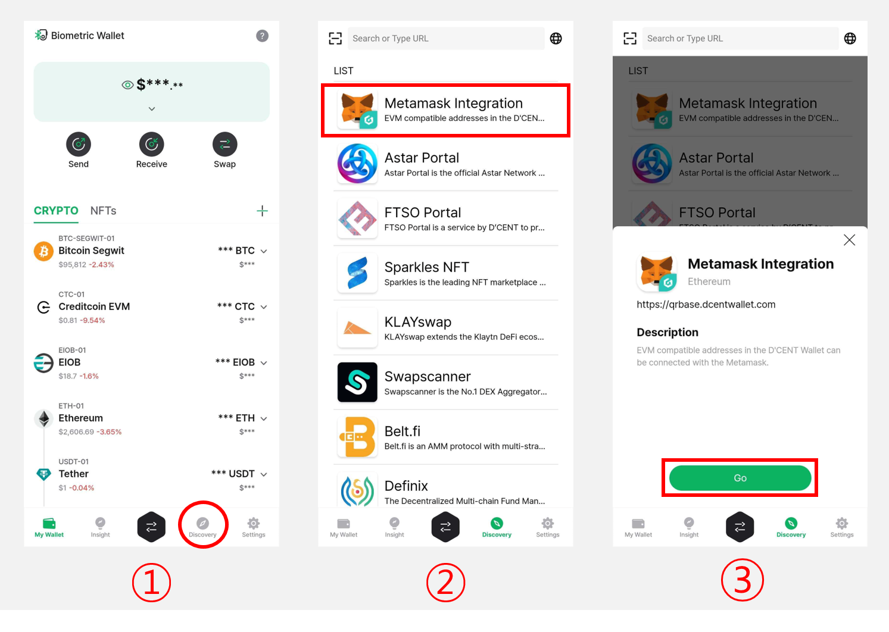
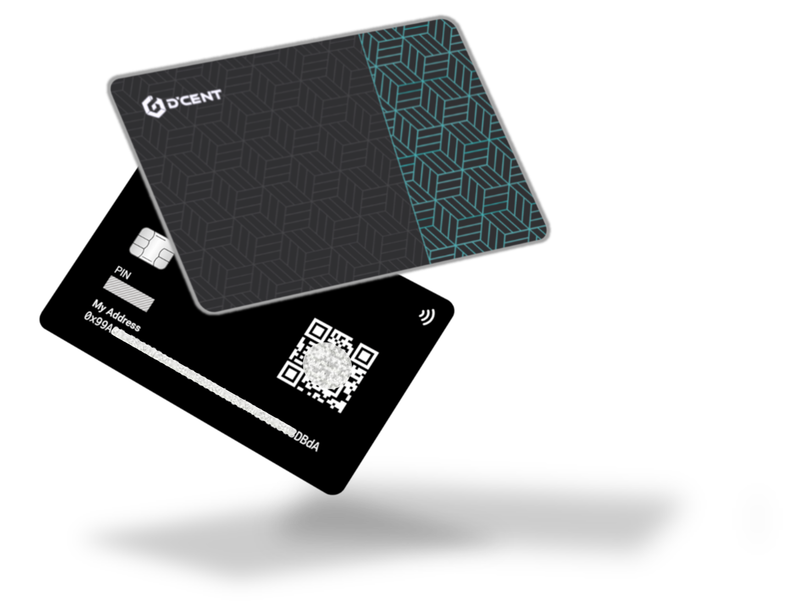
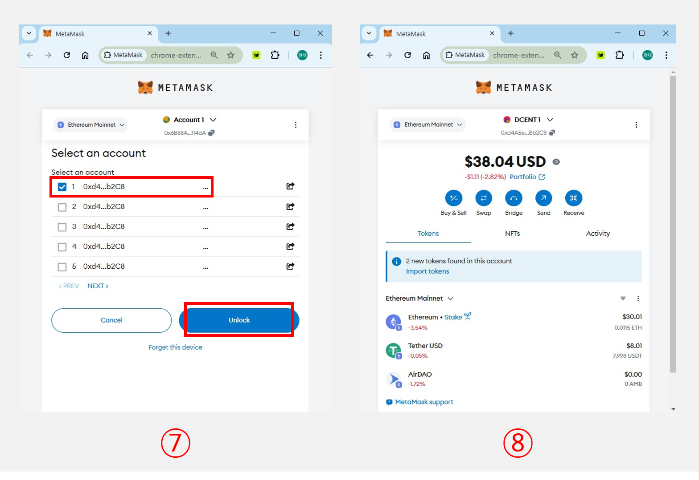
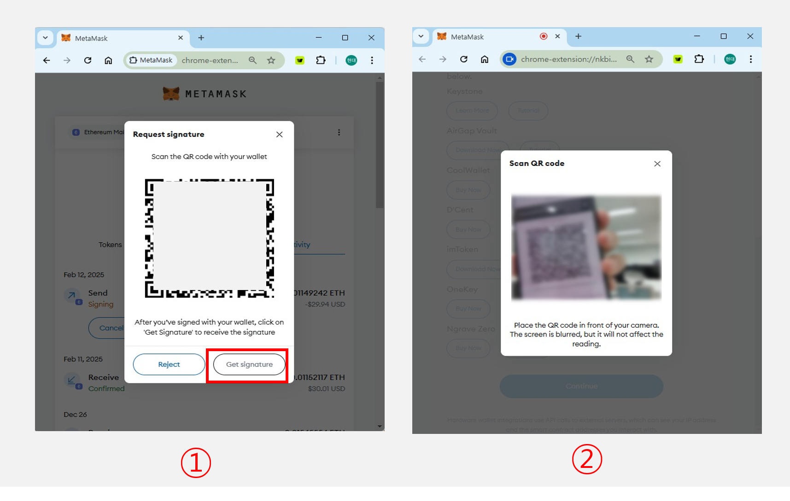

# 메타마스크 연결하기(QR-based)

.png>)

메타마스크는 EVM계열(스마트 컨트랙트가 동작하는)의 블록체인을 지원하여, 여러 DApp 사이트에서 사용되는 지갑입니다. 메타마스크에는 자체 계정 이외에도 하드웨어 월렛의 계정과 연동하기 위한 QR-based프로토콜을 지원합니다.

디센트 앱에서는 해당 QR-based 프로토콜을 이용해 디센트 계정(EVM계열)을 메타마스크와 연동시켜주는 기능을 제공합니다.

## 메타마스크 다운로드 및 설치 

먼저 Chrome용 메타마스크를 다운로드([https://metamask.io/download/](https://metamask.io/download/))하고 절차에 따라 설치를 진행 합니다.

## 메타마스크와 디센트지갑 연결 


해당 기능은 **지문인증형 지갑** 및 **앱 지갑(소프트웨어)** 모드에서만 지원이 가능합니다.&#x20;

**지원가능한 최소버전**

* **지문인증형 콜드월렛** 펌웨어 버전: **2.19.7 이상**
* 디센트 **앱** 버전: **안드로이드 (5.16.1 이상) / iOS (5.16.2 이상)**



메타마스크에서 지원하는 QR-based 프로토콜은 컴퓨터에 **카메라(웹캠)가 설치** 되어있어야만 이용이 가능합니다.

외장형 카메라를 사용한다면 해당 카메라가 **자동 포커스(Auto Focus) 기능과 QR코드 스캔 기능**을 지원하는 지 확인하여 주시기 바랍니다.




### \[Step 1] 디센트 앱에서 메타마스크 연결 준비하기 

**1)** 디센트 앱을 실행 후, Discovery 탭으로 진입합니다.&#x20;


EVM계열 계정이 없는 경우, [계정 만들기 사용자 가이드](https://userguide.dcentwallet.com/v/kr/mobile-app/create-account)_를 참조하여 계정을 생성한 후 사용해주시기 바랍니다._


**2)** 목록에서 **메타마스크 연동**을 선택합니다.&#x20;

**3) 서비스 바로가기**를 터치합니다.

**4)** 메타마스크 연동 화면에서 **메타마스크 계정 연결**을 터치합니다.

**5)** 계정 연결 리스트에서 연결할 계정을 선택 후 **연결하기** 버튼을 터치합니다.

**6)** QR 코드가 생성되는 것을 확인 후, 아래 **\[Step 2]** 컴퓨터에서 연결하기를 진행합니다.


절대 다른 사람과 QR코드 화면을 공유하지 마세요.


### \[Step 2] 컴퓨터에서 QR 코드 스캔하여 지갑 연결하기 

.png>)

**1)** 메타마스크 메인화면 상단 중앙의 Account 버튼을 클릭합니다.

**2)** 계정 또는 하드웨어 지갑 추가 버튼을 선택하고 **하드웨어 지갑 추가**를 클릭합니다.

**3) QR-based** 선택 후 하단의 **계속** 버튼을 클릭합니다.

**4)** QR코드 스캔화면으로 전환됩니다.

**5)** **\[Step 1]**&#xC5D0;서 준비한 QR 코드를 컴퓨터의 카메라를 이용하여 스캔합니다.

**6)** QR코드 스캔이 정상적으로 완료되면 계정 선택 확면으로 전환됩니다.

<figure><figcaption></figcaption></figure>


컴퓨터의 카메라에서 QR 코드가 인식되지 않는 경우 **핸드폰의 화면 밝기를 최대로 높여보시기 바랍니다.**&#x20;


**7)** 계정 선택화면에서 **첫 번째 계정**을 선택 후 **잠금 해제**를 클릭합니다.

_(디센트 계정의 경우, QR스캔시 목록에 보이는 계정이 모두 동일하기 때문에 어떤 계정을 선택해도 무관합니다.)_

**8)** 디센트 지갑의 계정과 메타마스크가 연동된 화면을 확인할 수 있습니다.

## 메타마스크를 이용하여 ETH 보내기 



### **\[Step 1] 메타마스크로 ETH 트랜잭션을 생성하기** 

**1)** 메타마스크 메인화면에서 **보내기** 버튼을 클릭합니다.

**2)** 코인을 보낼 상대방의 주소를 입력하고 **계속** 버튼을 클릭합니다.&#x20;

.png>)

**3)** 보내고자 하는 금액을 입력한 후 **계속** 버튼을 클릭한 뒤 거래 내역을 확인한 후 **컨펌** 버튼을 클릭합니다.

(_**편집 옵션**을 선택하여 거래 수수료를 원하는 한도로 조정 가능합니다._)

**4)** QR코드 형식의 서명 요청 화면으로 전환됩니다.

### \[Step 2] 디센트 앱을 이용하여 트랜잭션에 대한 서명 생성 하기 

서명 요청 QR을 스캔하는 방식은 2가지 방법이 존재합니다.

**1)** 디센트 앱의 Discovery 탭에 접속하여 **메타마스크 연동 >** **메타마스크 QR 스캔** 버튼을 터치합니다.&#x20;

**2)** 또는, Discovery 탭 좌측 상단의 **QR스캔** 버튼을 터치합니다.

<figure><figcaption></figcaption></figure>

**3)** QR코드 스캔 화면으로 전환되면, **\[Step 1]**&#xC5D0;서 생성한 서명 요청 QR 코드를 스캔합니다.

**4)** 보내려는 주소가 맞는 지 확인한 후 **계속하기** 버튼을 터치합니다.

**5)** 메타마스크에서 요청한 거래 정보와 동일한지 확인 후, **서명하기** 버튼을 터치합니다.

**6)** 지문인증형 콜드월렛인 경우, 화면에 표시되는 정보를 한번 더 확인 후, 정보가 올바른 경우 **OK** 버튼을 누르고 **지문**이나 **PIN번호**를 입력합니다.

**7)** 앱 월렛인 경우, 처음 실행시 등록한 **비밀번호(6자리)**&#xB97C; 입력합니다.

**8)** 서명이 완료되면 QR코드 형식의 서명을 확인할 수 있습니다.

### \[Step 3] 생성된 서명을 메타마스크로 보내기 

<figure><figcaption></figcaption></figure>

**1)** 메타마스크의 서명 요청 화면에서 **서명 받기** 버튼을 클릭합니다.

**2)** 디센트 앱에서 표시된 QR 코드를 컴퓨터의 카메라를 이용하여 스캔합니다.

**3)** QR 코드 스캔이 완료되면, **활동** 탭에서 트랜잭션 내역을 확인할 수 있습니다.
