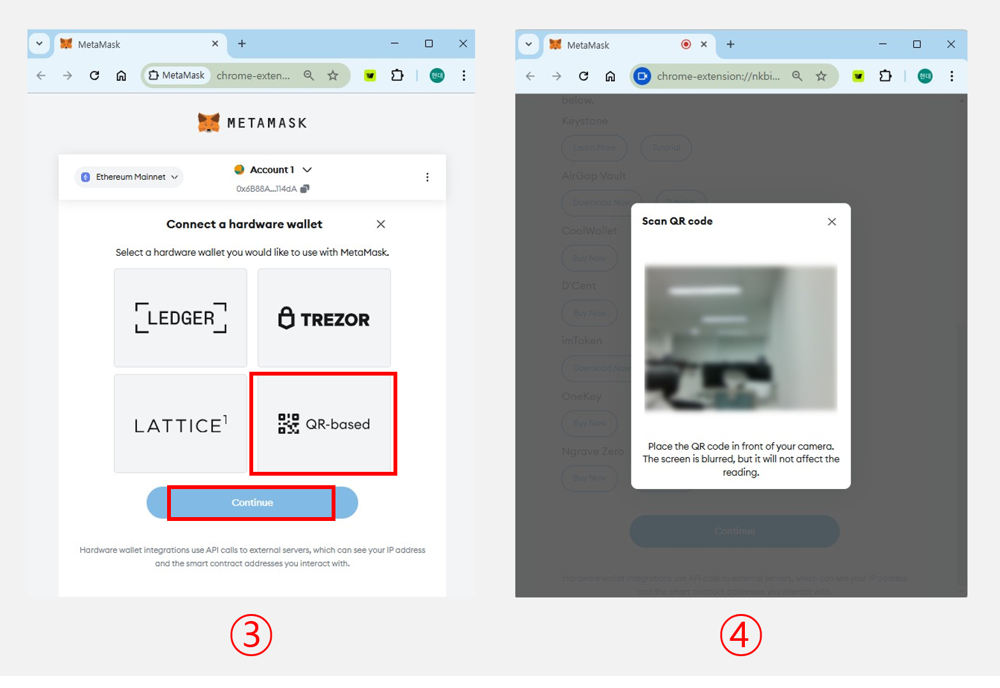
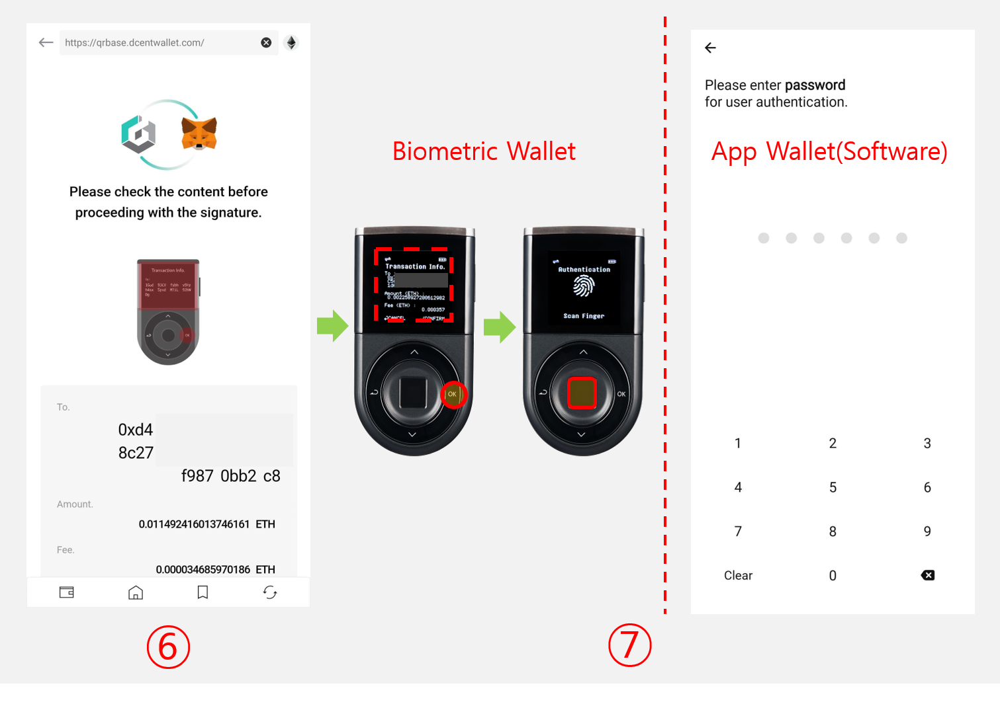
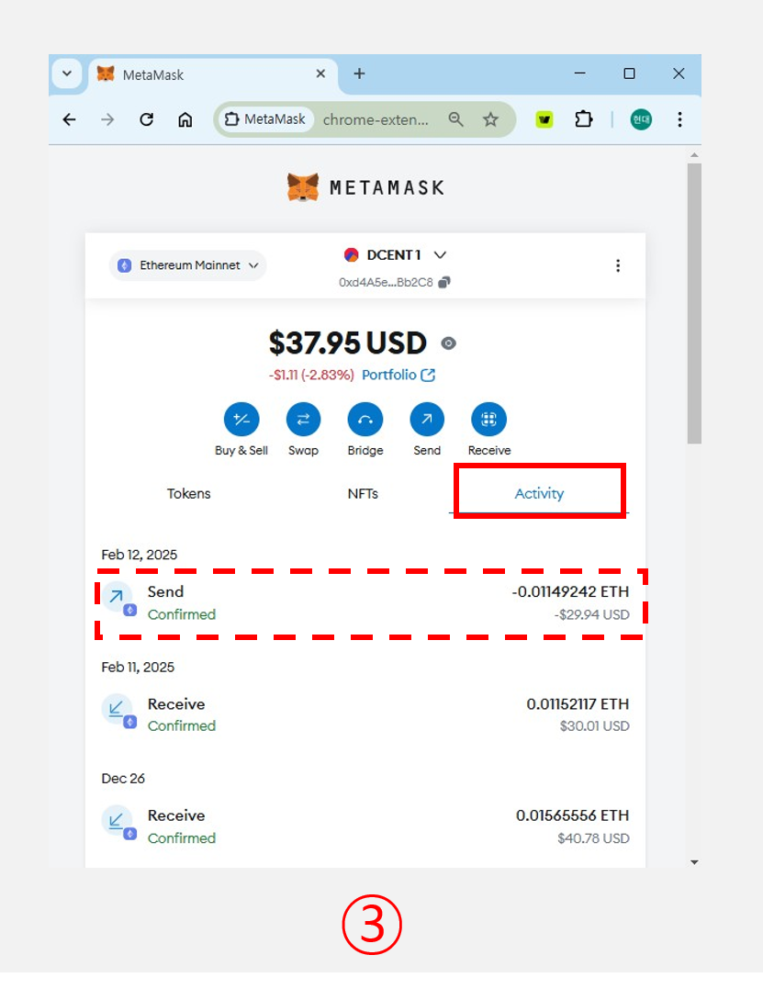

# Connect with MetaMask (QR-based)

.png>)

MetaMask supports **EVM-compatible blockchains** (those that run **smart contracts**) and is widely used across various **DApp platforms**. In addition to its built-in accounts, MetaMask also supports a **QR-based protocol** for integrating with **hardware wallets**.

The **D'CENT app** utilizes this **QR-based protocol** to enable seamless integration between **D'CENT accounts (EVM-compatible)** and **MetaMask**.

## Download and Install MetaMask

First, download the MetaMask Chrome extension from ([https://metamask.io/download/](https://metamask.io/download/)) and follow its instructions to install.

<figure><figcaption></figcaption></figure>

## How to connect D’CENT Wallet with MetaMask


This function is supported only in **Biometric Wallet** and **App Wallet(Software)** mode. Minimum supported version

* **Biometric Wallet** firmware version: **2.19.7 or higher**
* **D’CENT App** version: **Android (5.16.1 or higher) / iOS (5.16.2 or higher)**&#x20;



The QR-based protocol supported by the MetaMask can only be used when a camera(webcam) is installed on the computer.

If you use an external camera device, please check if the camera supports the **auto focuing and QR code scanning function.**


### \[Step 1] Preparing to connect with MetaMask in the D’CENT App

<figure><figcaption></figcaption></figure>

**1.** After running the D’CENT App, enter the **Discovery** tab.


_If you do not have an EVM account, please refer to user guide_ [_‘How to create a coin account’_](https://userguide.dcentwallet.com/mobile-app/create-account) _to create an account and use it._


**2.** Select MetaMask Integration from the list.

**3.** Tap on **Go** button.

<figure><figcaption></figcaption></figure>

**4.** On the MetaMask integration screen, click on **Connect Metamask account** button.

**5.** Select the account to be linked from the account selection list and click on **Connect** button.

**6.** After confirming that the QR code is generated, Proceed to **\[Step 2]**.


**DO NOT** disclose QR code to others.


### \[Step 2] Connect the D'CENT Wallet by scanning the QR code on your computer

<figure><figcaption></figcaption></figure>

**1.** On the **MetaMask main screen**, click the **Account** button at the top center.

**2.** Select **Add Account or Hardware Wallet**, then click **Add Hardware Wallet**.

<figure><figcaption></figcaption></figure>

**3.** After selecting **QR-based**, click the **Continue** button at the bottom.

**4.** It switches to the QR code scanning page.

<figure><figcaption></figcaption></figure>

**5.** Scan the QR code prepared in **\[Step 1]** using the camera on your computer.

**6.** When the QR code scan is completed normally, it will be converted to the account selection page.

<figure><figcaption></figcaption></figure>


If the camera on your computer is having difficulty reading the QR code, **please try again after adjusting the screen brightness to max on your phone.**


<figure><figcaption></figcaption></figure>

**7.** On the account selection page, select **First account** and click **Unlock**.

_(In the case of a D’CENT account, it doesn’t matter which account you choose because all the accounts shown in the QR scan list are the same.)_

**8.** You can check the page where the account of the D’CENT wallet and the MetaMask are linked.

## Example of how to send ETH using MetaMask



### \[Step 1] Create ETH transaction with MetaMask

<figure><figcaption></figcaption></figure>

**1.** On the **MetaMask main screen**, click the **Send** button.

**2.** Enter the recipient’s **wallet address**, then click **Continue** button.

<figure><figcaption></figcaption></figure>

**3.** Input the **amount** you wish to send, then click **Continue** button and review the transaction details. Click **Confirm** to proceed. _(You can adjust the transaction fee limit by selecting the "Edit" option.)_

**4.** The screen will switch to a **QR code format** for the **signature request**.

### \[Step 2] Create a signature for the transaction using the D’CENT App

<figure><figcaption></figcaption></figure>

There are **two ways** to scan the **signature request QR code**:

**1.** From D'CENT App, go to the **Discovery tab** and Click on **Metamask QR Scan** button.

**2.** Alternatively, tap the **QR Scan** button in the **top left corner** of the **Discovery** tab.

<figure><figcaption></figcaption></figure>

**3.** When the **QR scanning screen** appears, scan the **signature request QR code** generated in **\[Step 1]**.

**4.** Verify the **recipient address**, then tap **Continue**.

**5.** Check if the transaction details match the request from **MetaMask**, then tap **Sign**.

<figure><figcaption></figcaption></figure>

**6.** If you are using a **biometric cold wallet**, carefully review the displayed information once more. If everything is correct, press **OK**, then enter your **fingerprint or PIN**.

**7.** If you are using an **app wallet**, enter the **6-digit password** you set when you first launched the app.

<figure><figcaption></figcaption></figure>

**8.** After signing, you can check the signature in QR code format.

### \[Step 3] Sending signed data to MetaMask

<figure><figcaption></figcaption></figure>

**1.** Click the **Get Signature** button on the signature request page completed in **\[Step 1]**.

**2.** Scan the QR code prepared in **\[Step 2]** using the camera on your computer.

<figure><figcaption></figcaption></figure>

**3.** Once the **QR code scan** is completed, go to the **Activity** tab in **MetaMask** to view the transaction details.
