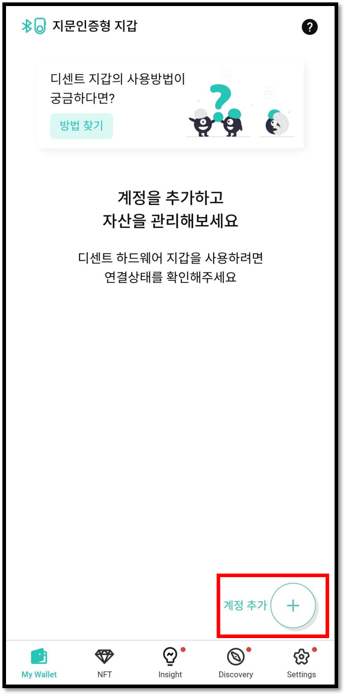
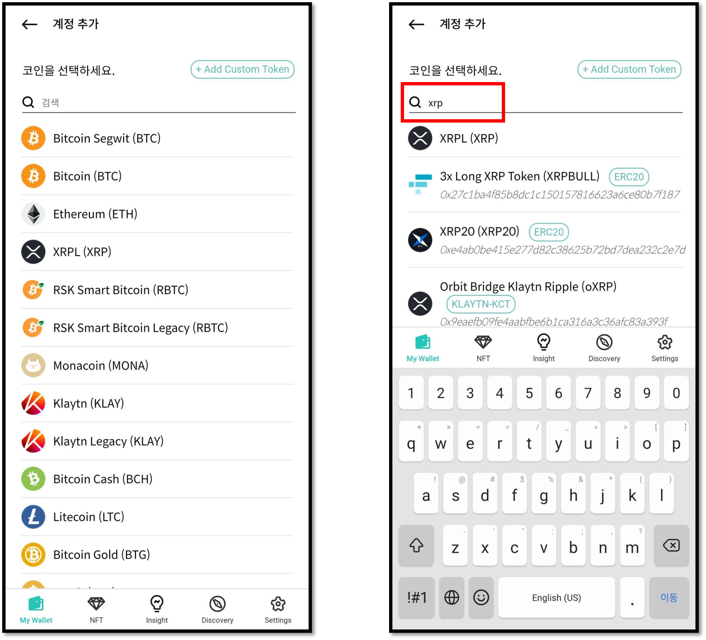
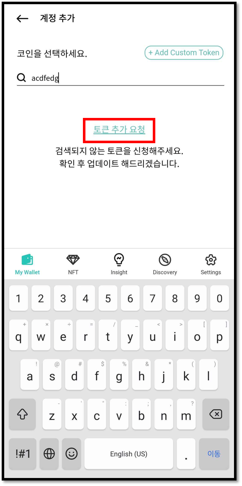
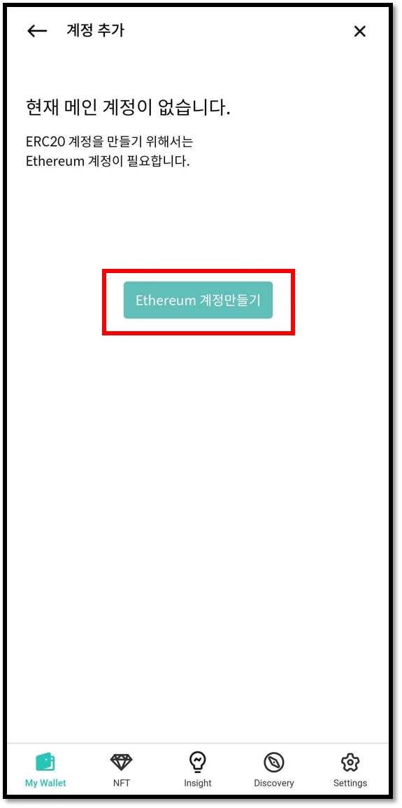
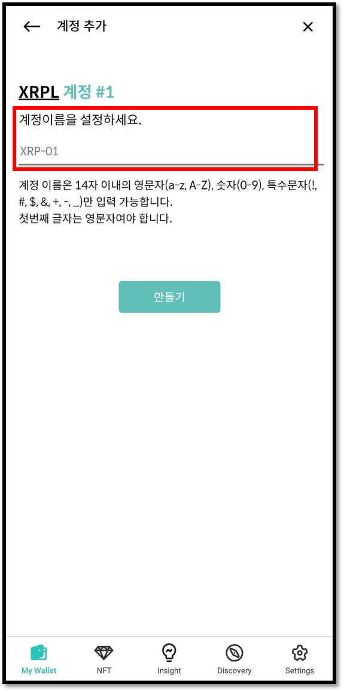

# 계정 만들기

## 계정 생성하기



My Wallet 탭의 **"계정 추가`+` "** 버튼을 눌러 계정을 생성할 수 있습니다.


지문인증형 지갑을 사용한다면 콜드월렛이 디센트 모바일 앱과 블루투스로 연결된 상태에서 계정을 추가할 수 있습니다.


## 추가하려는 토큰/코인 선택

리스트에서 추가하려는 코인을 선택하세요. 코인 이름이나 심볼 이름으로 검색도 가능합니다.


디센트 월렛에서 지원하는 전체 코인 리스트는 [**여기**](https://www.dcentwallet.com/ko/supportedcoin)를 참고하세요.


### 추가하려는 코인/토큰이 없는 경우

추가하고자 하는 코인이나 토큰이 없는 경우에는 [**"토큰 추가 요청"**](https://docs.google.com/forms/d/e/1FAIpQLScj4yDDb4JpquEdhm6KjM2cM-eUvlGaBeSs-Ko9g-dQN456OQ/viewform) 링크를 클릭하여, 코인이나 토큰 추가를 요청해주세요. 디센트 팀에서는 최대한 빠르게 지원할 수 있도록 노력하고 있습니다.

### 수수료 계정이 없는 상태에서 토큰을 추가하려 하는 경우

ERC20, BEP20, RRC20, KCT 등과 같은 토큰 계정을 생성하기 위해서는 해당 메인넷의 계정이 생성되어 있어야 합니다.

* ERC20 토큰 계정 생성 시 : 이더리움 계정 필요
* BEP20 토큰 계정 생성 시 : 바이낸스 스마트 체인 계정 필요
* RRC20 토큰 계정 생성 시 : RSK 계정 필요&#x20;
* KCT 토큰 계정 생성 시 :  클레이튼 계정 필요&#x20;

## 계정 이름 설정

추가하려는 코인/토큰을 선택한 후에는 계정이름을 설정해주세요. 입력하지 않고 "만들기" 버튼을 누를 경우 기본으로 설정된 이름이 표시됩니다.

계정이름은 각 계정이 가지고 있는 별명이며, 모바일 앱의 계정 정보와 지문인증형 콜드월렛의 계정 정보에 표시됩니다.

## 계정 생성 완료

계정 생성이 완료되면 블록체인에서 잔액 정보를 불러오고 My Wallet 화면에 계정 정보가 표시됩니다.

이제 코인을 보내거나 받아보세요.


[receive.md](../../coin-send-receive/receive.md)



[send](../../coin-send-receive/send/)


### 지문인증형 콜드월렛 모드로 계정을 생성한 경우

지문인증형 콜드월렛 모드로 계정을 생성한 경우, 콜드월렛에도 생성된 계정 정보가 업데이트 됩니다. 더 자세한 내용은 [지문인증형 콜드월렛 동기화](../../biometric-wallet/synch-with-app.md) 항목을 참고하세요.

### 생성 가능한 최대 계정 갯수&#x20;

지문인증형 지갑은 최대 80개까지 계정을 생성할 수 있습니다.&#x20;
