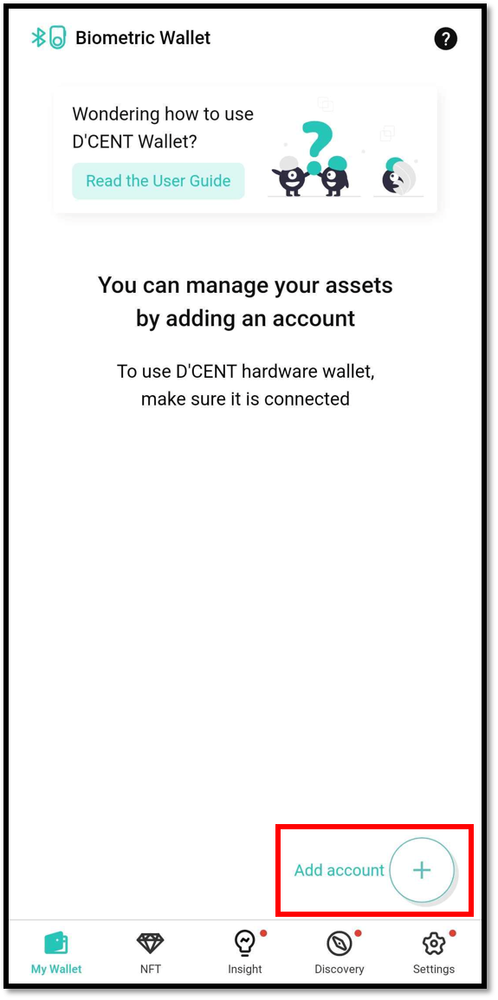
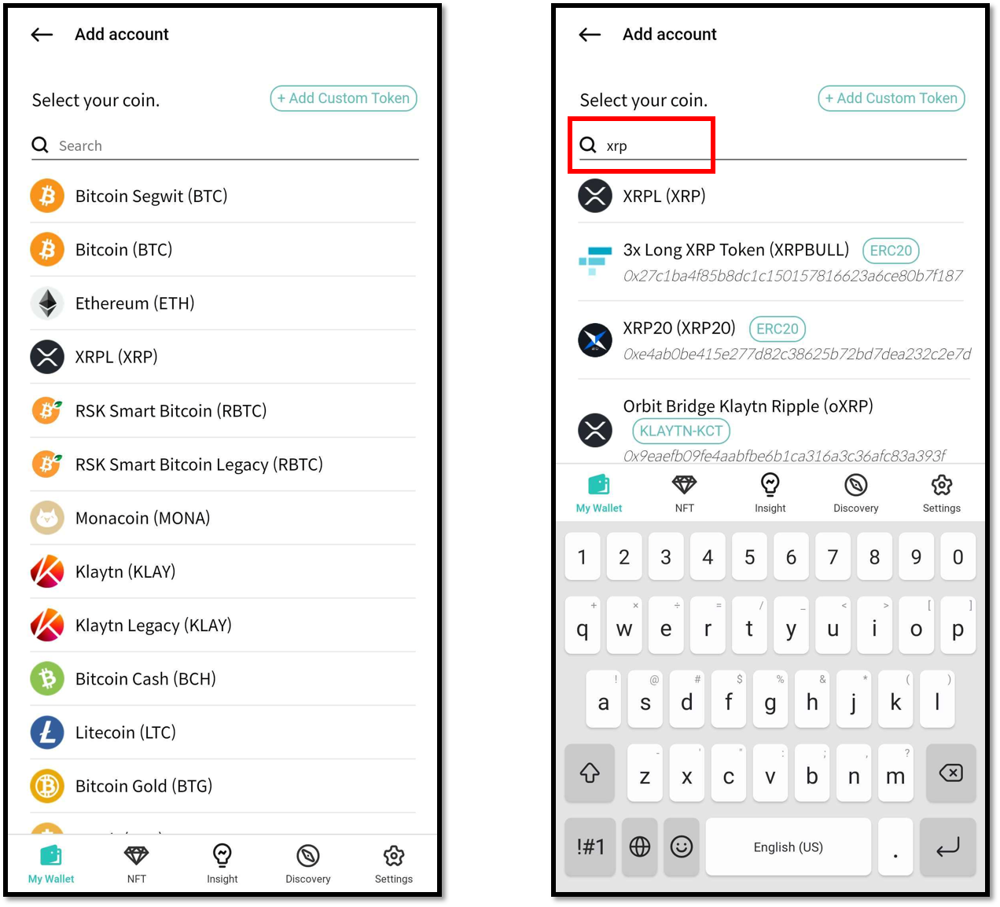
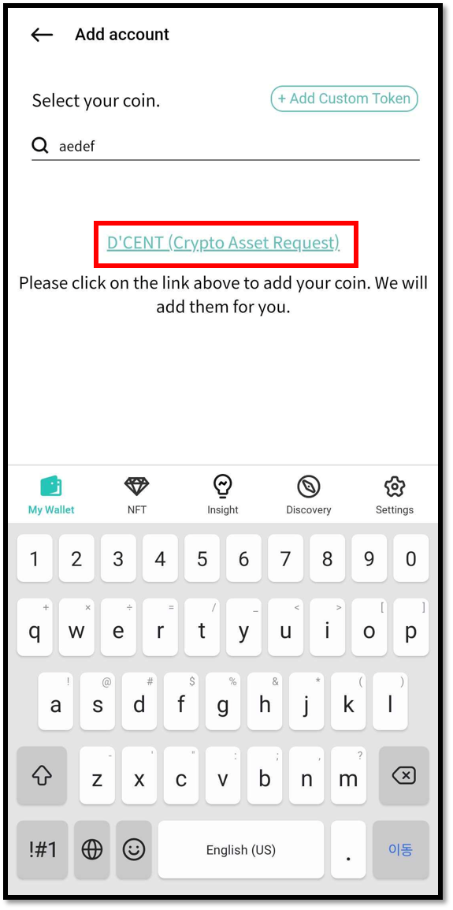
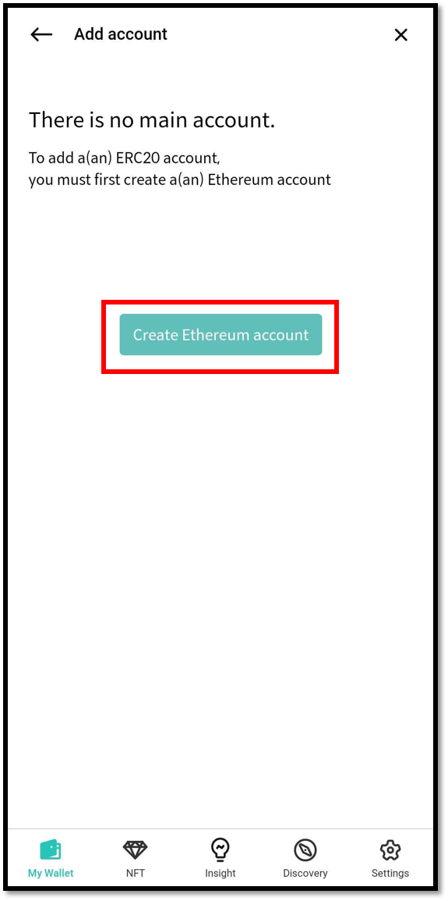
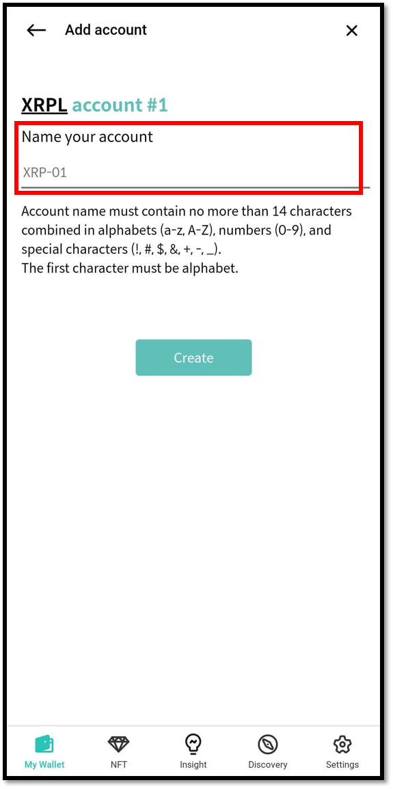
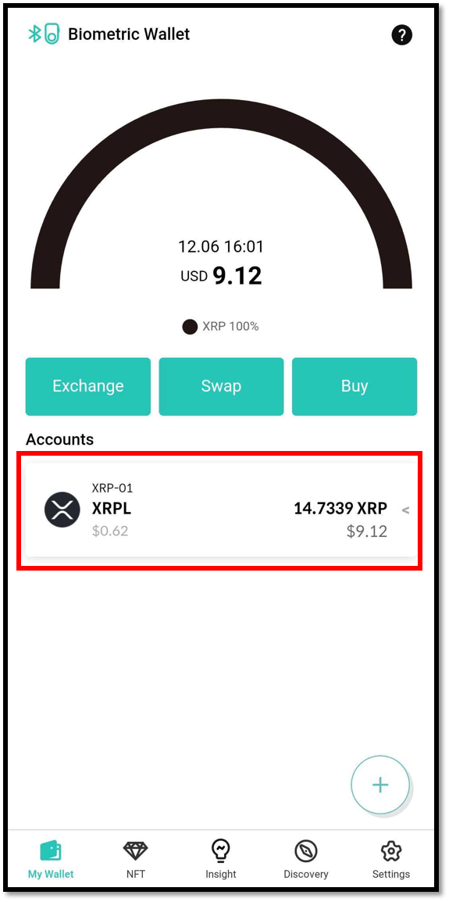

# How to create a coin account

## How to create an account



From the My Wallet tab, click the **"Add account`+` "** button to create an account.


In the case of using the **Biometric Wallet mode**, your Biometric Wallet must also be connect in order to create an account.


## Select the Coin/Token

Select the coin you want to add from the list. You can also search by coin name or symbol name.


Click [here](https://www.dcentwallet.com/en/supportedcoin) for a full list of cryptocurrencies supported by D'CENT Wallet.


### What if the Coin/Token you want to add is not on the list?

If you cannot find your coins or tokens to add, you can ask the D'CENT team to add it to the list. \
Click the [**"Crypto Asset Request"**](https://docs.google.com/forms/d/e/1FAIpQLSddydt7fv7D0ATnw49tCsBsex9DpHinAr0sebGb\_eQb0ne37g/viewform) link and fill out the form. The D'CENT team will try to reflect your need as quickly as possible.

### When trying to add a token account without the fee account

To create token accounts such as ERC20, BEP20, RRC20, and KCT, the corresponding mainnet account must be created first.

* To create ERC20 token account: Ethereum account is required
* To create BEP20 token account: Binance smart chain account is required
* To create RRC20 token account: RSK account is required
* To create KCT token account: Klaytn account is required

## Set Account Name

After selecting the coin / token to add, please set the account name. If you click the “Create” button without entering a name, the default name will be displayed. The account name is the nickname for the account, and it is displayed in the account information of the mobile app and also on the Biometric Wallet.

### Account created successfully

When the account creation is completed, your account will appear on the My Wallet screen. The account balance information is retrieved from the blockchain network.

Now you can try SEND or RECEIVE from your account.


[receive.md](../../coin-send-receive/receive.md)



[send](../../coin-send-receive/send/)


## When an account is created in the Biometric Wallet mode

When an account is created in the Biometric Wallet mode, the created account information is also updated in the Biometric Wallet. For more information, refer to [Synchronizing the Biometric Wallet with the Mobile App](../../biometric-wallet/synch-with-app.md).

### Maximum number of account can be created

You can create 80 accounts with Biometric wallet.
