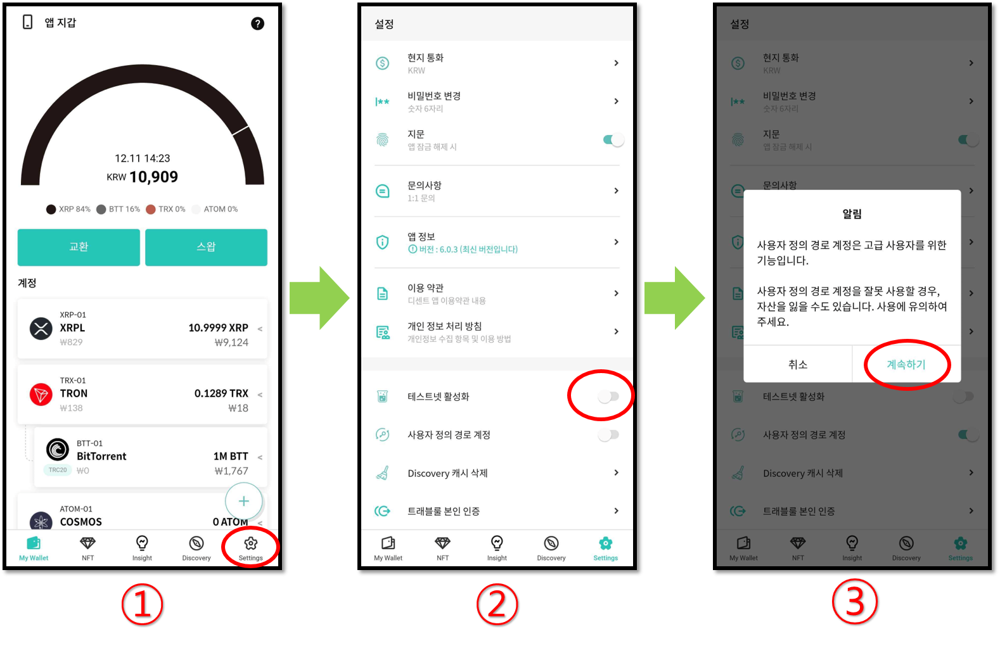
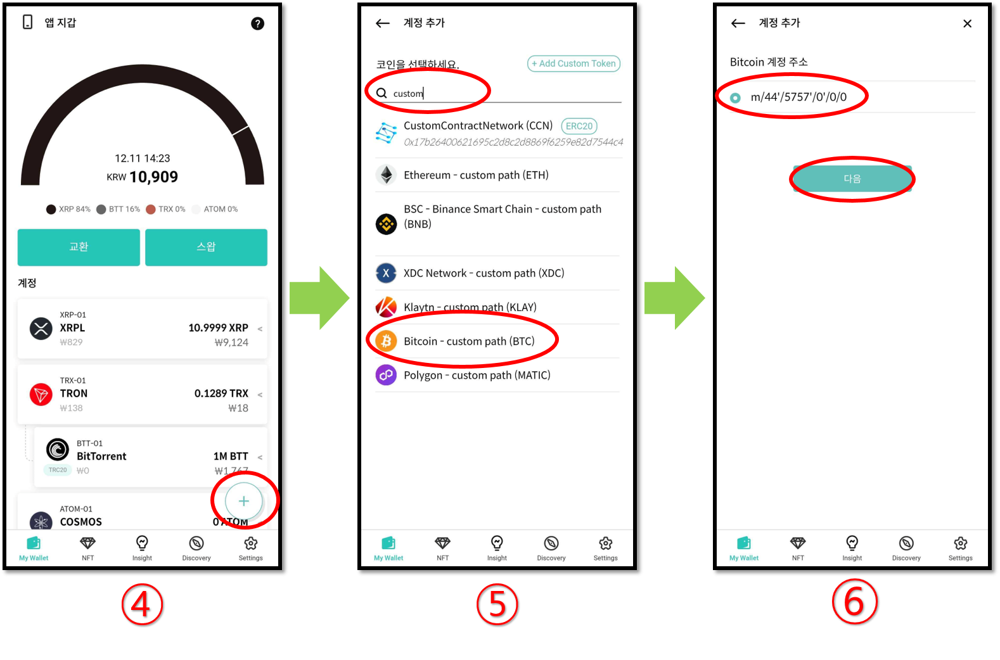
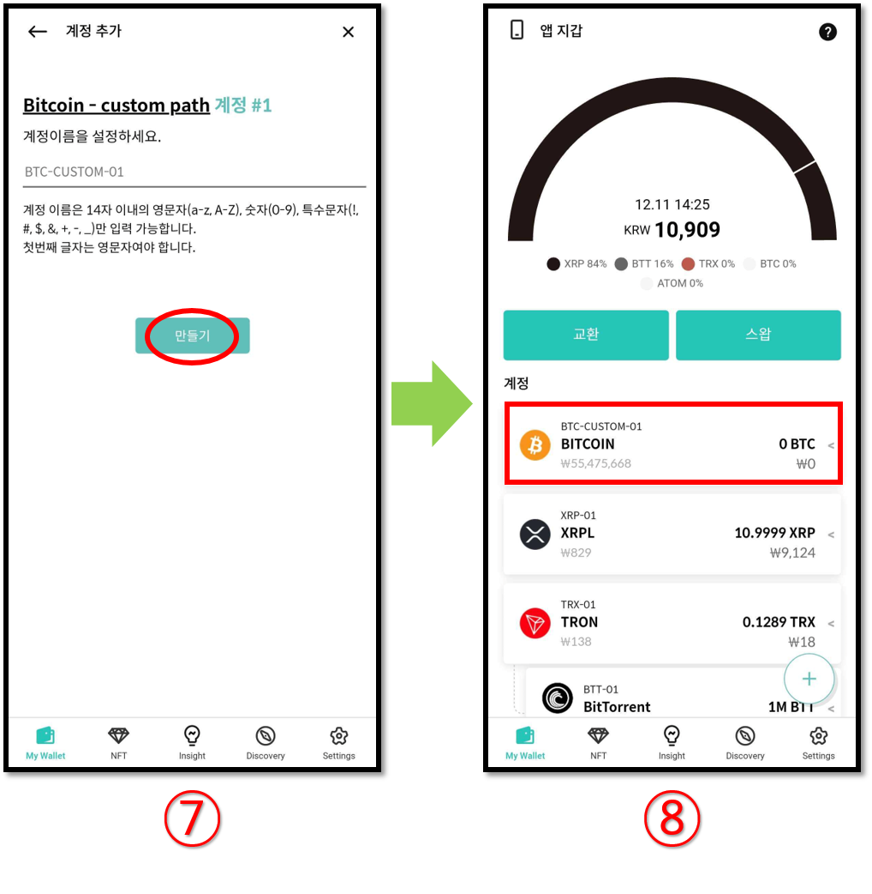

# 커스텀 경로 BTC 계정 추가하는 방법

이 가이드는 사용자 지정 경로 BTC 계정을 추가하는 방법에 대한 설명입니다.

1\) "**Settings"** 탭을 클릭합니다.

2\) "**사용자 정의 경로 계정"**&#xC744; 활성화합니다.

3\) 주의 사항을 읽으시고 "**계속하기**"를 클릭합니다.

4\) My Wallet 탭에서 **(+)** 버튼을 클릭하여 새로운 계정을 추가합니다.

5\) 검색란에 "**Custom**"을 입력하고 결과에서 "**Bitcoin custom path (BTC)"**&#xB97C; 선택합니다.

6\) 주소 경로를 선택하고 "**다음"**&#xC744; 클릭합니다.

7\) 계정 이름을 지정하거나 기본값으로 사용할 수 있습니다. 사용자 정의 경로 BTC 계정을 추가하려면 "**만들기**"를 클릭합니다.

8\) My Wallet 탭에서 새롭게 추가한 커스텀 경로 BTC 계정을 확인할 수 있습니다.
