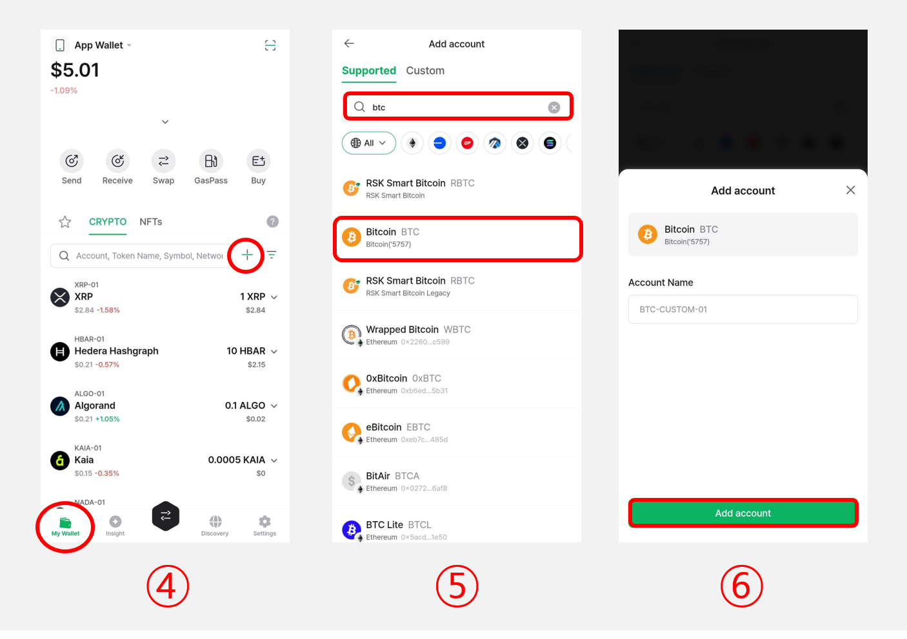
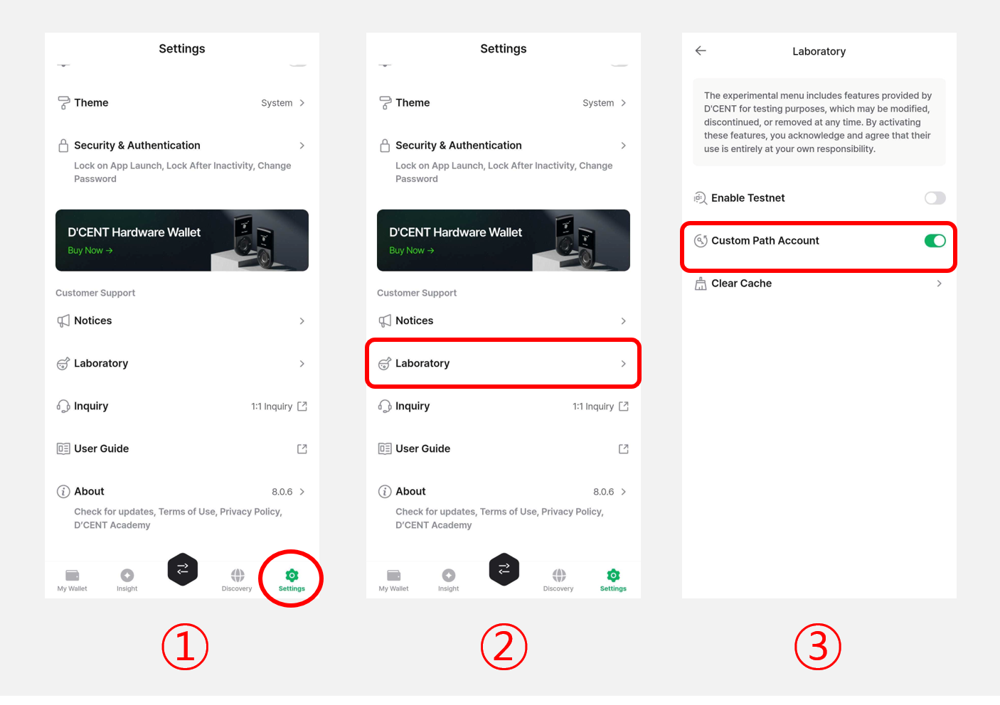
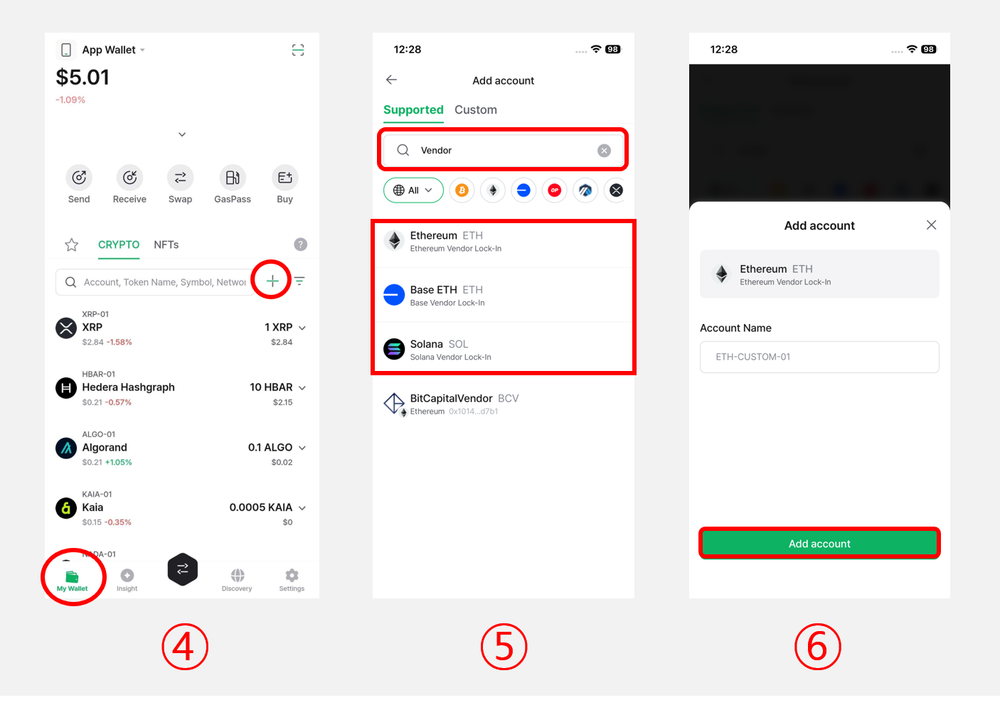

# How to add a custom path account

This guide details the instructions for adding a custom path BTC account.

## Add a Custom Path Account

<figure><figcaption></figcaption></figure>

**1)** Tap on **"Settings" tab**.

**2)** Scroll down and tap **"Laboratory"**.

**3)** Enable **"Custom Path Account"**.

<figure><figcaption></figcaption></figure>

**4)** Navigate to the **"My Wallet"** tab and tap the **"Add Account`+` "** button.

**5)** Search for BTC and select the entry with a number appended to BTC **(e.g., BTC - 5757)**.

**6)** Name your account (optional) to complete the account addition.

Likewise, you can also add custom path accounts for networks such as ETH or BNB.

## Add a Vendor Lock-In Account

The **"Vendor Lock-In Account"** is a type of custom path account that enables the creation of wallet addresses compatible with external wallets such as MetaMask or Phantom Wallet.

If you've recovered a wallet in D'CENT using a mnemonic phrase created by an external wallet but some addresses appear differently, adding a Vendor Lock-In Account allows you to use the same addresses as those created in the external wallet.


**Requirements for Vendor Lock-In Account**

**Minimum Supported Version**

* D'CENT Mobile App: v8.0.0 or higher
* Only supported on **App Wallets** (not available for Biometric or Card Wallet)

**Supported Networks**

* Ethereum (ERC20)
* Base (BASE-ERC20)
* Solana (SPL-Token)


The steps to add a Vendor Lock-In Account are the same as adding a **Custom Path Account**.

<figure><figcaption></figcaption></figure>

**1)** Tap on **"Settings" tab**.

**2)** Scroll down and tap **"Laboratory"**.

**3)** Enable **"Custom Path Account"**.

<figure><figcaption></figcaption></figure>

**4)** Navigate to the **"My Wallet"** tab and tap the **"Add Account`+` "** button.

**5)** Search for **"Vendor"** in the search bar to find **Vendor Lock-In accounts for Ethereum, Base, and Solana.**

**6)** Name your account (optional) to complete the account addition.
