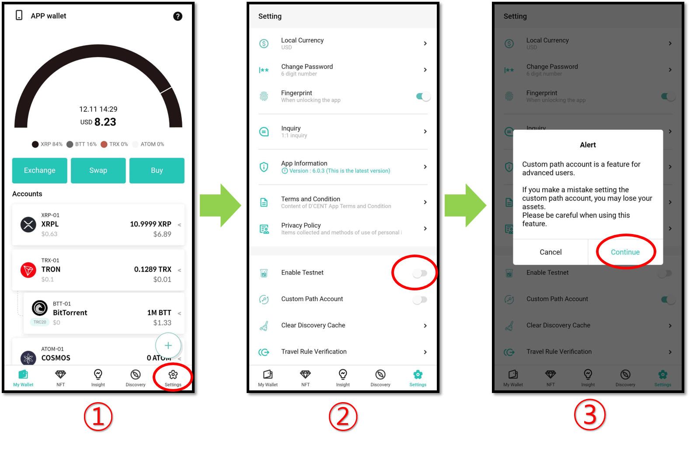
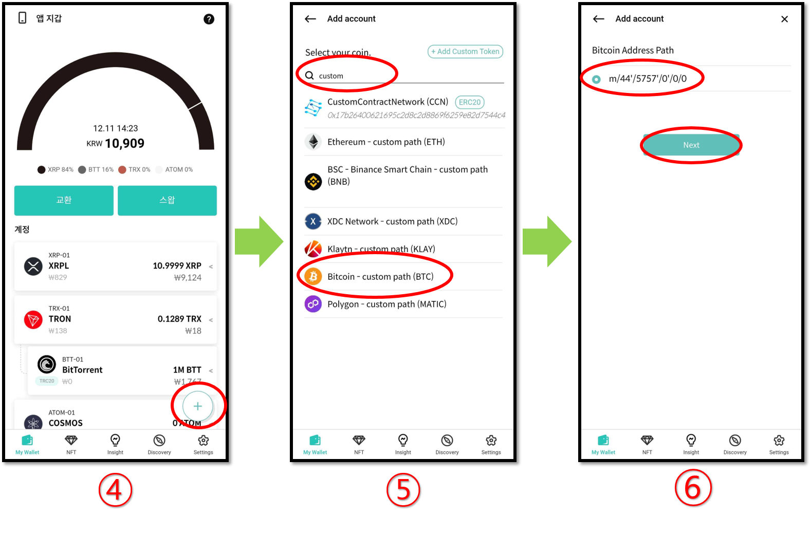
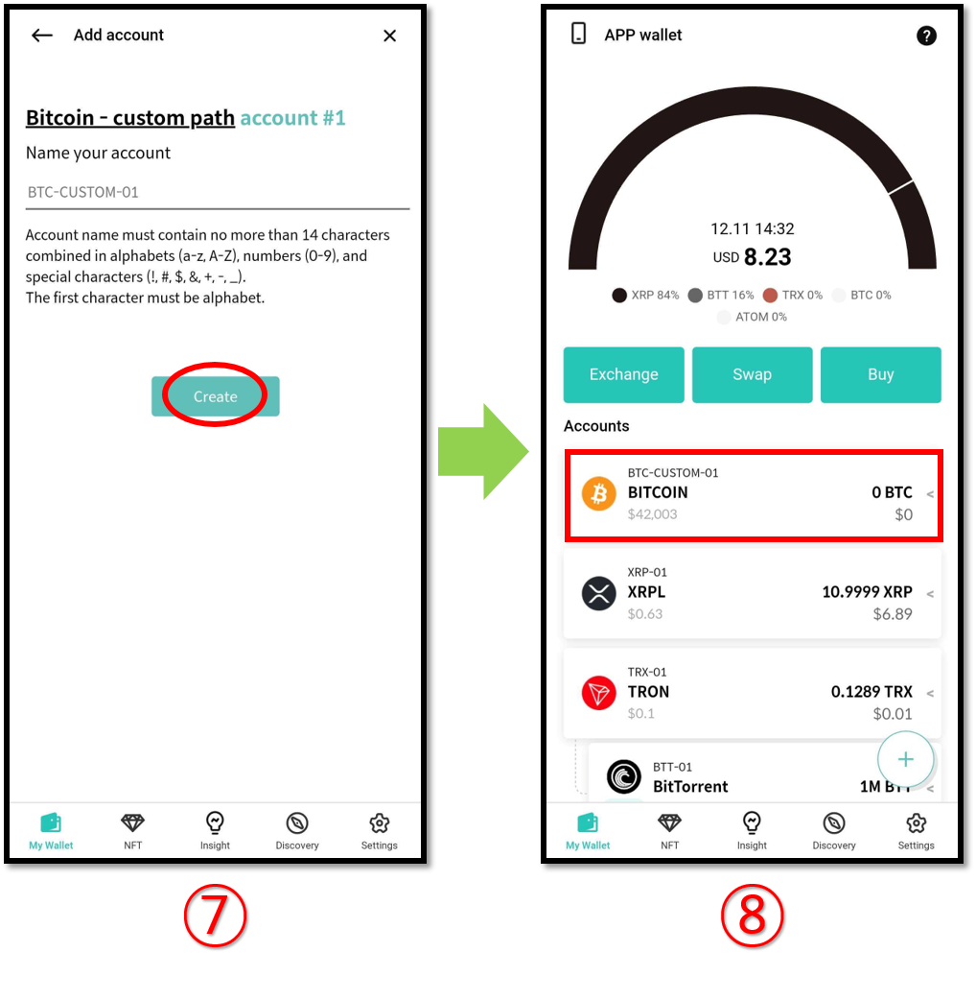

# How to add a custom path BTC account

This guide details the instructions for adding a custom path BTC account.

1\) Click on **"Settings"**.

2\) Slide the button to enable "**Custom Path Account".**

3\) Read the alert message and click on "**Continue"**.

4\) To add a Custom Path Account, click on the **(+) button.**

5\) In the search field, type "**Custom**". From the result, select "**Bitcoin - custom path (BTC)".**

6\) Select the address path and click "**Next"** to continue.

7\) Name your account or leave it as default. Click "**Create"** to add a custom path BTC account.

8\) Custom path BTC account is shown in the My Wallet Tab.&#x20;
