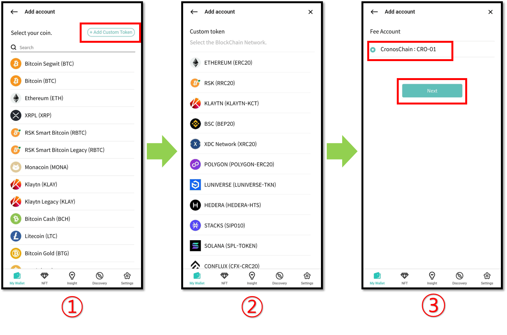
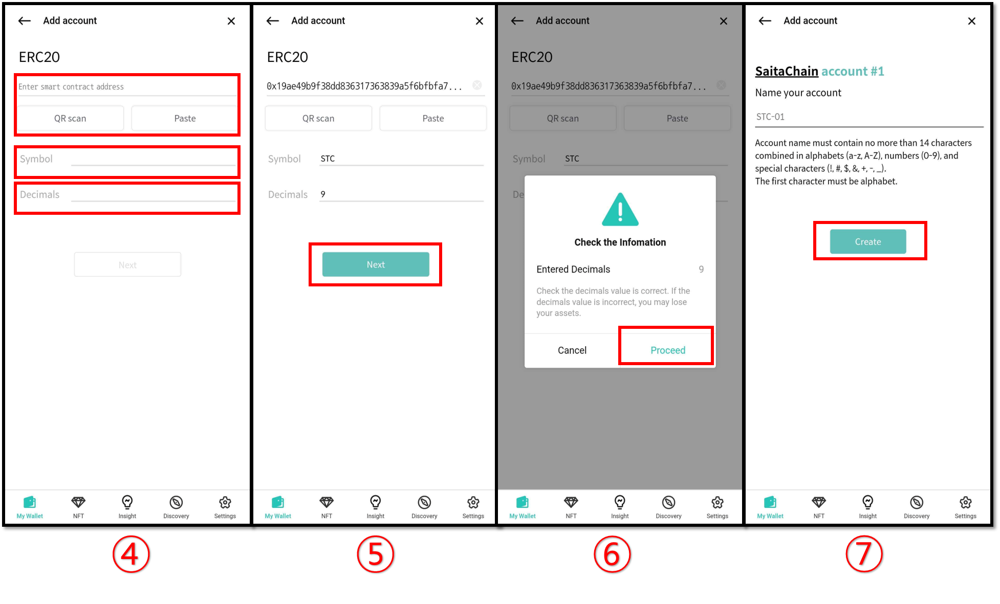

# How to add a custom token account

Custom tokens are token-type cryptocurrencies that are not listed in the support list. Custom token accounts can be added manually by the user for management.&#x20;

**For custom added accounts, only the amount of cryptocurrency held is displayed. Other information such as the market price and converted balance is not displayed.**

To request official support for a specific token from D'CENT Wallet, please use the Google form below. Requesting support for a new blockchain network can take a significant amount of time.

[**Request form for additional tokens/coins**](https://docs.google.com/forms/d/e/1FAIpQLSddydt7fv7D0ATnw49tCsBsex9DpHinAr0sebGb\_eQb0ne37g/viewform)

Custom tokens can be added for the following blockchain networks:

\
✅ Ethereum (ERC20) \
✅ RSK (RRC20) \
✅ Klaytn (KCT) \
✅ BSC (BEP20) \
✅ XinFin (XRC20)  \
✅ Polygon (Polygon-ERC20) \
✅ Luniverse (Luniverse-TKN) \
✅ Hedera (Hedera-HTS)  \
✅ Stacks (SIP010)\
✅ Solana (SPL-TOKEN)\
✅ Conflux (CFX-CRC20)\
✅ Tezos (XTZ-FA)\
✅ Vechain (VET-TOKEN)\
✅ Havah (HAVAH-HSP20)\
✅ Near (NEAR-TOKEN)\
✅ Coreum (SMART-TOKEN)\
✅ Alogland (ALGO-ASSET)\
✅ Alogland (ALGO-APP)\
✅ HECO (HRC20)\
✅ Gnosis Chain (xDai-ERC20)\
✅ FTM (FTM-ERC20)  \
✅ Celo (Celo-ERC20) \
✅ META (Meta-MRC20) \
✅ KCC (KCC-ERC20) \
✅ SONGBIRD (Songbird-ERC20) \
✅ AVAX C-Chain (AVAX-ERC20)\
✅ EWC (EWC-ERC20) \
✅ Arbitrum (Arbitrum-ERC20)\
✅ BOBA L2 (BOBA-ERC20)\
✅ OEC (OEC KIP20)\
✅ Harmony (harmony-HRC20)\
✅ Orbit Chain (ORC-ERC20)\
✅ Open Chain (OC-ERC20)\
✅ CronosChain (CRO-ERC20)\
✅ Flare Network (FLR-ERC20)\
✅ Oasys Games (OAS-ERC20)\
✅ Optimism (OPTIMISM-ERC20)\
✅ MEVerse (MEV-ERC20)\
✅ Base (BASE-ERC20)\
✅ Kroma (Kroma-ERC20)\
✅ ASTAR-EVM (ASTAR-ERC20)\
✅ ASTAR (ASTR-ERC20)

## How to add a custom token account

Adding custom tokens is straightforward and easy. Before you can add a custom token, make sure you have already created its respective blockchain account.

For example, if you intend to add an ERC20, you must first have created an Ethereum account in the wallet.

1\) Click on **"+Add Custom Token"** button

2\) Select the correct Blockchain Network where your custom token was issued.

3\) Select the Fee account and press the **"Next"** button.

<figure><figcaption></figcaption></figure>

4\) Enter the **Smart contract address, Symbol,** and **Decimals.**

5\) After checking that each item has been entered correctly, press the **“Next”** button.

6\) After checking that the decimals entered are correct, press the **“Continue”** button.

7\) Enter name your account and click the **"Create"** button to add the token.


Smart contract addresses, Symbols, and Decimals can be checked through blockchain explorer or the token issuer.


