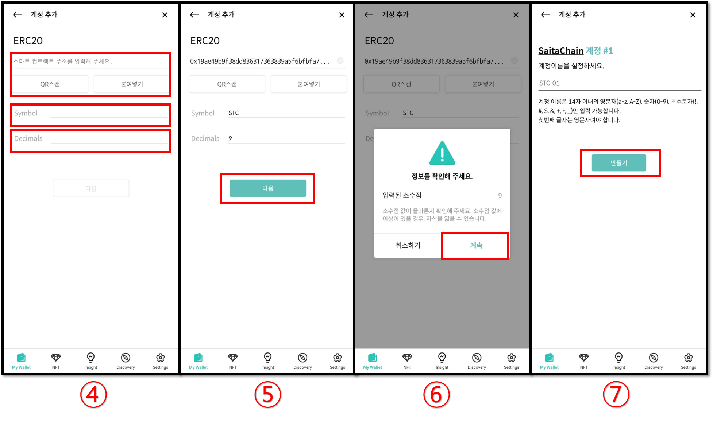

# 커스텀 토큰을 추가하는 방법

커스텀 토큰이란 디센트 지갑의 코인 리스트에서 지원하지 않으나 사용자가 직접 추가할 수 있는 토큰을 말합니다.\
사용자가 직접 커스텀 토큰을 디센트 모바일 앱에서 추가하면 해당 토큰 계정이 지갑에 표시됩니다.

**사용자가 직접 커스텀 추가한 계정은 보유한 암호화폐 수량만 표시되며, 시세 및 환산 잔액의 정보는 표시가 되지 않습니다.**&#x20;

디센트 지갑에 특정 토큰의 공식 지원을 요청하시려면 아래 구글폼을 사용해주세요. 새로운 블록체인 네트워크 지원을 요청하시는 경우 상당한 시간이 걸릴 수 있습니다.

[**토큰 / 코인 추가 요청하기**](https://docs.google.com/forms/d/e/1FAIpQLScj4yDDb4JpquEdhm6KjM2cM-eUvlGaBeSs-Ko9g-dQN456OQ/viewform)

다음 블록체인 네트워크의 커스텀 토큰을 추가할 수 있습니다:\
\
✅ Ethereum (ERC20) \
✅ RSK (RRC20) \
✅ Klaytn (KCT) \
✅ BSC (BEP20) \
✅ XinFin (XRC20)  \
✅ Polygon (Polygon-ERC20) \
✅ Luniverse (Luniverse-TKN) \
✅ Hedera (Hedera-HTS)  \
✅ Stacks (SIP010)\
✅ Solana (SPL-TOKEN)\
✅ Conflux (CFX-CRC20)\
✅ Tezos (XTZ-FA)\
✅ Vechain (VET-TOKEN)\
✅ Havah (HAVAH-HSP20)\
✅ Near (NEAR-TOKEN)\
✅ Coreum (SMART-TOKEN)\
✅ Alogland (ALGO-ASSET)\
✅ Alogland (ALGO-APP)\
✅ HECO (HRC20)\
✅ Gnosis Chain (xDai-ERC20)\
✅ FTM (FTM-ERC20)  \
✅ Celo (Celo-ERC20) \
✅ META (Meta-MRC20) \
✅ KCC (KCC-ERC20) \
✅ SONGBIRD (Songbird-ERC20) \
✅ AVAX C-Chain (AVAX-ERC20)\
✅ EWC (EWC-ERC20) \
✅ Arbitrum (Arbitrum-ERC20)\
✅ BOBA L2 (BOBA-ERC20)\
✅ OEC (OEC KIP20)\
✅ Harmony (harmony-HRC20)\
✅ Orbit Chain (ORC-ERC20)\
✅ Open Chain (OC-ERC20)\
✅ CronosChain (CRO-ERC20)\
✅ Flare Network (FLR-ERC20)\
✅ Oasys Games (OAS-ERC20)\
✅ Optimism (OPTIMISM-ERC20)\
✅ MEVerse (MEV-ERC20)\
✅ Base (BASE-ERC20)\
✅ Kroma (Kroma-ERC20)\
✅ ASTAR-EVM (ASTAR-ERC20)\
✅ ASTAR (ASTR-ERC20)

## 커스텀 토큰을 추가하는 방법

커스텀 토큰을 추가하는 방법은 매우 간단합니다. 특정 블록체인의 커스텀 토큰을 추가하려면 먼저 해당 블록체인의 계정이 추가되어있어야 합니다.

예를들어 ERC20 토큰을 추가하려면 먼저 이더리움 계정이 추가된 상태어야 합니다.

1\) **"+Add Custom Token"** 을 클릭하세요.

2\) 추가하려는 토큰이 발행된 올바른 블록체인 네트워크를 선택합니다.

3\) 수수료 계정을 선택하고 **"다음"** 버튼을 누릅니다.

<figure><figcaption></figcaption></figure>

4\) **스마트 컨트랙트 주소, Symbol, 및 Decimals(소수점)**를 입력합니다.

5\) 각 항목이 정상적으로 입력되었는 지 확인 후 **"다음"** 버튼을 누릅니다.

6\) 입력된 **소수점(Decimals)**이 정확한 지 확인한 후 **"계속"** 버튼을 누릅니다.

7\) 계정 이름을 설정하고 **"만들기"** 버튼을 누르면 토큰이 추가됩니다.


스마트 컨트랙트 주소, Symbol, 및 Decimals 은 블록체인 익스플로러 또는 토큰 발행 업체를 통해 확인할 수 있습니다.


