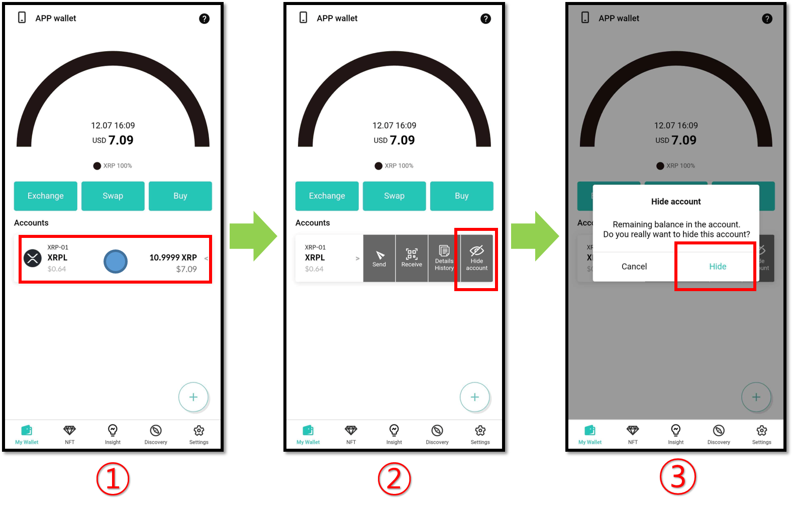
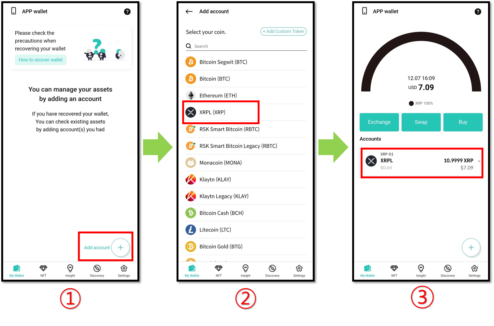

# How to remove (hide) a coin account

Accounts that have been created can be removed (hidden) from the My Wallet Tab by using the "Hide" function.&#x20;


In the case of using the **Biometric Wallet mode**, your Biometric Wallet must also be connect in order to hide an account. And the hidden account is synchronized with the your biometric wallet.


## Hide account

For example, let's remove the XRP account from the D'CENT Wallet.

1\) Click on the XRP account.

2\) Click on "**Hide account"**.

3\) Click on '**Hide**' to confirm the removal of this account from the My Wallet tab.\
If there is a balance in the account, the message indicating that the balance remains will be displayed as shown in the above image.


To remove a native asset account such as Ethereum, all the token accounts that are linked to this native asset account must be removed first.


## Re-add hidden account

The hidden account is only invisible in the "My Wallet" tab, and it is not permanently deleted from the blockchain. Therefore, you can add the hidden account back at any time.

Let’s re-add the hidden Ripple account.

<figure><figcaption></figcaption></figure>

1\) click on **"Add account`+` "** in the My Wallet tab.

2\) Select the XRP account you have hidden and create an account.

3\) You can see the XRP account again in the My Wallet tab. If there is a balance on the account, you can view the balance again.
