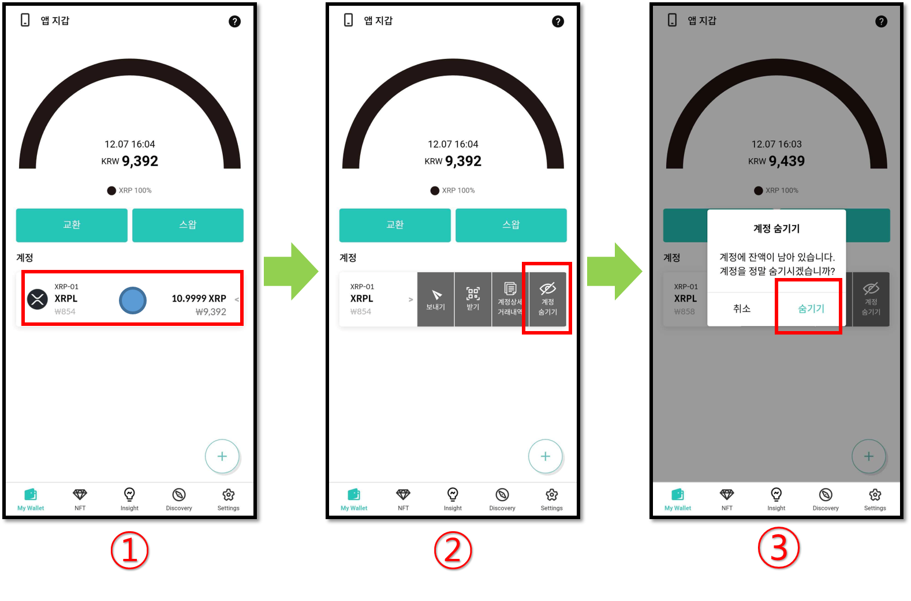
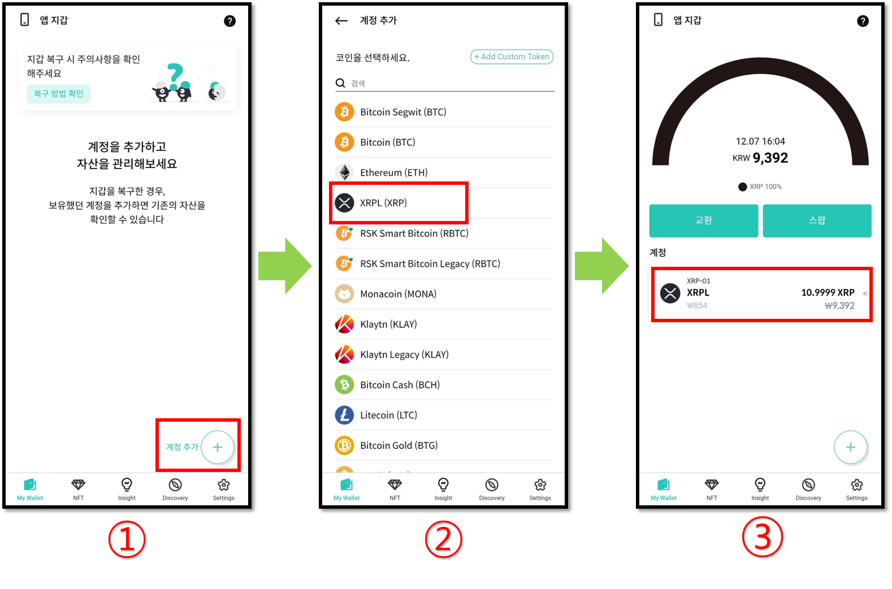

# 생성한 계정 제거 (숨기기) 방법

디센트 모바일 앱 My Wallet 탭에서 표시되는 암호화폐 계정은 **"숨기기"** 기능을 사용하여 제거가 가능합니다.&#x20;


지문인증형 지갑을 사용한다면 콜드월렛이 디센트 모바일 앱과 블루투스로 연결된 상태어야 하며, 숨기기를 한 계정이 콜드월렛에도 동기화가 됩니다.


## 계정 숨기기

예를 들어 리플 계정을 숨겨보겠습니다.

1\) My Wallet 탭에서  XRP 계정 터치

2\) **"계정 숨기기"** 선택&#x20;

3\) "**숨기기"**&#xB97C; 다시 한번 터치하면 해당 계정은 My Wallet 탭에 표시되지 않습니다.\
만약, 해당 계정에  잔액이 존재한다면 위 그림과 같이 잔액이 남아 있다는 문구가 표시됩니다.


숨기려는 암호화폐 계정에 연결된 토큰 계정이 존재하는 경우 먼저 연결된 토큰 계정을 모두 숨긴 이후 해당 계정 숨기기가 가능합니다.


## 숨겨진 계정 다시 추가하기

숨겨진 계정은 "My Wallet" 탭에서만 보이지 않는 것일 뿐 영구적으로 삭제되는 것은 아닙니다. 따라서 숨겨진 계정은 언제든지 다시 추가를 할 수 있습니다.

숨기기를 한 리플 계정을 다시 추가해보겠습니다.

<figure><figcaption></figcaption></figure>

1\) My Wallet 탭에서 **"계정 추가`+` "** 버튼을 터치합니다.

2\) 숨기기를 한 XRP 계정을 선택하여 계정 만들기를 완료합니다.

3\) My Wallet 탭에 XRP 계정이 보이고 해당 계정에 잔액이 존재한다면 다시 잔액을 볼 수 있습니다.
