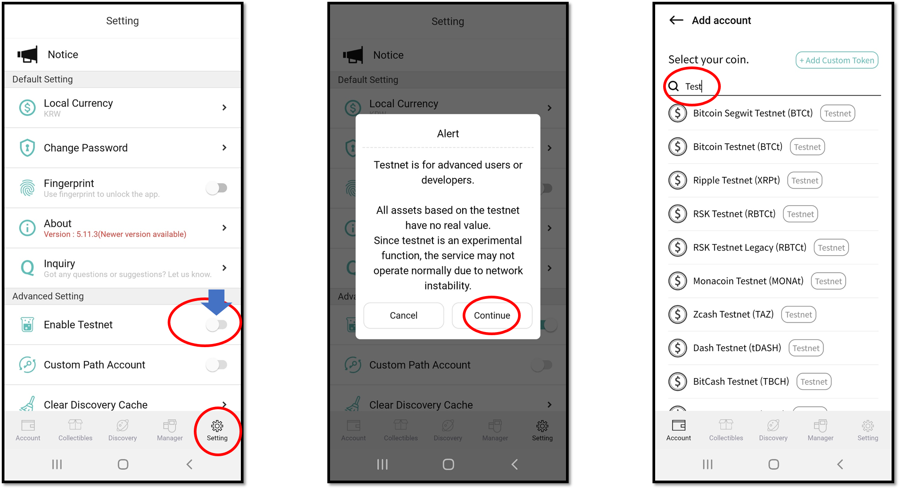

# How to activate Testnet

Testnet is used by developers for the purpose of testing DApp services. All assets on the test networks have no monetary value.

To enable the testnet function, go to 'Setting' tab on the bottom of the App.

Locate 'Enable Testnet' menu and slide the button to the right to activate the testnet function.

When adding a testnet account to your wallet, simply search for the name of the asset or type 'test' to get a list of all the testnest available.
