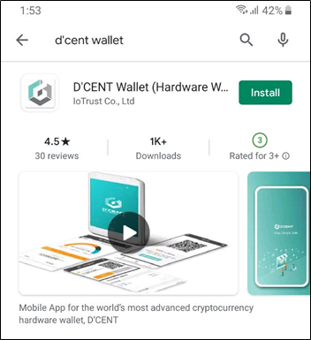
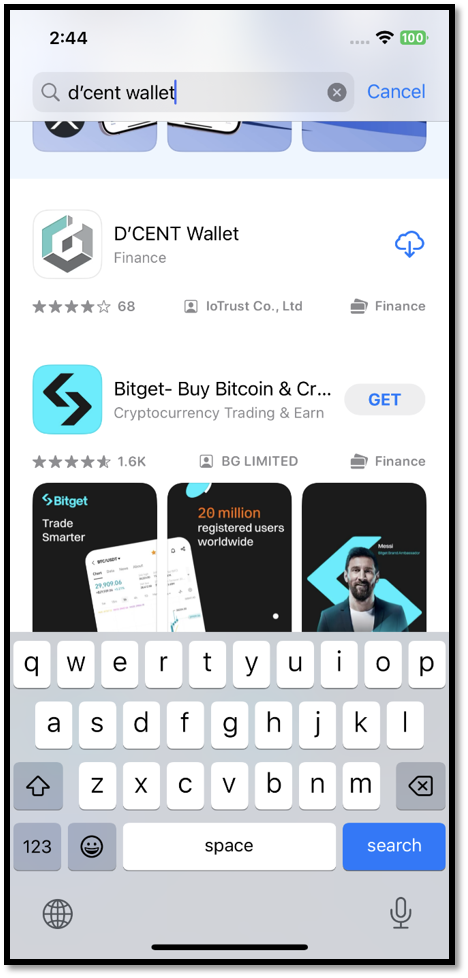

# Mobile App introduction

From a single D'CENT mobile app, users are given the choices of using Biometric Wallet, Card type Wallet, or the Software Wallet.

You can also easily manage your cryptocurrency assets through the mobile app by adding cryptocurrency accounts, checking the portfolio of coins you own on one screen, and conducting transactions such as sending and receiving coins.

## Mobile App download

### Android

You can install D'CENT mobile app by searching for the app directly from the Google Play Store.

Search for the keyword "**D'CENT Wallet**".

To install the mobile app for Android, please click [here](https://play.google.com/store/apps/details?id=com.kr.iotrust.dcent.wallet).

<figure><figcaption></figcaption></figure>

### iOS

You can install D'CENT mobile app by searching for the app directly from the App Store.

Search for the keyword "**D'CENT Wallet**".

To download the D'CENT mobile app for iOS, please click [here](https://apps.apple.com/kr/app/dcent-hardware-wallet/id1447206611).

<figure><figcaption></figcaption></figure>

## Main features

<figure><figcaption></figcaption></figure>

[**My Wallet** ](https://userguide.dcentwallet.com/mobile-app/create-account): [Add a coin account](https://userguide.dcentwallet.com/mobile-app/create-account) or display a list of created accounts. Additionally, you can view your portfolio, including the amount, balance, and price information of coins held in D'CENT Wallet, on one screen, and [send](https://userguide.dcentwallet.com/coin-send-receive/send) and [receive](https://userguide.dcentwallet.com/coin-send-receive/receive) coins through the My Wallet tab.

[**NFT** ](https://userguide.dcentwallet.com/coin-send-receive/how-to-receive-or-send-an-nft-token): You can check the NFT assets you own in your D'CENT wallet as a collection and easily send NFT assets to another address. It can also be integrated with NFT marketplaces such as Opensea or Rarible.

_The NFT tab is not available in the mobile app for iOS. For information on how to access NFT collections for iOS users, please click_ [_here_](https://userguide.dcentwallet.com/coin-send-receive/how-to-receive-or-send-an-nft-token#how-to-access-nft-collectibles-for-ios-users)_._

[**Insight**](https://userguide.dcentwallet.com/native-service/insight) : You can check the list of the top 7 cryptocurrency trends most searched for by users in real time on CoinGecko and CoinMarketCap. If there is a coin you wish in the Top7 list, you can buy the coin right away using the “Swap” serive

_Insight tab is supported from D'CENT mobile app version 6.0.0 or higher._

[**Discovery** ](https://userguide.dcentwallet.com/native-service/dapp-browser): It is a DApp browser that allows access to various Web3 services such as DeFi, DEX, and NFT marketplace. You can easily connect your D'CENT wallet by entering the URL in the search box, doing a Google search, or selecting the desired service from the "list".

[**Settings**](https://userguide.dcentwallet.com/mobile-app/mobile-app-setting-menu/mobile-app-dcent-walletmode) : Provides the ability to change app settings, such as changing the supported language, local currency, and password of the mobile app. Additionally, you can easily and conveniently change to the desired mode, such as Biometric Wallet, Card type Wallet, or Software Wallet, through “Switch Wallet Mode”.
