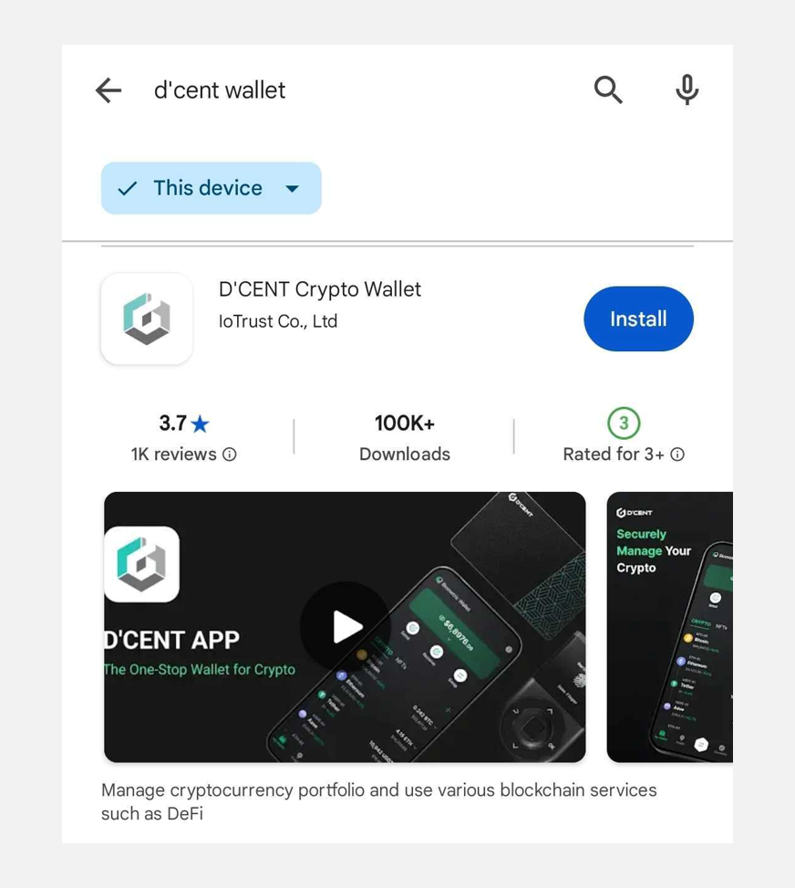
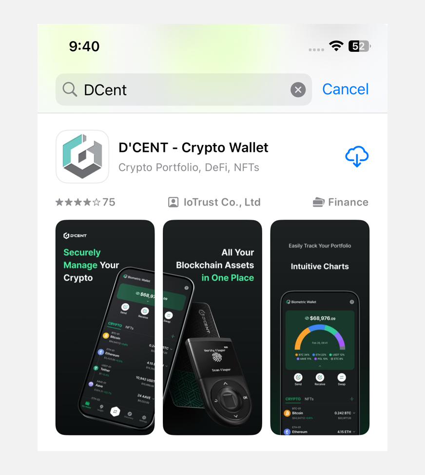

# Mobile App introduction

From a single D'CENT mobile app, users are given the choices of using Biometric Wallet, Card type Wallet, or the Software Wallet.

You can also easily manage your cryptocurrency assets through the mobile app by adding cryptocurrency accounts, checking the portfolio of coins you own on one screen, and conducting transactions such as sending and receiving coins.

## Mobile App download

### For Android

You can install D'CENT mobile app by searching for the app directly from the Google Play Store.

Search for the keyword "**D'CENT Wallet**".

To install the mobile app for Android, please click [here](https://play.google.com/store/apps/details?id=com.kr.iotrust.dcent.wallet).

<figure><figcaption></figcaption></figure>

### For iOS

You can install D'CENT mobile app by searching for the app directly from the App Store.

Search for the keyword "**D'CENT Wallet**".

To download the D'CENT mobile app for iOS, please click [here](https://apps.apple.com/us/app/dcent-crypto-wallet/id1447206611).

<figure><figcaption></figcaption></figure>

## Main features

<figure><figcaption></figcaption></figure>

**My Wallet** : You can view your existing coin accounts or add new ones. You can send and receive coins, check your transaction history, and manage your assets with ease. Additionally, by tapping the **"NFTs"** tab, you can view all NFT assets stored in your wallet at a glance.

**Insight** : You can check coin prices and current trading trends. Additionally, you can compare the prices of each asset across different platforms.

**Swap :** You can trade your desired assets, including cross-network transactions.

**Discovery** : It is a DApp browser that allows access to various Web3 services such as DeFi, DEX, and NFT marketplace. You can easily connect your D'CENT wallet by entering the URL in the search box, doing a Google search, or selecting the desired service from the **"LIST"**.

**Settings** : Provides the ability to change app settings, such as changing the supported language, local currency, and password of the mobile app. Additionally, you can easily and conveniently change to the desired mode, such as **Biometric, Card**, or **App Wallet**, through **"Switch Wallet Mode".**
