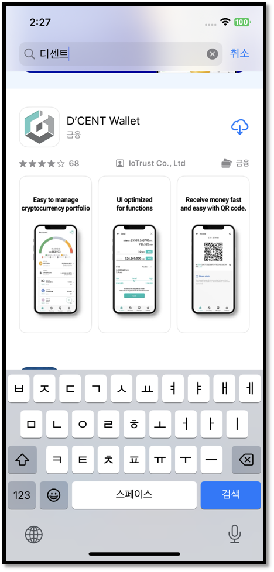

# 모바일 앱 소개

디센트 모바일 앱 하나로 디센트에서 출시한 지문인증형 콜드월렛, 카드타입 콜드월렛, 소프트웨어 월렛을 모두 관리할 수 있습니다.&#x20;

또한 암호화폐 계정을 추가하고 가지고 있는 코인의 포트폴리오를 한 화면에서 확인하거나 코인 주고 받기 등 모바일 앱을 통해 쉽고 간편하게 암호화폐 자산을 관리할 수 있습니다.

## 모바일 앱 다운로드

### 안드로이드 앱 

구글 플레이 스토어에서 **"디센트 월렛"** 또는 **"디센트 지갑"** 을 검색하여 모바일 앱을 설치할 수 있습니다.

또는 [**여기**](https://play.google.com/store/apps/details?id=com.kr.iotrust.dcent.wallet)를 클릭하여 바로 설치 할 수 있습니다.

<figure><figcaption>
구글 플레이스토어 디센트 월렛 검색 화면
</figcaption></figure>

### 아이폰 앱 

앱 스토어에서 **"디센트"** 혹은 **"D'CENT"** 를 검색하여 모바일 앱을 설치할 수 있습니다.

또는 [**여기**](https://apps.apple.com/kr/app/dcent-hardware-wallet/id1447206611)를 클릭하여 바로 설치 할 수 있습니다.

<figure><figcaption>
앱스토어 디센트 월렛 검색 화면
</figcaption></figure>

## 주요 기능

<figure><figcaption></figcaption></figure>

[**My Wallet** :](https://userguide.dcentwallet.com/v/kr/mobile-app/create-account) 코인 계정을 [추가](https://userguide.dcentwallet.com/v/kr/mobile-app/create-account)하거나 생성된 계정 목록을 보여줍니다. 또한 디센트 지갑에서 보유하고 있는 코인의 수량, 잔액, 시세 정보 등의 포트폴리오를 한 화면에서 볼 수 있고 My Wallet 탭을 통해 코인 [보내기](https://userguide.dcentwallet.com/v/kr/coin-send-receive/send)와 [받기](https://userguide.dcentwallet.com/v/kr/coin-send-receive/receive)를 할 수 있습니다.

[**NFT** :](https://userguide.dcentwallet.com/v/kr/coin-send-receive/nft) 디센트 지갑에서 보유하고 있는 NFT 자산을 콜렉션 형태로 확인할 수 있고 다른 주소로 NFT 자산을 간편하게 보낼 수 있습니다. 또한 Opensea 나 Rarible 과 같은 NFT 마켓 플레이스와 연동할 수 있습니다.

_아이폰 모바일 앱에선 NFT 탭이 제공되지 않습니다. 아이폰 유저의 NFT 자산 확인  방법은_ [_여기_](https://userguide.dcentwallet.com/v/kr/coin-send-receive/nft#nft-1)_를 참고하세요._

[**Insight** :](https://userguide.dcentwallet.com/v/kr/native-service/insight) 코인게코와 코인마켓캡에서 사용자들이 가장 많이 검색한 암호화폐의 실시간 트렌드 Top7 리스트를 확인할 수 있습니다. Top7 리스트에서 마음에 드는 코인이 있다면 "Swap" 서비스로 코인을 바로 구매할 수 있습니다.

_Insight 탭은 모바일 앱 버전 6.0.0 이상부터 지원합니다._

[**Discovery** :](https://userguide.dcentwallet.com/v/kr/native-service/dapp-browser) DeFi, DEX, NFT 마켓 플레이스 등 다양한 Web3 서비스에 접근할 수 있는 DApp 브라우저입니다. 검색창에 URL 을 입력하거나 구글 검색을 할 수 있고 "목록"에서 원하는 서비스를 선택하여 간편하게 디센트 지갑을 연결할 수 있습니다.

[**Settings :**](https://userguide.dcentwallet.com/v/kr/mobile-app/mobile-app-setting-menu) 모바일 앱의 지원 언어, 현지 통화, 비밀번호 변경 등 설정 변경 기능을 제공합니다. 또한 "월렛모드 변경" 을 통해 지문인증형 콜드월렛, 카드타입 콜드월렛, 소프트웨어 월렛 등 원하는 모드로 쉽고 간편하게 변경할 수 있습니다.
