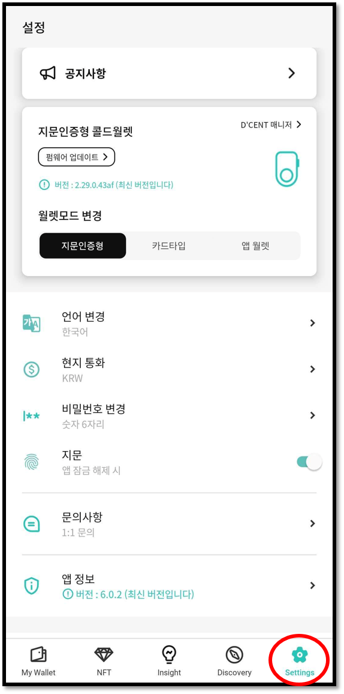
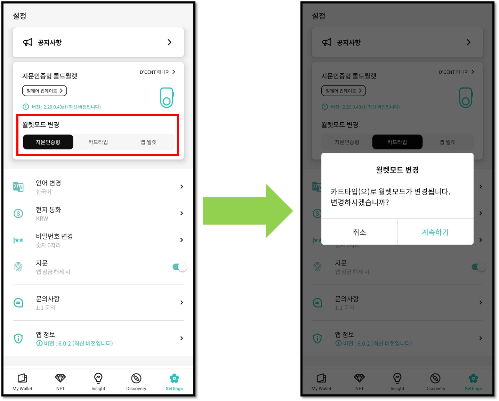
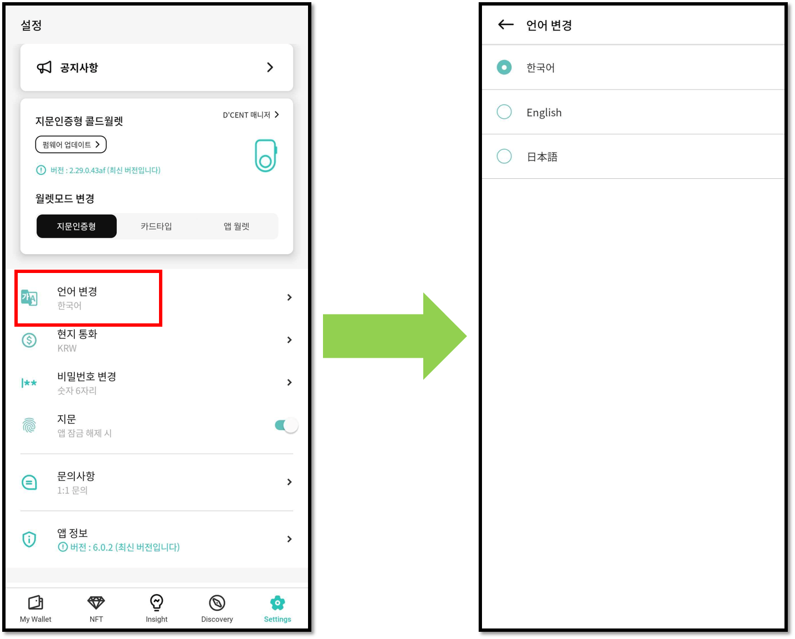
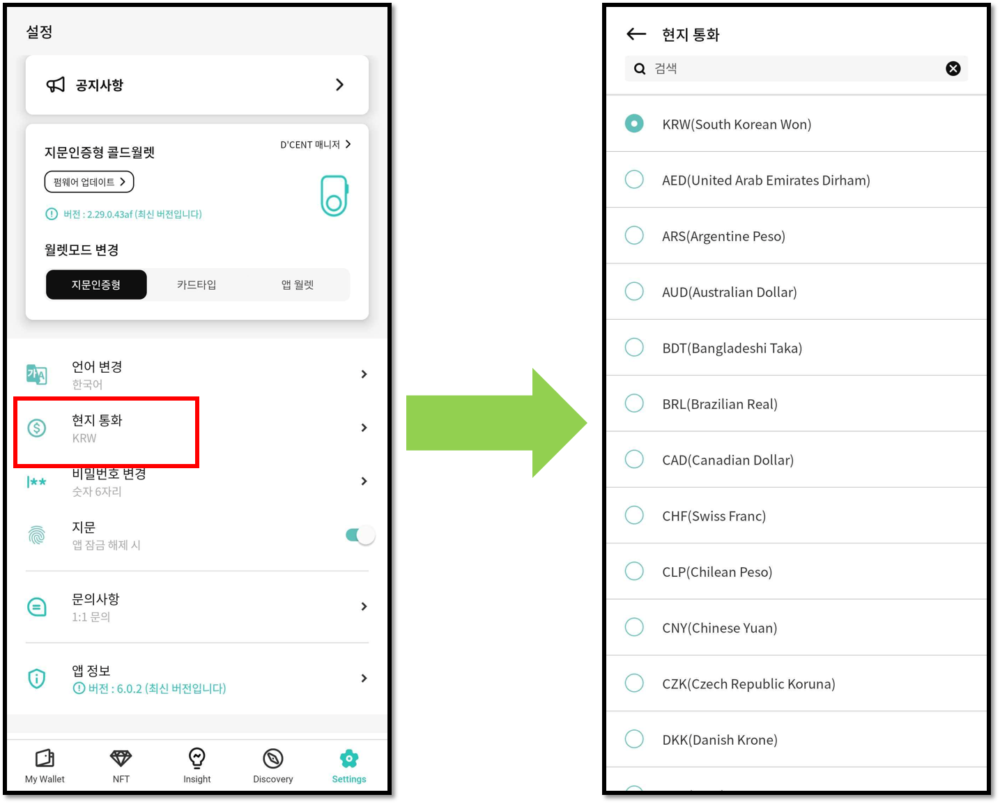
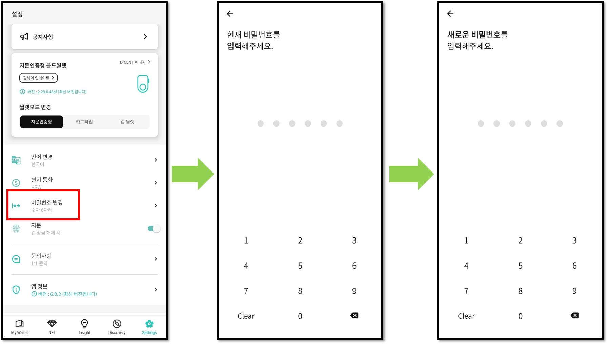
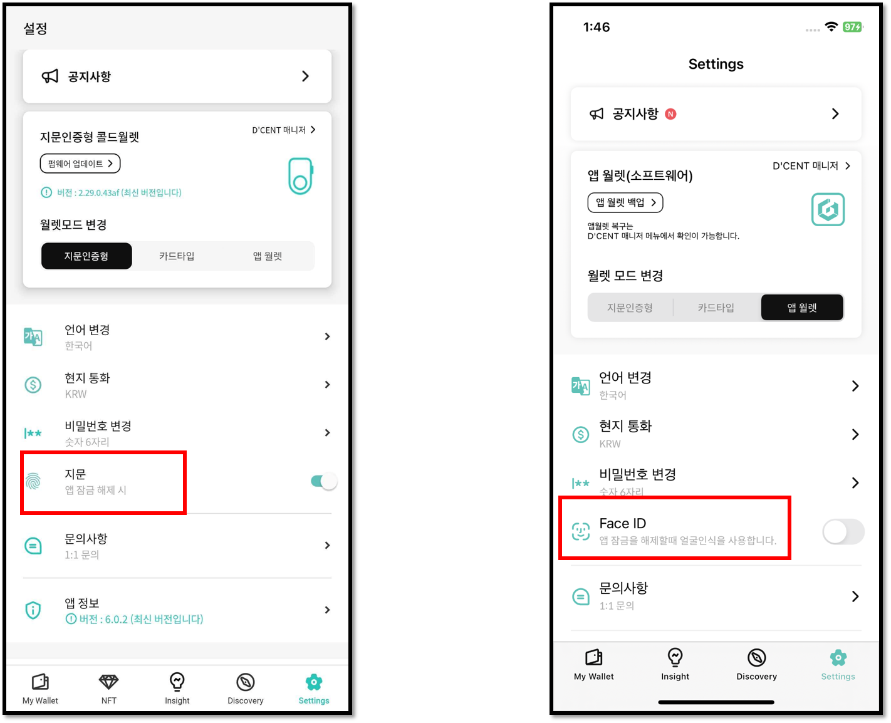
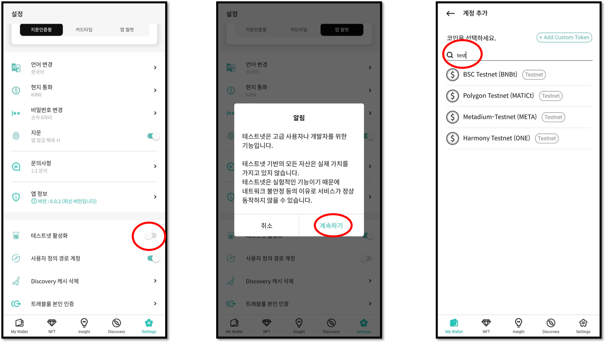

# 앱 설정 메뉴

"Setting" 메뉴를 이용하여 모바일 앱의 여러가지 설정을 변경할 수 있습니다.


모바일 앱 버전 6.0.0 이상부터 "Manager" 탭이 Setting 탭 내로 이동하였습니다.


## 월렛모드 변경 

사용하는 지갑에 따라 월렛모드를 변경할 수 있습니다.&#x20;

**"지문인증형", "카드타입", "앱 월렛(소프트웨어)"** 중 사용할 지갑으로 변경할 수 있으며, 월렛모드가 변경되면 각 모드에 맞는 계정 정보를 다시 불러오게 됩니다.

<figure><figcaption></figcaption></figure>

월렛모드 변경 및 각 모드별 D'CENT 매니저 메뉴 사용 방법은 아래 링크를 참고해주세요.


[mobile-app-dcent-walletmode](mobile-app-dcent-walletmode/)


## 언어 변경 

디센트 모바일 앱의 언어를 변경할 수 있습니다. 다음 언어를 지원합니다.

* 한국어
* 영어
* 일본어

<figure><figcaption></figcaption></figure>

## 현지 통화 설정 

​코인/토큰 가격을 표시할 통화를 설정합니다.&#x20;

KRW(한국 원화), USD(미국 달러), JPY(일본 엔화), EUR(유럽 유로), 영국 파운드(GBP), 중국 위안화(CNY) 등 총 39개의 법정 화폐와 BTC(비트코인), ETH(이더리움) 암호화폐로 가격을 표시할 수 있습니다.

<figure><figcaption></figcaption></figure>

## 비밀번호 변경 

디센트 모바일 앱의 6자리 비밀번호를 변경할 수 있습니다.

모바일 앱의 비밀번호 6자리는 앱을 초기에 설정할 때 등록한 비밀번호입니다.

<figure><figcaption></figcaption></figure>

## 모바일 앱의 추가 인증 방법 설정 

6자리 비밀번호 이외에 추가로 앱의 인증 방법을 선택할 수 있습니다.

안드로이드 기기는 지문 인증을 추가 인증 수단으로 사용할 수 있습니다.\
아이폰은 Touch ID나 Face ID를 추가 인증 수단으로 사용할 수 있습니다.

<figure><figcaption></figcaption></figure>

## 테스트넷 활성화

"테스트넷 활성화" 메뉴를 오른쪽으로 밀면 해당 기능을 활성화 할 수 있습니다.

이후 지갑에 테스트넷 계정을 추가할 때 자산 이름을 검색하거나 "test"를 입력하면 사용 가능한 모든 테스트넷 목록이 표시됩니다.


테스트넷은 **개발자 및 디앱(DApp) 서비스 테스트를 목적**으로 사용되며 네트워크의 모든 테스트용 자산은 금전적 가치가 없습니다.


<figure><figcaption></figcaption></figure>
