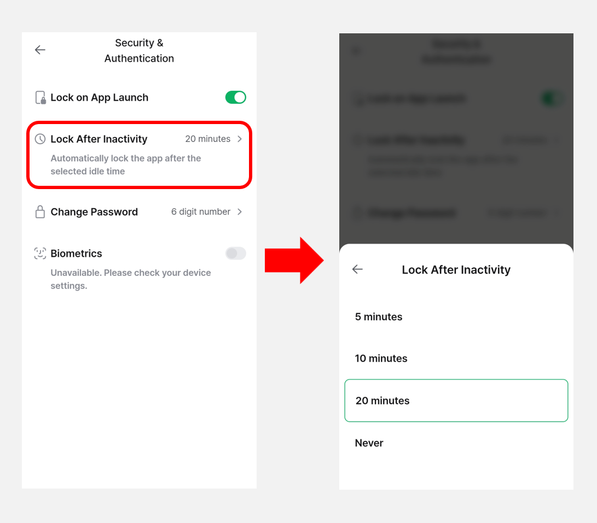
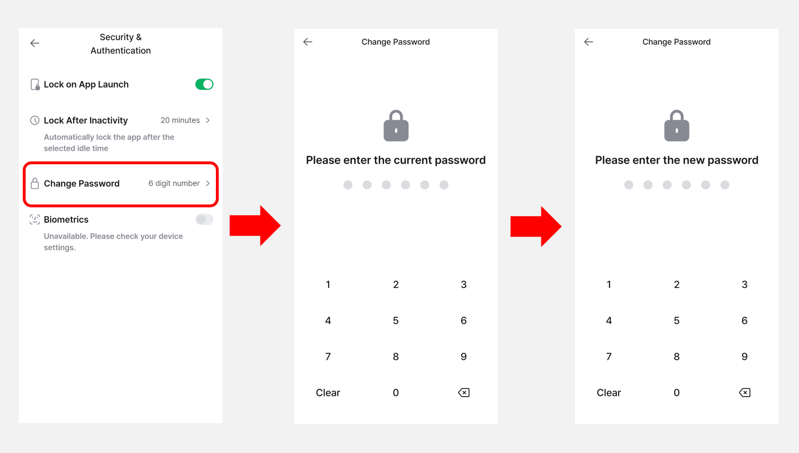
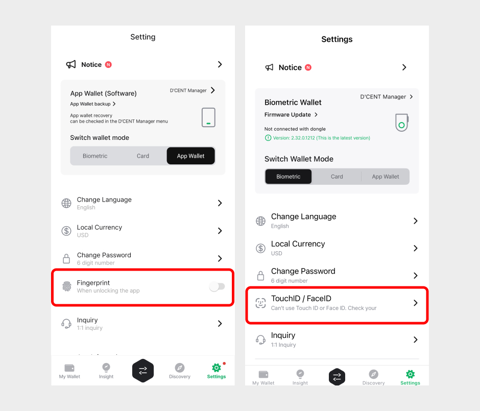
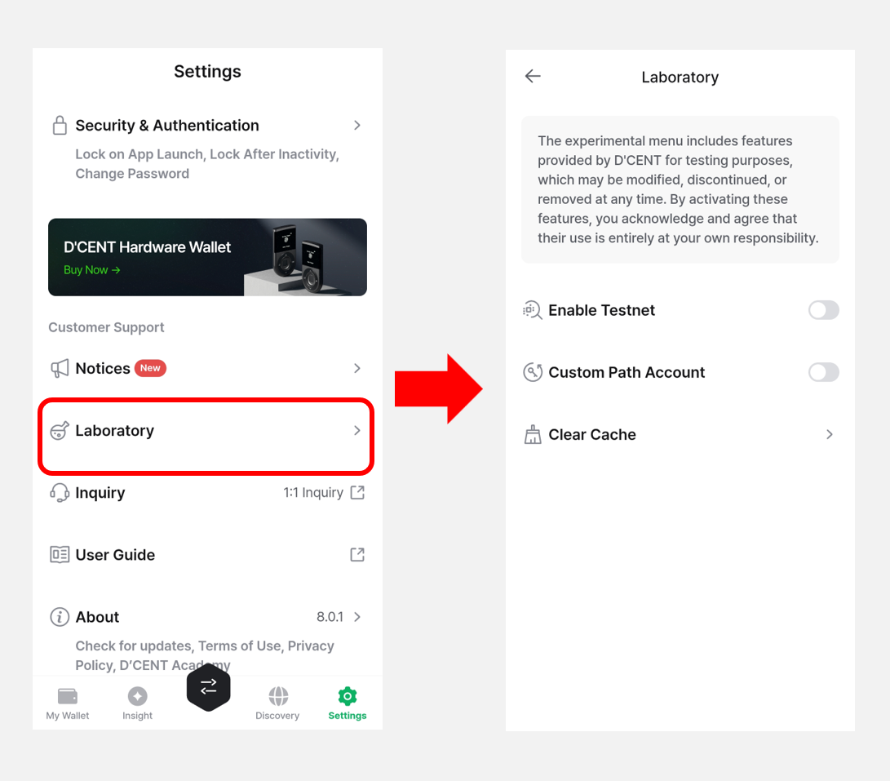

# Mobile App "Settings" menu

You can change various settings of the mobile app from the **"Settings"** menu.

<figure><figcaption></figcaption></figure>

## Manage All Wallets

You can manage all wallets currently registered in the app, including **Biometric Wallets**, **Card Wallets**, and **App Wallets**. And you can also add new wallets.

<figure><figcaption></figcaption></figure>

If no wallets are registered, please click the **Manage All Wallets button** and register the wallet you want to use from Biometric Wallet, Card Wallet, or App Wallet (Software).

<figure><figcaption></figcaption></figure>

For more details about the **Manage All Wallets menu**, please refer to the guide below.


[manage-all-wallets](manage-all-wallets/)


## Change Language

You can change the language of the D'CENT mobile app. Supports the following languages:

* **English**
* **Korean**
* **Japanese**
* **Spanish**
* **Portuguese (Brazil)**

<figure><figcaption></figcaption></figure>

## Local Currency

​Set the currency to display coin / token price.

It supports a total of 39 local currencies, including KRW (South Korean Won), USD (United States Dollar), JPY (Japanese Yen), EUR (European Euro), GBP (British Pound Sterling), CNY (Chinese Yuan), and others.\
And it supports BTC (Bitcoin) and ETH (Ethereum) cryptocurrencies.

<figure><figcaption></figcaption></figure>

## Notification

You can set up push notifications for major coin price fluctuations and market trend updates.

Push notifications are sent in the following cases:

* When there are price fluctuations for BTC, ETH, XRP, BNB, or SOL coins on CoinGecko.
* When a cryptocurrency newly enters the Top 7 trending list on CoinGecko or CoinMarketCap.

By tapping on a notification, you can view detailed information about the cryptocurrency in the **"Insight"** tab.


Even without disabling notification settings, you can use your phone's **Do Not Disturb** mode to mute notifications during specific time periods.\
For instructions on setting up Do Not Disturb mode on your device, please refer to the following links:

* [Android](https://support.google.com/android/answer/9069335?hl=en-GB\&sjid=8568208612761623854-NC)
* [iOS](https://support.apple.com/en-gb/guide/iphone/iph5c3f5b77b/18.0/ios/18.0)


<figure><figcaption></figcaption></figure>

## Theme

You can set the D’CENT mobile app to either **Light Mode** or **Dark Mode**. The app’s appearance will change depending on the selected theme. By default, the theme is set to **Light Mode**.\
(_If you select **System**, the theme will automatically follow your phone’s Light or Dark Mode settings.)_

<figure><figcaption></figcaption></figure>

## Security & Authentication

You can manage security settings for the D’CENT mobile app, including **App lock**, **change password**, and **Biometric authentication**.

<figure><figcaption></figcaption></figure>

### Lock on App Launch

This setting allows you to enable or disable the app lock when launching the D’CENT mobile app.\
By default, this option is enabled.

If you turn it off, the app will open **without requiring the 6-digit password or biometric authentication** (fingerprint or Face ID).

<figure><figcaption></figcaption></figure>

### Lock After Inactivity

This setting allows the D’CENT mobile app to automatically lock after a period of inactivity. \
The default value is **20 minutes**, and you can choose from **5 minutes, 10 minutes, 20 minutes**, or **Never**.

<figure><figcaption></figcaption></figure>

### Change Password

You can change the **6-digit password** of the D'CENT mobile app.

The 6-digit password for the mobile app is the password you registered when initially setting up the app.

<figure><figcaption></figcaption></figure>

### Biometrics

In addition to the 6-digit password, **you can also select another method of authenticating** to the mobile app.&#x20;

* For Android phones, fingerprint authentication can be set as a method of authentication.&#x20;
* For iPhones, Touch ID or FaceID can be set as a method of authentication.


**If biometric authentication is canceled or fails, you will be required to enter your 6-digit password.**


<figure><figcaption></figcaption></figure>

## Laboratory

The Laboratory menu provides experimental features developed by D’CENT. These features may be modified, discontinued, or removed at any time.\
By enabling them, you agree that **you are solely responsible for their use**.

* **Enable Testnet** : This feature is intended for developers or testing DApp services.\
  After enabling this option, enter `"test"` when adding an account to display all available testnets.
* **Custom Path Account :** The Custom Path Account feature is used for **recovering assets sent to the wrong network** between EVM-compatible blockchains.\
  This is considered an advanced setting and is **not recommended for general users**.
* **Clear Cache** : Use this option to delete the cache data stored in the D’CENT mobile app.

<figure><figcaption></figcaption></figure>
