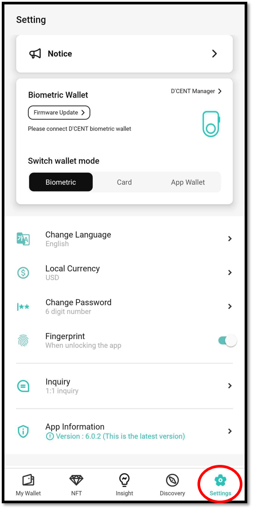
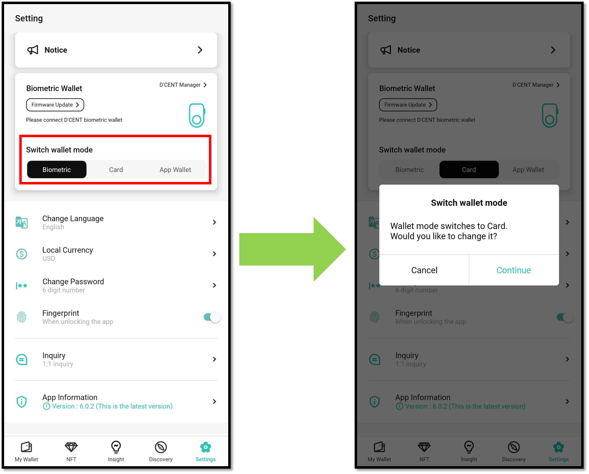
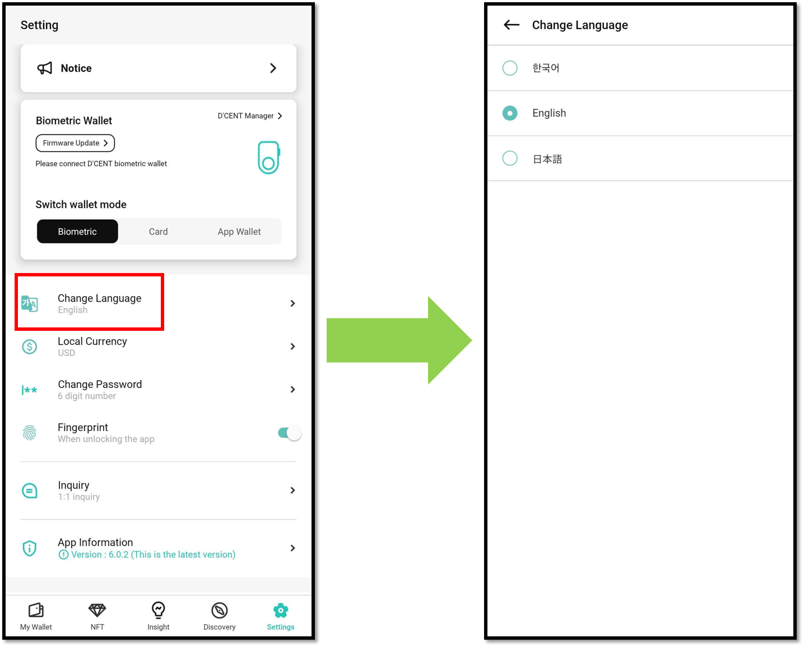
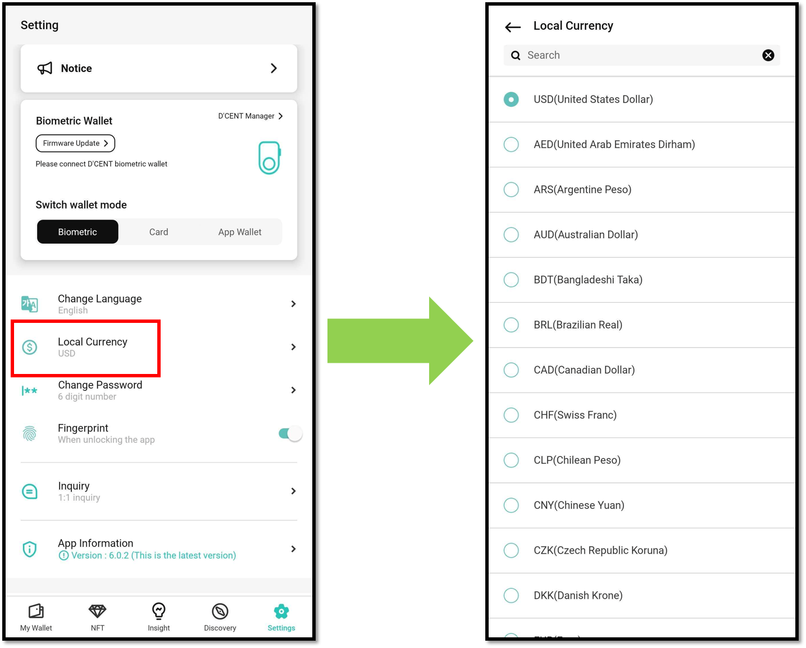
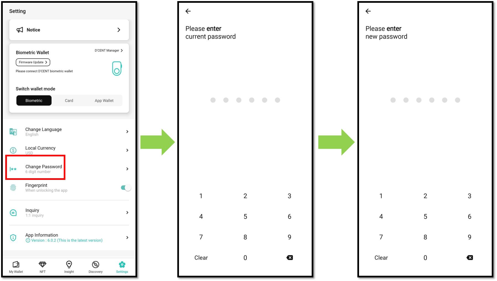
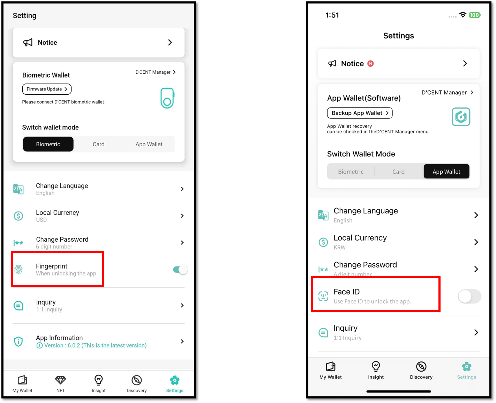
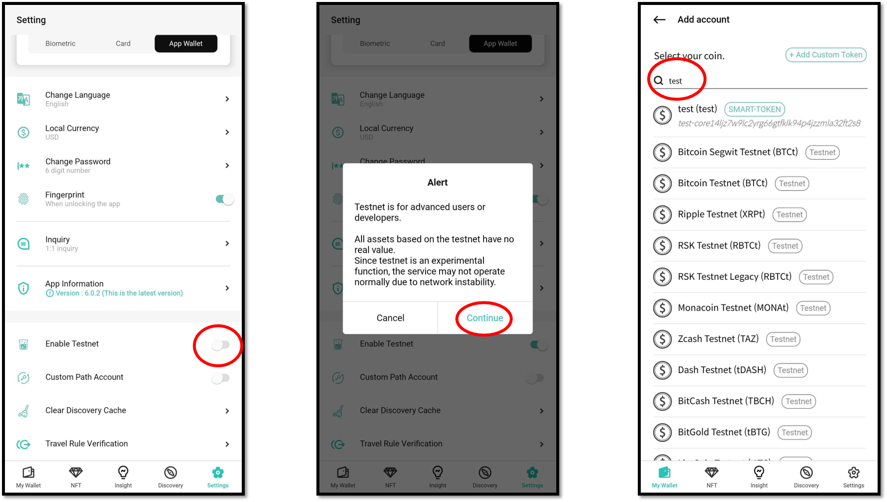

# Mobile App "Settings" menu

You can change various settings of the mobile app from the "Settings" menu.


"Manager" tab has been moved to the "Settings" tab starting from mobile app version 6.0.0 or higher.


## Switch wallet mode

You can switch the wallet mode depending on the wallet you are using.

You can switch the wallet mode by selecting one of **“Biometric”**, **“Card”**, and **“App Wallet(software)”**, and when the wallet mode is switched, the corresponding account information for the mode is retrieved.

<figure><figcaption></figcaption></figure>

Please refer to the link below for information on how to switch wallet mode and use the D'CENT Manager menu for each mode.


[mobile-app-dcent-walletmode](mobile-app-dcent-walletmode/)


## Change Language

"You can change the language of the D'CENT mobile app. Supports the following languages:"

* English
* Korean
* Japanese

<figure><figcaption></figcaption></figure>

## Local Currency

​Set the currency to display coin / token price.

It supports a total of 39 local currencies, including KRW (South Korean Won), USD (United States Dollar), JPY (Japanese Yen), EUR (European Euro), GBP (British Pound Sterling), CNY (Chinese Yuan), and others.\
And it supports BTC (Bitcoin) and ETH (Ethereum) cryptocurrencies.

<figure><figcaption></figcaption></figure>

## Change Password

You can change the 6-digit password of the D'CENT mobile app.

The 6-digit password for the mobile app is the password you registered when initially setting up the app.

<figure><figcaption></figcaption></figure>

## Set additional authentication methods for mobile app

In addition to the 6-digit password, you can also select another method of authenticating to the mobile app. \
\
For Android phones, fingerprint authentication can be set as a method of authentication. \
\
For iPhones, Touch ID or FaceID can be set as a method of authentication.

<figure><figcaption></figcaption></figure>

## How to activate Testnet

**"Enable Testnet"** menu and slide the button to the right to activate the testnet function.

When adding a testnet account to your wallet, simply search for the name of the asset or type 'test' to get a list of all the testnest available.


Testnet is **used by developers for the purpose of testing DApp services.** All assets on the test networks have no monetary value.


<figure><figcaption></figcaption></figure>
