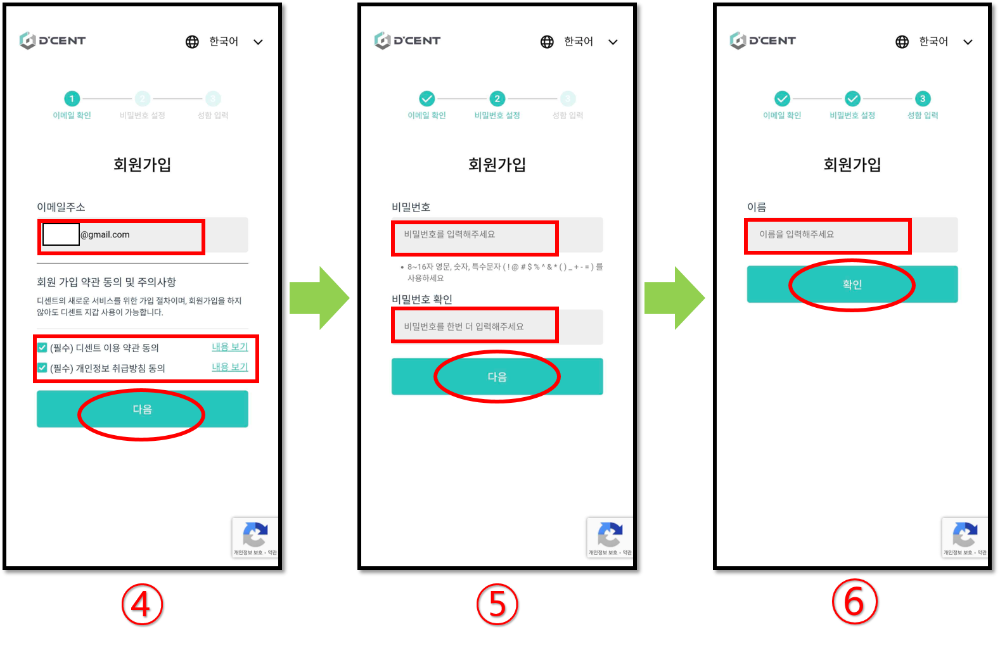
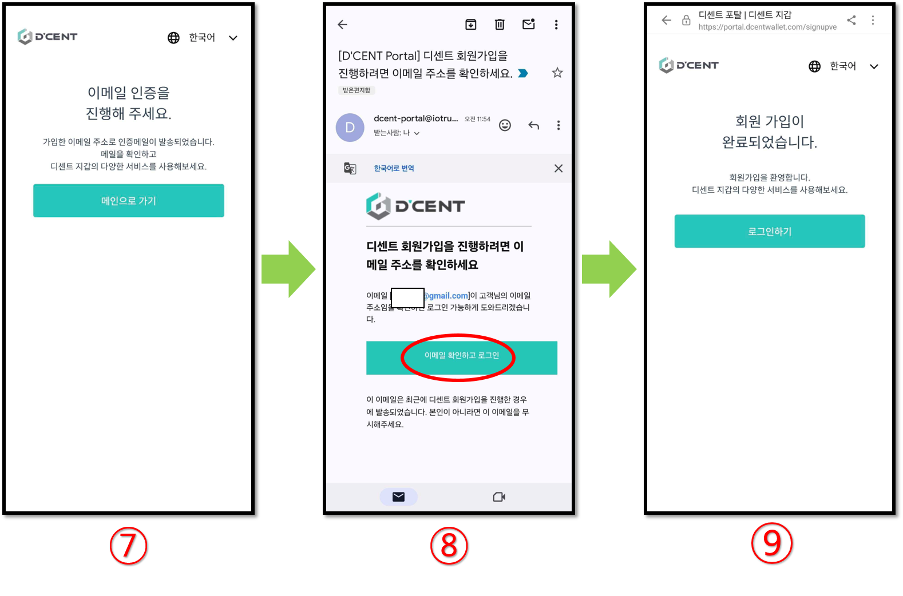

# 거래소 개인 지갑 인증 (이메일 인증 기능)

트래블룰이 적용되는 국내 거래소에서 코인을 입출금 할 때 각 거래소 정책에 따라 개인 지갑 정보 인증이 필요할 수 있습니다.\
이에 디센트 모바일 앱의 거래소 개인 지갑 인증 메뉴를 통해 이메일 인증 기능을 가입하면 관련 인증 작업에 도움이 될 수 있습니다.


국내 거래소의 트래블룰 적용에 따른 개인 지갑 입출금 주소 등록 정책과 입출금 방법은 각 거래소에서 직접 확인하시길 바랍니다.



거래소 개인 지갑 인증은 디센트 사용을 위한 필수 사항은 아니며, **가입 또는 로그인을 하지 않더라도 디센트 지갑의 모든 기능을 사용할 수 있습니다.**


## 거래소 개인 지갑 인증 가입하기

<figure><figcaption></figcaption></figure>

1\) 디센트 모바일 앱 **"Setting"** 탭에서 **"거래소 개인 지갑 인증"** 메뉴를 선택합니다.

2\) **"회원가입"** 버튼을 누릅니다.

3\) 주의사항을 확인한 후 **"동의하고 가입하기"** 버튼을 누릅니다.

<figure><figcaption></figcaption></figure>

4\) 이메일 주소를 입력합니다. 이때 **이메일 주소는 거래소에 가입된 것과 동일**하게 입력해주세요.\
&#x20;    동의 항목을 체크 후 **"다음"** 버튼을 누릅니다.\
&#x20;    _만약 이미 가입되었다면 "중복된 이메일 주소입니다" 라는 팝업이 표시됩니다._

5\) 회원가입에 필요한 비밀번호를 입력합니다.\
&#x20;    동일한 비밀번호를 한번 더 입력하고 **"다음"** 버튼을 누릅니다.

6\) 실명 이름을 입력하고 **"확인"** 버튼을 누릅니다. **거래소에 가입된 성함 정보와 동일**하게 입력해주시길 바랍니다.


거래소 개인 지갑 인증의 회원가입에는 제한이 없습니다. 만약, 거래소마다 다른 이메일 주소를 사용한다면 이메일 주소를 다르게 하여 새로 회원가입을 하실 수 있습니다.


<figure><figcaption></figcaption></figure>

7\) 이메일 인증을 진행해야 한다는 안내가 확인되며, 가입된 이메일 주소로 인증메일이 발송됩니다.

8\) 가입된 이메일 주소의 수신함에서 인증메일을 확인합니다. **"이메일 확인하고 로그인"** 버튼을 누르면 인증이 완료됩니다.

9\) 이제 회원가입을 완료하고 이메일 인증 기능을 로그인 할 수 있습니다.

## 거래소 개인 지갑 인증 로그인하기

<figure><figcaption></figcaption></figure>

1\) 디센트 모바일 앱 **"Setting"** 탭에서 **"거래소 개인 지갑 인증"** 메뉴를 선택합니다.

2\) 가입된 이메일 주소와 비밀번호를 입력하고 **"로그인"** 버튼을 누릅니다.

3\) 로그인을 완료하면 **"거래소 개인 지갑 인증"** 메뉴에 <mark style="color:green;">**"인증됨"**</mark> 아이콘이 표시됩니다.

### 코인 계정 받기 화면에서 로그인된 정보 확인하기

거래소 정책에 따라 개인 지갑 정보 인증과 함께 지갑 주소 확인을 요청할 수 있습니다. 거래소 개인 지갑 인증 메뉴에 로그인을 하면 지갑 주소와 로그인된 정보를 한 화면에서 확인할 수 있습니다.

<figure><figcaption></figcaption></figure>

1\) 모바일 앱의 **"My Wallet"** 탭을 누릅니다.

2\) 거래소에 인증할 코인 계정의 **"Receive(받기)"** 버튼을 누릅니다.

3\) 받기 화면 하단에 **"내 정보"** 항목이 표시되고 로그인 된 사용자 정보가 표시됩니다.

해당 화면을 스크린샷으로 캡쳐하여 거래소로 보내면 관련 인증 작업에 도움이 될 수 있습니다.


반드시 이용하려는 거래소에서 인증 작업에 필요한 요구 사항들을 미리 확인하시고 진행해주시길 바랍니다.


거래소 개인 지갑 인증 메뉴 이용 시 문제가 발생하는 경우에는 아래 트러블 슈팅 가이드를 참고하여 주시길 바랍니다.


[check-points-on-email-verification-error.md](../../troubleshooting/check-points-on-email-verification-error.md)

