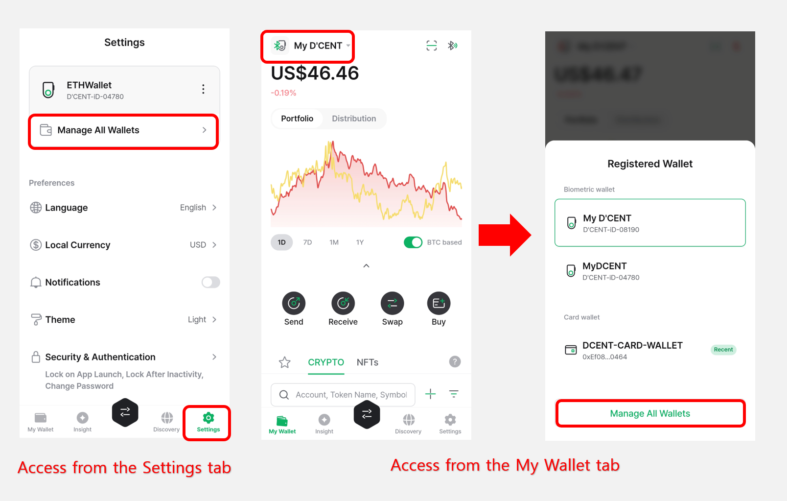

# Manage All Wallets


This guide is based on **D’CENT mobile app version 8.1.0**.


The **Manage All Wallets** menu allows you to easily manage all wallets registered in a single D’CENT mobile app.

## Accessing the Manage All Wallets Menu

You can access the **Manage All Wallets** menu from the **Settings** tab or the **My Wallet** tab in the D’CENT mobile app.

<figure><figcaption></figcaption></figure>

When you open the menu, you will see a list of all wallets currently registered. You can also click the **“+ Add” button** to register additional wallets.

<figure><figcaption></figcaption></figure>

For instructions on how to add each type of wallet, please refer to the user guide below.

* [**Biometric Wallet (Android)**](https://userguide.dcentwallet.com/biometric-wallet/android-connect)
* [**Biometric Wallet (iPhone)**](https://userguide.dcentwallet.com/biometric-wallet/iphone-connect)
* [**Card Wallet (All-in-One Wallet)**](https://userguide.dcentwallet.com/card-wallet/intro/set-up-your-all-in-one-wallet#set-up-the-all-in-one-wallet)
* [**App Wallet (Software)**](https://userguide.dcentwallet.com/mobile-app/mobile-app-setting-menu/mobile-app-dcent-walletmode/software-wallet)

When you click the **More (⋮) button** next to a registered wallet, a management menu will appear.\
From this menu, you can view and configure additional information related to the selected wallet, such as **firmware details**, **backup and recovery**, and more.

<figure><figcaption></figcaption></figure>

## Menu composition for each mode

You can check how to use the Manager menu for each wallet mode in the following sections.


[biometric-wallet.md](biometric-wallet.md)



[card-wallet.md](card-wallet.md)



[software-wallet.md](software-wallet.md)

