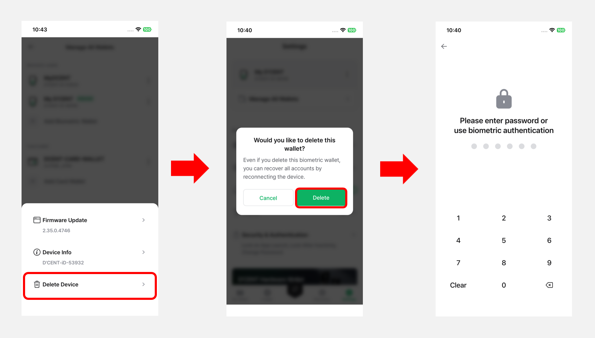

# Biometric Wallet


This guide is based on **D’CENT mobile app version 8.1.0**.


When your **Biometric Cold Wallet** is connected, clicking the **More (⋮) button** in the **Settings** tab will display the following menu, as shown in the image.

<figure><figcaption></figcaption></figure>

## Firmware update

You can check the firmware version of your Biometric Wallet. If the firmware is not up to date, a **“New”** icon will appear to indicate that an update is available.

<figure><figcaption></figcaption></figure>

By pressing the **"Firmware Update"** button, you can check for the latest version and find instructions on how to update.

Click [**here**](../../../biometric-wallet/firmware-update-from-computer/) for more information on firmware updates.

<figure><figcaption></figcaption></figure>


Mobile Firmware update via OTG cable is **only available on the Andorid phones**. Please click [**here**](https://userguide.dcentwallet.com/biometric-wallet/firmware-update-from-mobile) for more details.


## **Device Info**

When you click the **Device Info** menu, you can view your **Biometric Cold Wallet’s** device information, including the **Bluetooth name**, **firmware version**, and **KSM version**.

And you can also change the device name displayed when booting the Biometric Wallet by clicking the **edit icon** next to **“My D’CENT”**.

<figure><figcaption></figcaption></figure>

## Delete Device

**Starting from version 8.1.0 of the D'CENT mobile app**, a **"Delete Device"** option is available for removing registered biometric cold wallets. This feature allows you to delete unused cold wallets directly within the mobile app for better wallet management.

Deleting the device from the app **does not delete any of the private keys associated to the wallet accounts** you have created. You can recover your assets by **reconnecting the device via Bluetooth.**

When you tap the "Delete" button, you will be prompted to authenticate with either your **6-digit mobile app password or biometric verification** to proceed.

<figure><figcaption></figcaption></figure>

