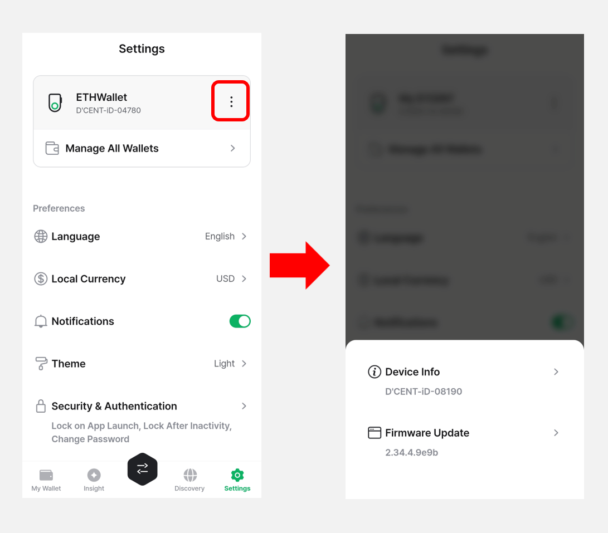
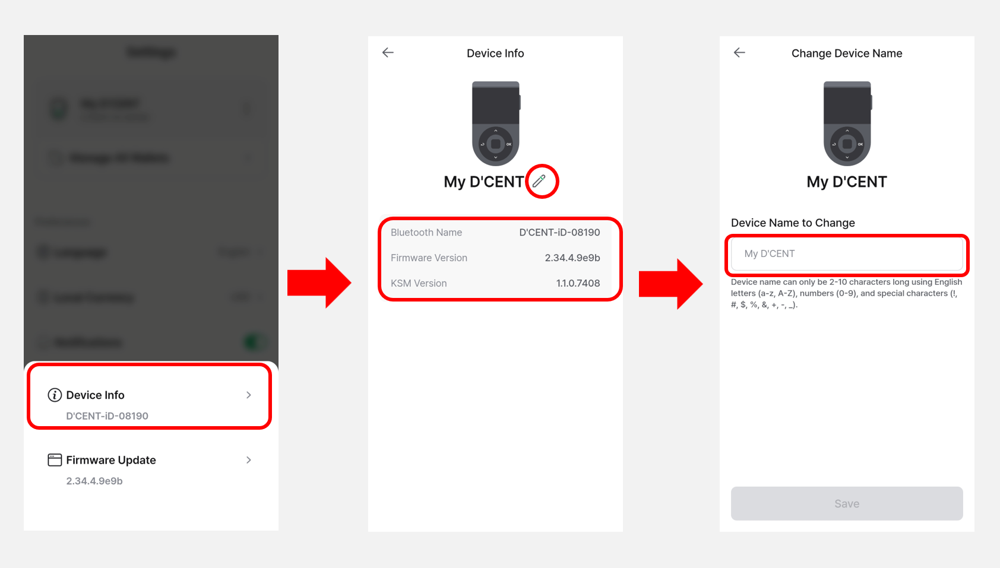
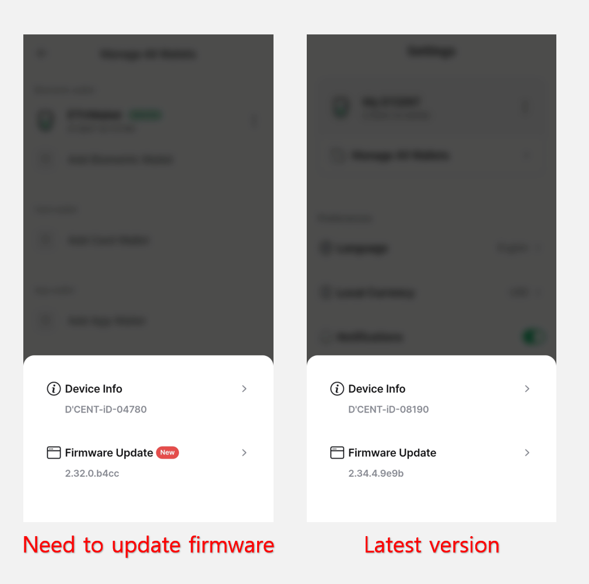
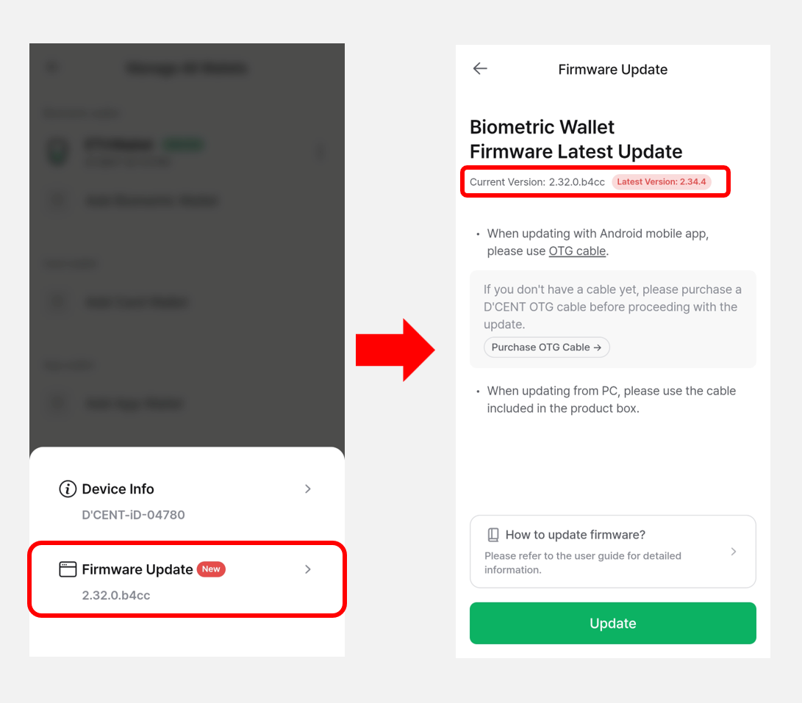

# Biometric Wallet

When your **Biometric Cold Wallet** is connected, clicking the **More (⋮) button** in the **Settings** tab will display the following menu, as shown in the image.

<figure><figcaption></figcaption></figure>

## **Device Info**

When you click the **Device Info** menu, you can view your **Biometric Cold Wallet’s** device information, including the **Bluetooth name**, **firmware version**, and **KSM version**.

And you can also change the device name displayed when booting the Biometric Wallet by clicking the **edit icon** next to **“My D’CENT”**.

<figure><figcaption></figcaption></figure>

## Firmware update

You can check the firmware version of your Biometric Wallet. If the firmware is not up to date, a **“New”** icon will appear to indicate that an update is available.

<figure><figcaption></figcaption></figure>

By pressing the **"Firmware Update"** button, you can check for the latest version and find instructions on how to update.

Click [**here**](../../../biometric-wallet/firmware-update-from-computer/) for more information on firmware updates.

<figure><figcaption></figcaption></figure>


Mobile Firmware update via OTG cable is **only available on the Andorid phones**. Please click [**here**](https://userguide.dcentwallet.com/biometric-wallet/firmware-update-from-mobile) for more details.

