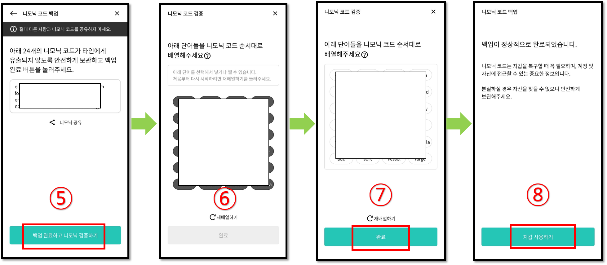
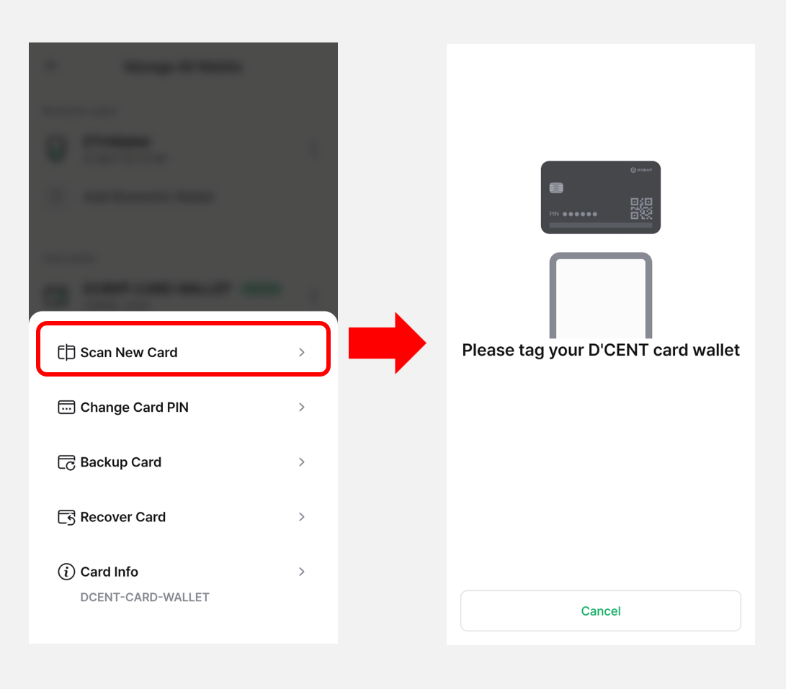
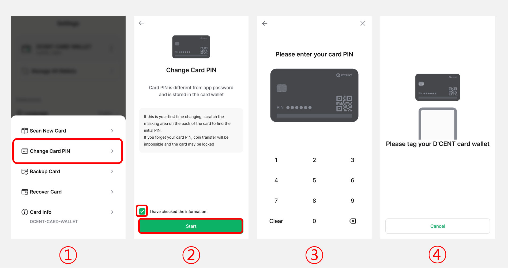
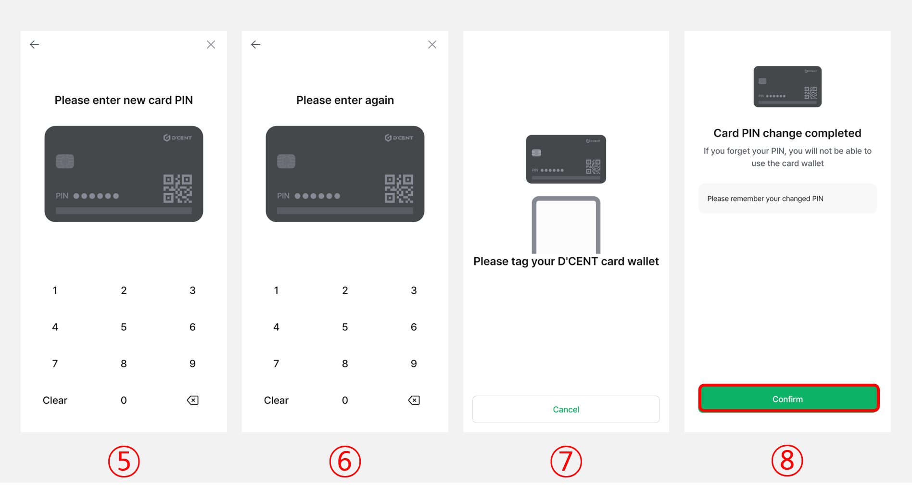
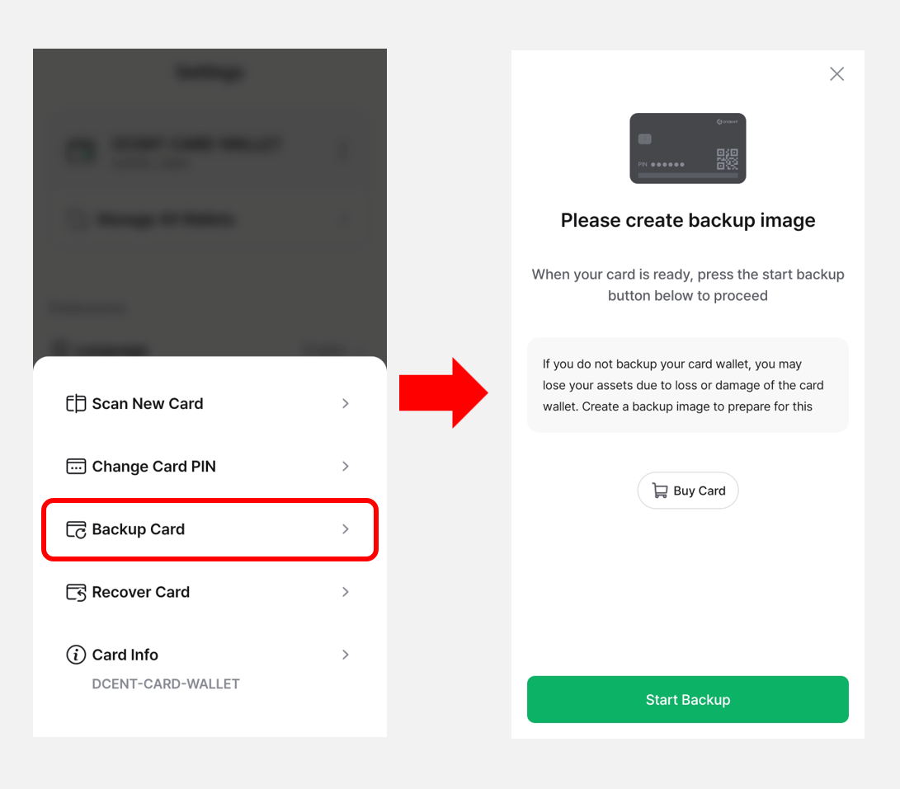
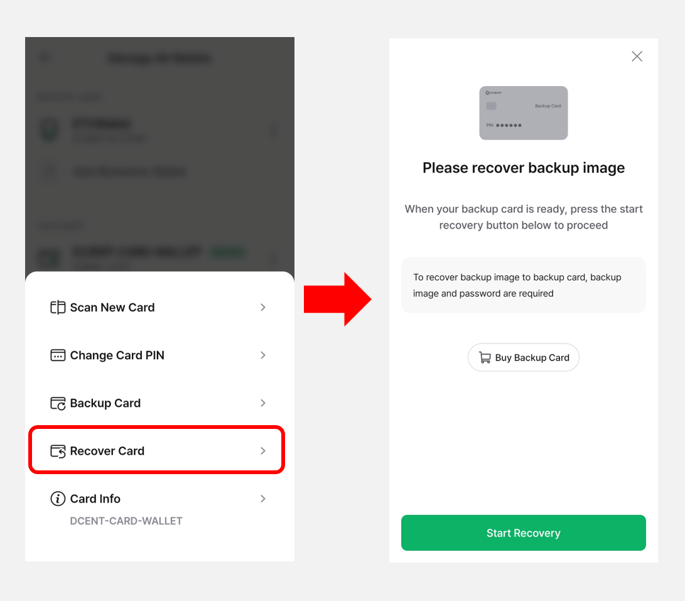

# Card Wallet (All-in-One Wallet)

When your **Card Wallet** is connected, clicking the **More (⋮) button** in the **Settings** tab will display the following menu, as shown in the image.

<figure><figcaption></figcaption></figure>

## Scan new card

You can change the Card Wallet you want to use through the **"Scan new card"** menu.

Click the **"Scan new card"** menu and tag the another Card Wallet.

<figure><figcaption></figcaption></figure>

## Change Card PIN


Click [**here**](https://userguide.dcentwallet.com/card-wallet/intro/set-up-your-all-in-one-wallet#change-the-factory-pin-to-your-own-pin) for more information how to change the factory PIN to your own PIN.


You can change the **6-digit PIN** of your currently used Card Wallet in the **“Change Card PIN”** menu.

Please follow the steps below to change your PIN:

<figure><figcaption></figcaption></figure>

**1)** Select the **“Change Card PIN”** menu.

**2)** Check **“I have checked the information”**, then click the **“Start”** button.

**3)** Enter your **current card PIN**.

**4)** **Tag the Card Wallet** to your mobile phone.

<figure><figcaption></figcaption></figure>

**5)** Enter a **new 6-digit PIN.**

**6)** Re-enter the **new PIN** to confirm.

**7)** **Tag the Card Wallet** again to apply the change.

**8)** Click the **“Confirm”** button to complete the PIN change process.


**If you lose your PIN, use of your card wallet may be blocked.**


## Backup Card

You can create a **backup image** of your Card Wallet to prepare for cases where the card is lost, damaged, or becomes unusable due to more than 10 failed PIN attempts.


**Creating a backup is strongly recommended to protect your assets.**


<figure><figcaption></figcaption></figure>

Click [**here**](https://userguide.dcentwallet.com/card-wallet/dcent-backup-card-wallet-recovery/step-2-create-backup-image) for detailed instructions on how to back up your Card Wallet.

## Recover Card

If your Card Wallet is lost, damaged, or locked after 10 or more failed PIN attempts, you can **restore the backup image** using a **Backup Card**.


**A Backup Card is required to perform the recovery.**


<figure><figcaption></figcaption></figure>

Click [**here**](https://userguide.dcentwallet.com/card-wallet/dcent-backup-card-wallet-recovery/step-3-recover-backup-image) for detailed instructions on how to recover your Card Wallet.

## Card Info

When you click the **"Card Info"** menu, you can view the Card Wallet address, number of available backups, and other details about the cardwallet.\
If a backup card is scanned, the message **"This is a backup card."** will be displayed.

And you can change the card name displayed in the **"My Wallet"** tab.

<figure><figcaption></figcaption></figure>
