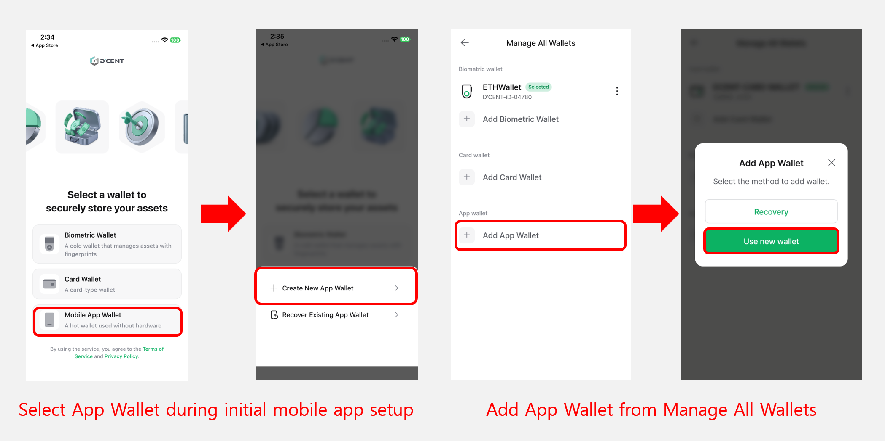
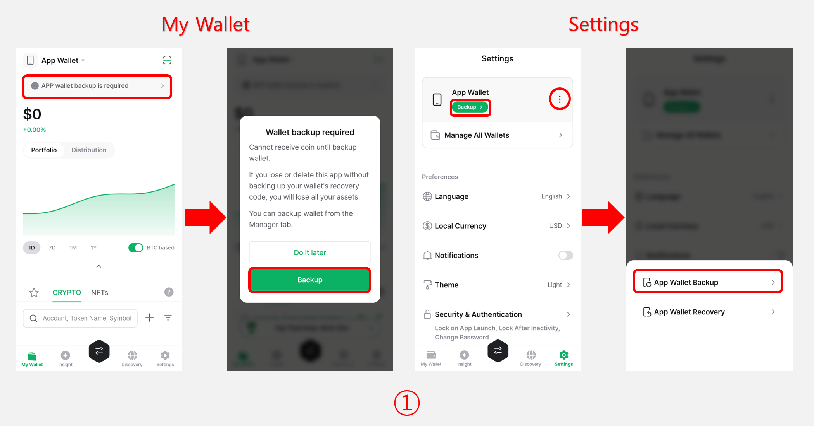
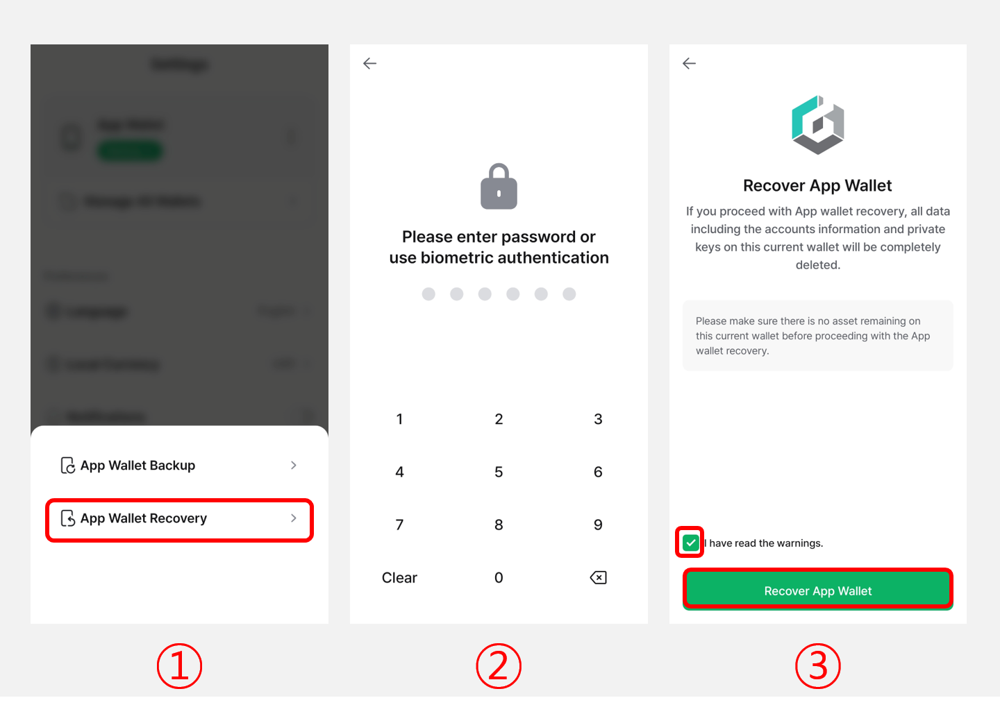
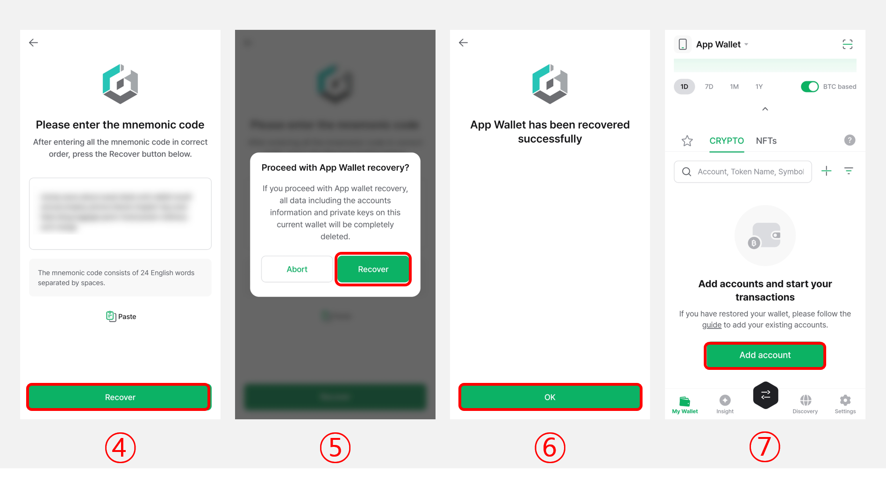

# App Wallet (Software)

## Using the App Wallet

You can start using the App Wallet by selecting **"Mobile App Wallet"** when you first launch the D'CENT mobile app after installation.

Alternatively, if you are already using a cold wallet (Biometric Wallet or Card Wallet), you can also add an App Wallet by going to **"Settings > Manage All Wallets"** and selecting **"Add App Wallet"**.

<figure><figcaption></figcaption></figure>

## App Wallet Backup

When you first use the App Wallet, **a message indicating the required backup (24 mnemonic code)** for the App Wallet will be displayed.\
In the D'CENT mobile app, a message indicating the required for backup is displayed at the top of the **"My Wallet"** tab, when adding a cryptocurrency account, and in the **"Settings"** tab.

**Therefore, you must back up the 24 mnemonic code of the App Wallet and store it in a safe place.**


**If you delete the D'CENT mobile app or lose your mobile phone without backing up the mnemonic code, you will lose all your coins in the software wallet.**


**Please proceed in the following order to back up your wallet.**

<figure><figcaption></figcaption></figure>

**1)** Tap the **"Backup"** button on the top banner of the **"My Wallet"** tab, or go to the **"Settings"** tab and tap **"App Wallet backup"** to access the backup screen.

<figure><figcaption></figcaption></figure>

**2)** Please enter the **6-digit password** for the mobile app. (If biometric authentication is enabled in the mobile app, you can use it instead of entering the password.)

**3)** Read the warning and tick the box. Press the **“Backup mnemonic code”** butto&#x6E;**.**

**4)** After checking the warning pop-up for sensitive information, press the **"OK"** button.

**5)** **Write down all 24 words** in the exact order as shown on your screen.  You can also use the **"Copy to clipboard"** button to save temporarily in the clipboard. Press **"Verify mnemonic code"** button  to continue.&#x20;


**For secure asset management, be sure to write down your mnemonic code and store it in an offline environment, such as a notebook.**


<figure><figcaption></figcaption></figure>

**6)** Check the mnemonic code you wrote down, select the words displayed on the screen, and rearrange the mnemonic code in order.

**7)** When you have completed verifying by correctly rearranging the 24 mnemonic codes, press the **"Complete"** button.

**8)** Press the **"Go to My Wallet tab"** button to complete the backup.

**9)** Now, you can tap the **"Add Account"** button to add the necessary **coin accounts**.&#x20;

For detailed instructions on **adding coin accounts**, click [**here**](https://userguide.dcentwallet.com/mobile-app/create-account).

## App Wallet Recovery 

You can recover your wallet by using the mnemonic code (24 recovery words).

**Please proceed in the following order**

<figure><figcaption></figcaption></figure>

**1)** Select **"App Wallet Recovery"** from the Manage All Wallets menu.

**2)** Please enter the **6-digit password** for the mobile app. (If biometric authentication is enabled in the mobile app, you can use it instead of entering the password.)

**3)** Read the warning and tick the box. Press the **"Recover App Wallet"** button to continue.

<figure><figcaption></figcaption></figure>

**4)** **Enter all 24 words** in the exact order as you have written down. You can also use the "**Paste"** button to paste in the information from the clipboard. After double-checking that the entered words are correct, press **"Recover"**

**5)** Press the **"Recover"** button to proceed with the wallet recovery.

**6)** Tap **"OK"** to complete the recovery process.

**7)** After completing the recovery, you need to re-add your existing accounts to check your balances.\
Tap the **"Add account"** button to add the accounts you previously managed.


The mnemonic code from your software wallet can also be used to recover your wallet on the Biometric hardware wallet. \
\
Click here for more information about [**recovering your wallet**](../../../biometric-wallet/recovery/) on Biometric Wallet.


### Important notes after recovering your wallet


[notes-on-wallet-recovery.md](../../../troubleshooting/notes-on-wallet-recovery.md)


