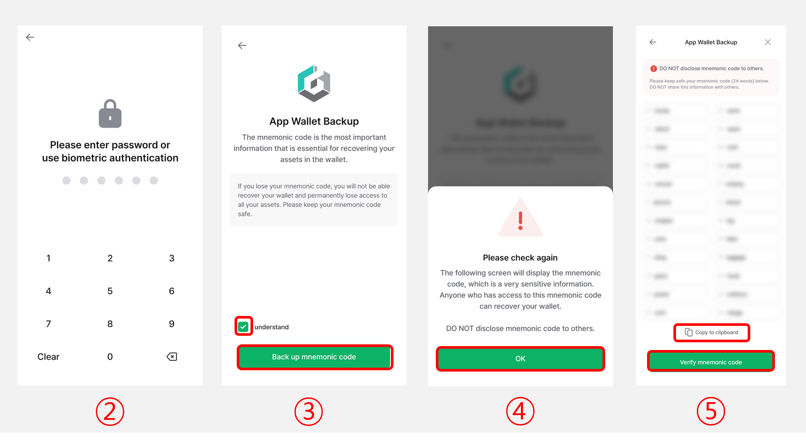
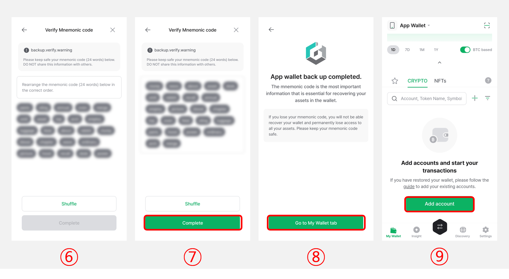
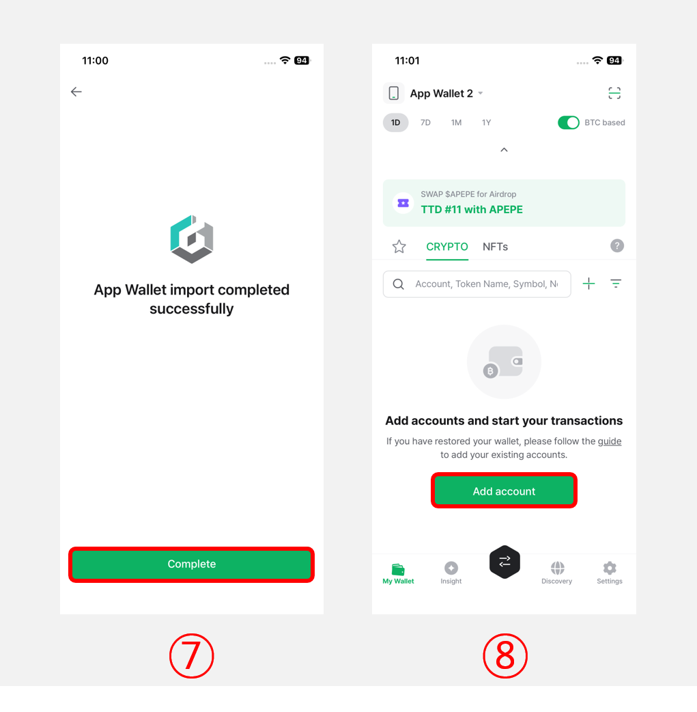
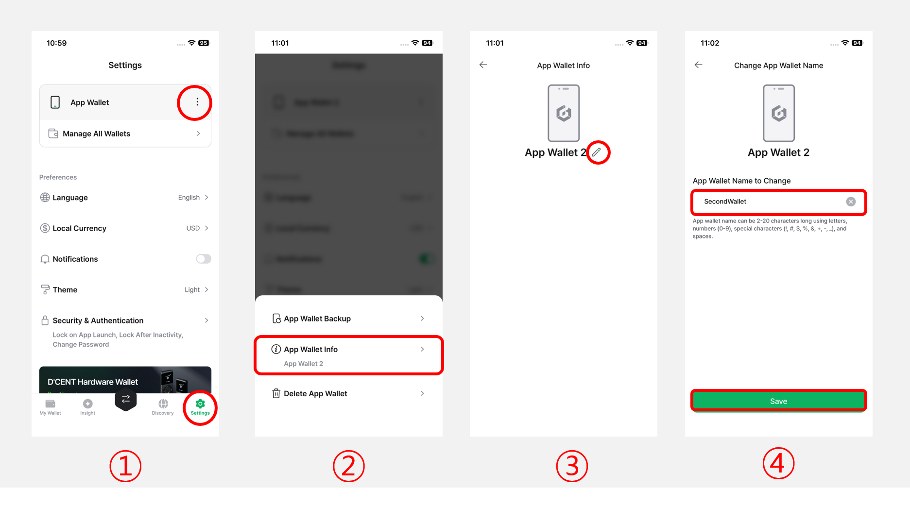
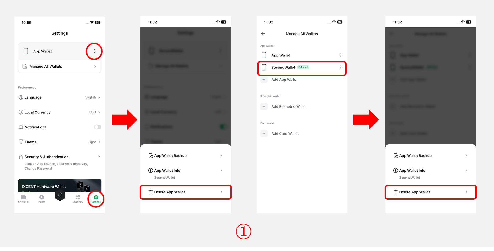
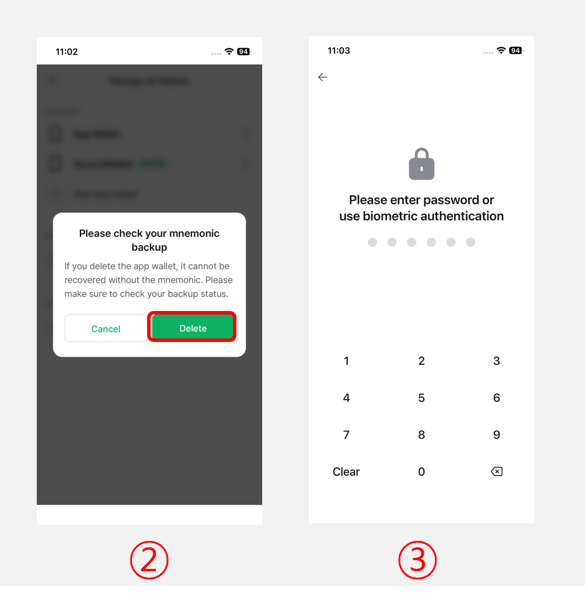

# App Wallet (Software)


This guide is based on **D’CENT mobile app version 8.0.0**.

**Please update the D'CENT mobile app to the latest version before using it.**


## Using the App Wallet

You can start using the App Wallet by selecting **"Mobile App Wallet"** when you first launch the D'CENT mobile app after installation.

Alternatively, if you are already using a cold wallet (Biometric Wallet or Card Wallet), you can also add an App Wallet by going to **"Settings > Manage All Wallets"** and selecting **"Add App Wallet"**.

<figure><figcaption></figcaption></figure>

## App Wallet Backup

When you first use the App Wallet, **a message indicating the required backup (24 mnemonic code)** for the App Wallet will be displayed.\
In the D'CENT mobile app, a message indicating the required for backup is displayed at the top of the **"My Wallet"** tab, when adding a cryptocurrency account, and in the **"Settings"** tab.

**Therefore, you must back up the 24 mnemonic code of the App Wallet and store it in a safe place.**


**If you delete the D'CENT mobile app or lose your mobile phone without backing up the mnemonic code, you will lose all your coins in the software wallet.**


**Please proceed in the following order to back up your wallet.**

<figure><figcaption></figcaption></figure>

**1)** Tap the **"Backup"** button on the top banner of the **"My Wallet"** tab, or go to the **"Settings"** tab and tap **"App Wallet backup"** to access the backup screen.

<figure><figcaption></figcaption></figure>

**2)** Please enter the **6-digit password** for the mobile app. (If biometric authentication is enabled in the mobile app, you can use it instead of entering the password.)

**3)** Read the warning and tick the box. Press the **“Backup mnemonic code”** butto&#x6E;**.**

**4)** After checking the warning pop-up for sensitive information, press the **"OK"** button.

**5)** **Write down all 24 words** in the exact order as shown on your screen.  You can also use the **"Copy to clipboard"** button to save temporarily in the clipboard. Press **"Verify mnemonic code"** button  to continue.&#x20;


**For secure asset management, be sure to write down your mnemonic code and store it in an offline environment, such as a notebook.**


<figure><figcaption></figcaption></figure>

**6)** Check the mnemonic code you wrote down, select the words displayed on the screen, and rearrange the mnemonic code in order.

**7)** When you have completed verifying by correctly rearranging the 24 mnemonic codes, press the **"Complete"** button.

**8)** Press the **"Go to My Wallet tab"** button to complete the backup.

**9)** Now, you can tap the **"Add Account"** button to add the necessary **coin accounts**.&#x20;

For detailed instructions on **adding coin accounts**, click [**here**](https://userguide.dcentwallet.com/mobile-app/create-account).


The mnemonic code from your software wallet can also be used to recover your wallet on the Biometric hardware wallet. \
\
Click here for more information about [**recovering your wallet**](../../../biometric-wallet/recovery/) on Biometric Wallet.


## Using Multi App Wallet

Starting from D’CENT Mobile App version **v8.1.0**, the **Multi App Wallet** feature allows you to add new App Wallets even if you are already using an existing App Wallet.

You can add a new App Wallet by selecting **"Add App Wallet" > "Create New Wallet"**, or import an existing wallet by selecting **"Import Wallet"** and entering the mnemonic phrase.


**Note:** You can add **up to 100 App Wallets** using the Multi App Wallet feature.


### Import Wallet

Starting from D'CENT mobile app version 8.1.0, the **"Recover Wallet"** menu has been renamed to **"Import Wallet"**.

The **Import Wallet** feature allows you to import **not only 24-word mnemonic codes generated by the D'CENT wallet**, but also **12 or 24-word mnemonic codes generated from external wallets.**

**You can import a wallet by following the steps below:**

<figure><figcaption></figcaption></figure>

**1)** Click the **"Settings > Manage All Wallets"** men&#x75;**.**

**2)** Select the **"Add App Wallet"**.

**3)** Click the **"Import wallet"** menu.

<figure><figcaption></figcaption></figure>

**4)** Please enter the **6-digit password** for the mobile app. (If biometric authentication is enabled in the mobile app, you can use it instead of entering the password.)

**5)** Read the warning and tick the box. Press the **"Start"** button to continue.

**6)** **Enter all 24 words of the mnemonic code in the exact order as you have written down.** You can also enter **12 or 24 words from an external wallet’s mnemonic code.**

You can also use the "**Paste"** button to paste in the information from the clipboard.&#x20;

After double-checking that the entered words are correct, press **"Import Wallet"**

<figure><figcaption></figcaption></figure>

**7)** Press the **"Complete"** button to proceed with the import wallet.

**8)** After completing the recovery, you need to re-add your existing accounts to check your balances.\
Tap the **"Add account"** button to add the accounts you previously managed.

### Important Notes When Adding an Account

#### **Legacy Account Notice**

Starting from Mobile App version **v5.3.1**, for assets that use **Ethereum-format addresses** such as **Kaia**, **Ethereum Classic**, and **RSK**, the app has been updated to generate accounts that use the _same address format as Ethereum_ when creating a new account.

**Please refer to the guide below for more details.**


[notes-on-wallet-recovery.md](../../../troubleshooting/notes-on-wallet-recovery.md)


#### **If assets are not visible after recovering from an external wallet's mnemonic code**

If you restore a wallet using a mnemonic code from an external wallet but find that the address is different and assets are not visible, you may need to enable the **Custom Path Account** feature and manually add the corresponding **"Vendor Lock-In"** account.

For detailed instructions on **Vendor Lock-In accounts**, click [**here**](https://userguide.dcentwallet.com/mobile-app/create-account/how-to-add-a-custom-path-account#add-a-vendor-lock-in-account).

## Change App Wallet Name

From the **App Wallet Info** menu, you can rename your App Wallet. When managing multiple App Wallets, you can manage them more efficiently by changing the wallet name based on each wallet’s purpose or owner.\
(e.g., **Wallet01, BTConly, MyAssets, ETHwallet, etc.**)

**Please proceed in the following order to change the App Wallet name.**

<figure><figcaption></figcaption></figure>

**1)** From the **"Settings"** tab of the D'CENT mobile app, click the **"More (⋮)"** button.

**2)** Select the **"App Wallet Info"** menu.

**3)** Click the **"edit icon".**

**4)** Enter the new name in the field and click the **"Save"** button.

## Delete App Wallet

If you have an App Wallet that is no longer in use, you can delete it from the **Delete App Wallet** menu.


**Important**: Before deleting an App Wallet, **make sure the mnemonic code has been backed up**.\
If the App Wallet is deleted without the backup, all assets may be permanently lost.


**Please proceed in the following order to delete your App Wallet.**

<figure><figcaption></figcaption></figure>

**1)** From the "**Settings"** tab of the D'CENT mobile app, click the "**More (⋮)"** button and select "**Delete App Wallet"** menu. Or go to the **"Manage All Wallets"** menu, **select the App Wallet you want to delete**, and then click **"Delete App Wallet"** menu.&#x20;

<figure><figcaption></figcaption></figure>

**2)** A confirmation message will appear. **Make sure your mnemonic backup is complete**, then cilck the **"Delete"** button.

**3)** Enter the **6-digit password** for the mobile app or use biometric authentication to complete the deletion.
