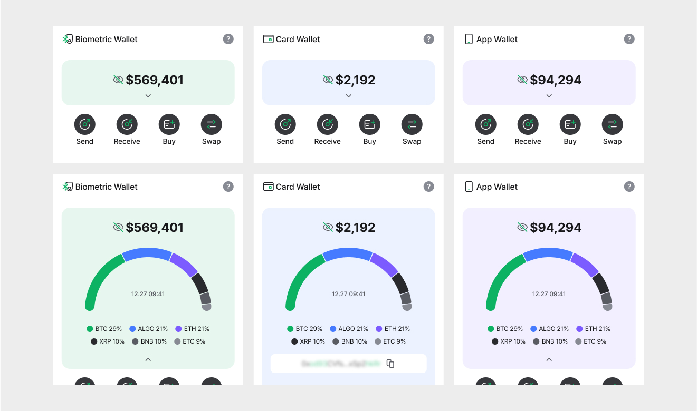

# Switch wallet mode

D'CENT allows easy and convenient management of Cold wallets (Biometric, Card type) or Software wallets (App wallet) through a one mobile app.

## Switching wallet mode

You can switch the wallet mode by selecting the **"Switch wallet mode"** menu in the **"Settings"** tab. \
\
D'CENT mobile app manages each account information from each wallet mode separately, and when the wallet mode is switched, the corresponding account information for the mode is retrieved.

<figure><figcaption></figcaption></figure>

For each wallet mode, the **"My Wallet"** tab screen and the **"Settings"** tab screen are as shown in the images below

<figure><figcaption></figcaption></figure>

## Menu composition for each mode

You can check how to use the Manager menu for each wallet mode in the following sections.


[biometric-wallet.md](biometric-wallet.md)



[card-wallet.md](card-wallet.md)



[software-wallet.md](software-wallet.md)

