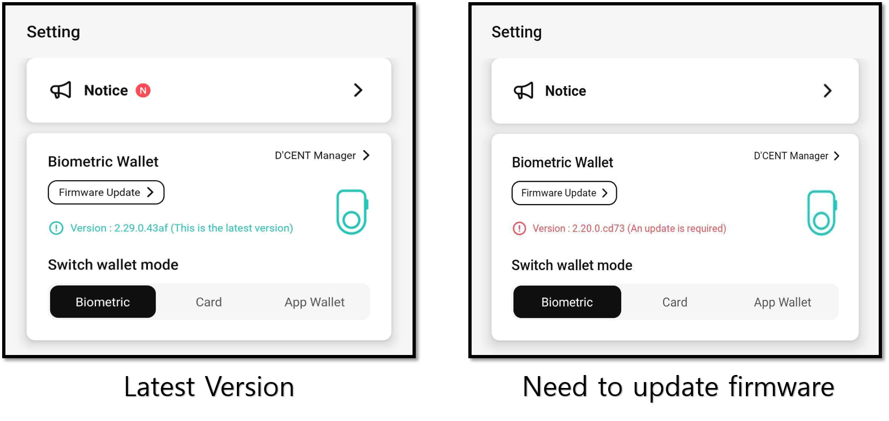
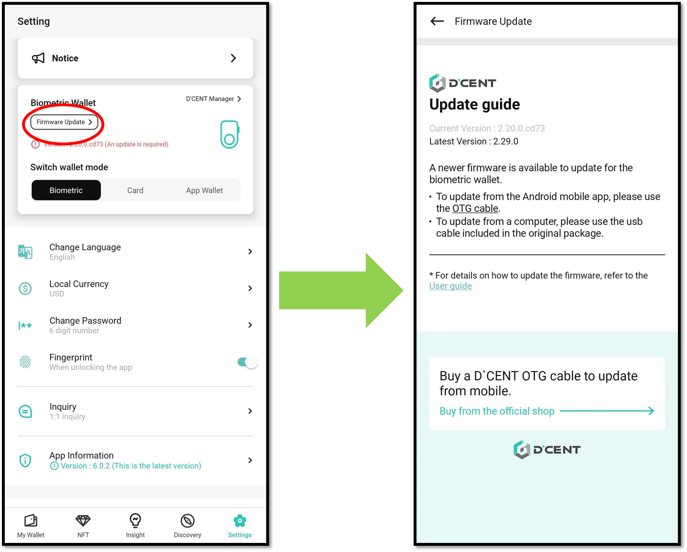
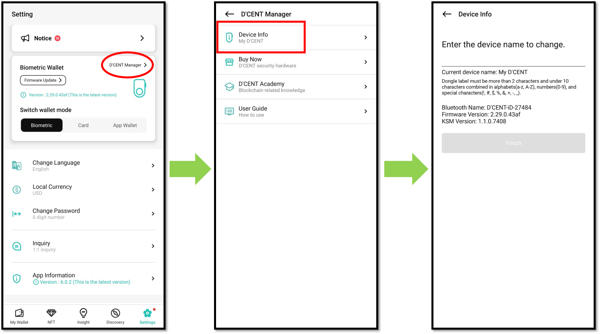

# Biometric Wallet

## Check firmware version

You can check the Biometric Wallet firmware version. If the firmware is not up-to-date, you will be informed about the firmware update.

By pressing the **"Firmware Update"** button, you can check for the latest version and find instructions on how to update.

Click [**here**](../../../biometric-wallet/firmware-update-from-computer/) for more information on firmware updates.

<figure><figcaption></figcaption></figure>

## Check Device Information

Select the **"D'CENT Manager Menu"** and press the **"Device Info"** menu to check the device information of the Biometric wallet.

And You can change the device name displayed when booting the Biometric wallet

