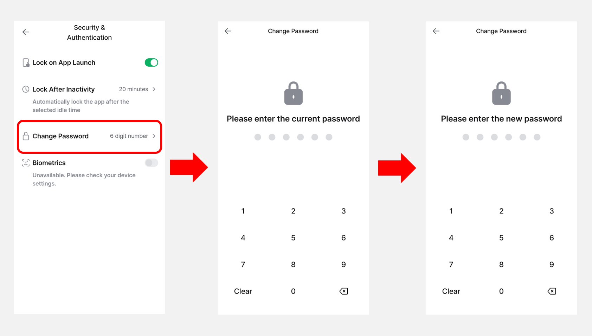
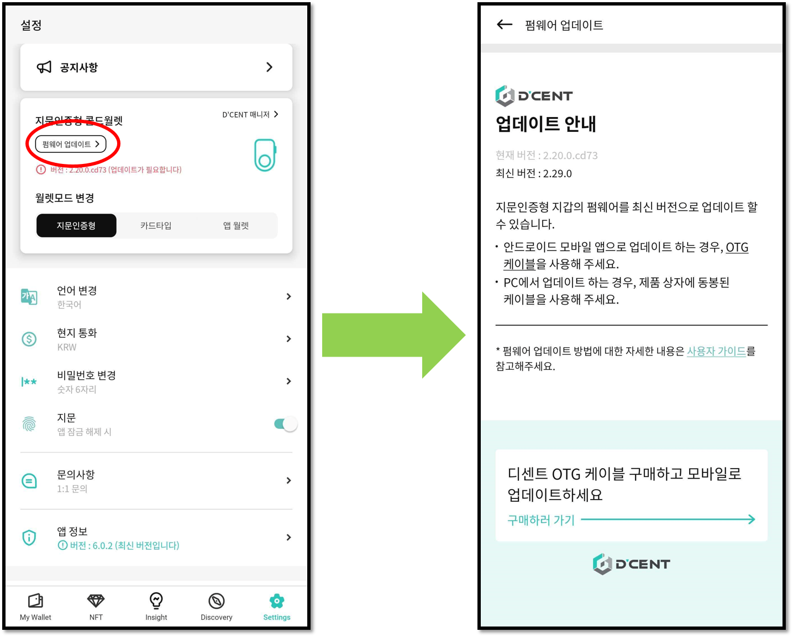
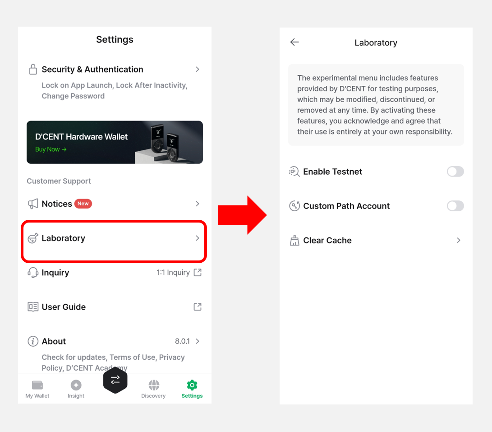

# 지문인증형 콜드월렛

## 펌웨어 버전 확인 

지문인증형 콜드월렛의 펌웨어 버전을 확인할 수 있습니다. 콜드월렛의 펌웨어가 최신이 아닌 경우 펌웨어 업데이트가 필요하다는 안내가 나타납니다.

**"펌웨어  업데이트"** 버튼을 누르면 최신 버전 안내와 함께 업데이트 방법을 확인할 수 있습니다.

펌웨어 업데이트에 대한 자세한 내용은 [**여기**](../../../biometric-wallet/firmware-update-from-computer/)를 참고하세요.

<figure><figcaption></figcaption></figure>


OTG 케이블을 통한 모바일 앱에서 업데이트는 안드로이드 휴대폰에서만 지원합니다.


## 콜드월렛 기기 정보 확인 

**"D'CENT 매니저 메뉴"**&#xB97C; 선택하고 **"기기 정보"** 메뉴를 누르면  지문인증형 콜드월렛 기기 정보를 확인할 수 있습니다.

또한 지문인증형 콜드월렛을 부팅할 때 표시되는 기기이름도 변경할 수 있습니다.

