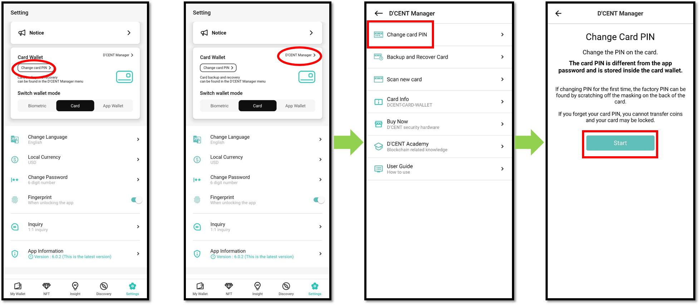
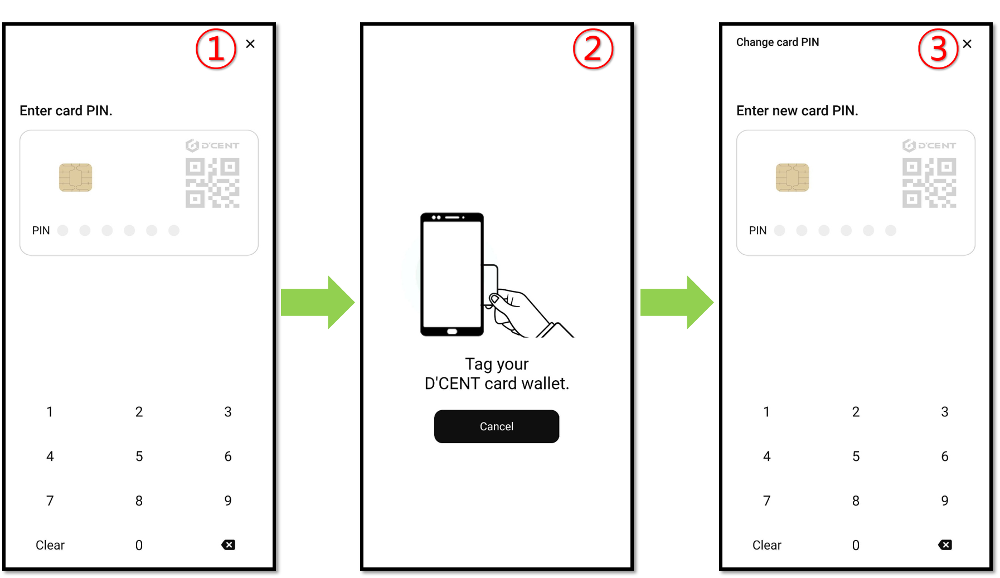
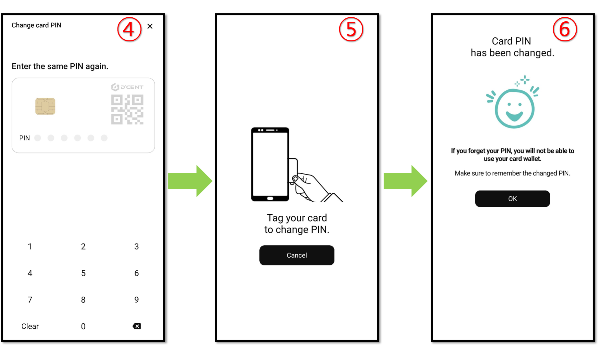
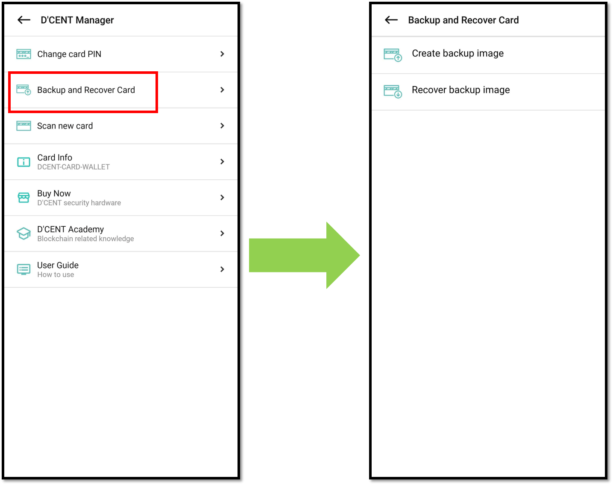
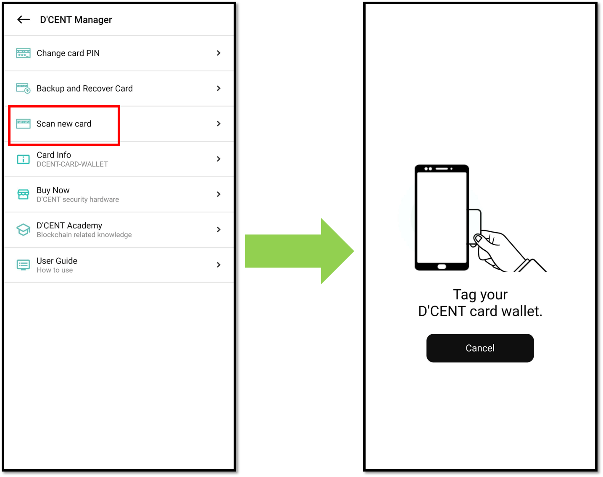

# Card type Wallet

## Change Card PIN

Click [**here**](https://userguide.dcentwallet.com/card-wallet/intro/set-up-your-all-in-one-wallet#change-the-factory-pin-to-your-own-pin) for more information how to change the factory PIN to your own PIN.

To change your current PIN to a new PIN, press the **"Change Card PIN"** button in the **"Settings"** tab or select the **"D'CENT Manager > Change Card PIN"** menu.

<figure><figcaption></figcaption></figure>

**Please proceed in the following order.**\
\
1\) Enter your current card PIN number&#x20;

2\) Tag the Card Wallet on your mobile phone

3\) Enter a new PIN number&#x20;

4\) Enter the new PIN number once more&#x20;

5\) Tag the Card Wallet on your mobile phone to change PIN

6\) Now the PIN number change has been completed.

<figure><figcaption></figcaption></figure>


**If you lose your PIN, use of your card wallet may be blocked.**


## Backup and Recover Card

You can create and recover a backup image of the Card Wallet.

Be sure to create a backup image in case the card wallet is lost or damaged, or Card Wallet use is blocked due to PIN authentication failures more than 10 times.

Click [**here**](https://userguide.dcentwallet.com/card-wallet/dcent-backup-card-wallet-recovery) for more information how to backup and recover Card Wallet.

<figure><figcaption></figcaption></figure>

## Scan new card

You can change the Card Wallet you want to use through the **"Scan new card"** menu.

Click the "Scan new card" menu and tag the another Card Wallet.

<figure><figcaption></figcaption></figure>
