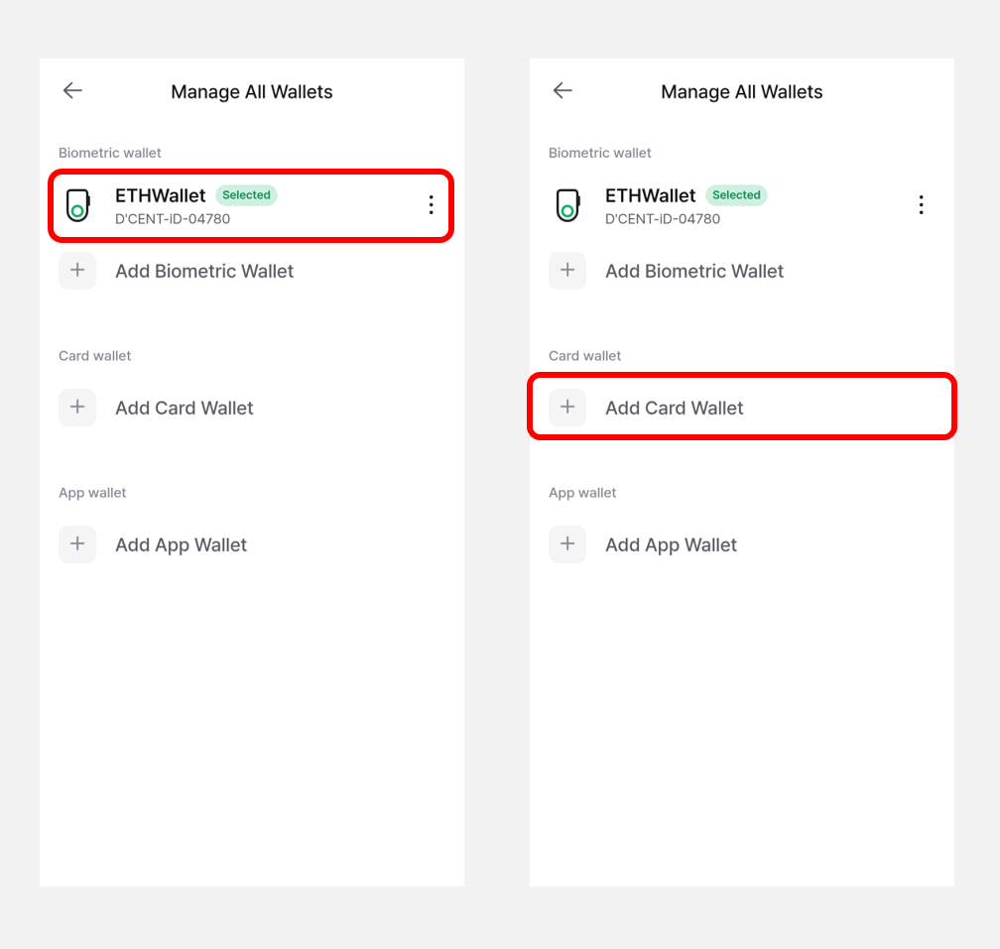
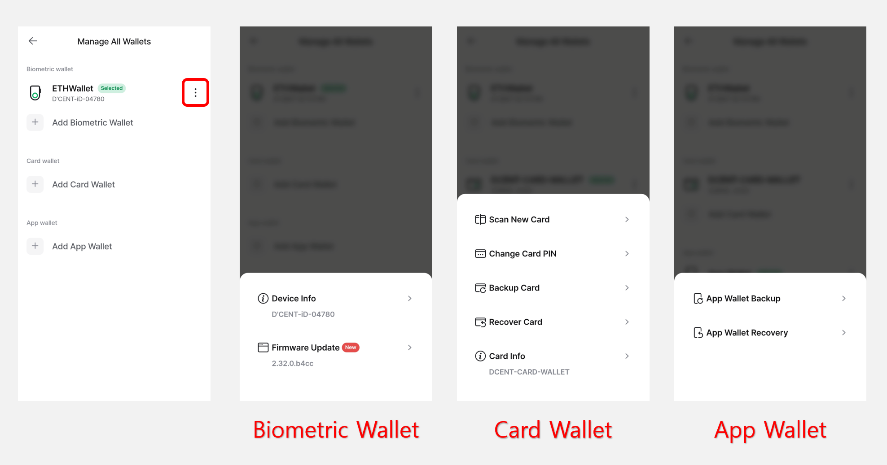

# 카드타입 콜드월렛

## 카드 PIN 변경

새 카드의 공장 초기 PIN 을 사용자 본인의 PIN 으로 변경하는 방법은 [**여기**](../../../card-wallet/intro/set-up-your-all-in-one-wallet.md#undefined-4)를 참고하시기 바랍니다.

사용 중인 PIN 을 새 PIN 으로 변경을 하려면 **"Setting"** 탭의 **"카드 PIN 변경"**  버튼 혹은 **"D'CENT Manager > 카드 PIN 변경"** 을 선택하여 변경할 수 있습니다.

<figure><figcaption></figcaption></figure>

**PIN 변경은 다음의 순서로 진행해주세요.**

1\) 현재 사용 중인 PIN 번호를 입력해주세요.

2\) 카드타입 콜드월렛을 휴대폰에 태깅합니다.

3\) 새로운 PIN 번호를 입력해주세요.

4\) 새로운 PIN 번호를 한번 더 입력해주세요.

5\) PIN 변경을 위해 카드타입 콜드월렛을 한번 더 휴대폰에 태깅합니다.&#x20;

6\) 이제PIN 번호 변경이 완료 되었습니다.

<figure><figcaption></figcaption></figure>

<figure><figcaption></figcaption></figure>


**PIN 을 분실할 경우 카드타입 콜드월렛 사용이 차단될 수 있습니다.**


## 카드 백업 및 복구

카드타입 콜드월렛을 분실 및  파손되거나 PIN 인증을 10회 이상 실패하여 사용이 차단될 경우에 대비하기 위해 카드타입 콜드월렛의 백업 이미지를 생성하고 복구할 수 있습니다.

<figure><figcaption></figcaption></figure>

자세한 방법은 [**여기**](../../../card-wallet/dcent-backup-card-wallet-recovery/)를 참고하여 주시기 바랍니다.

## 새 카드 스캔

**"D'CENT 매니저 메뉴" 를** 선택하고 **"새 카드 스캔"** 메뉴를 통해 다른 카드타입 콜드 월렛으로 변경할 수 있습니다.

"새 카드 스캔" 메뉴를 누르고 카드타입 콜드월렛을 휴대폰에 태깅하시면 됩니다.

<figure><figcaption></figcaption></figure>

