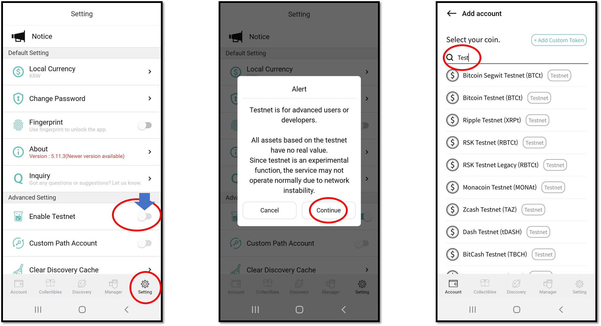

# 테스트넷 활성화하는 방법

테스트넷은 개발자 및 디앱(DApp) 서비스 테스트를 목적으로 사용되며 네트워크의 모든 테스트용 자산은 금전적 가치가 없습니다.

디센트 모바일 앱에서 테스트넷을 사용하기 위해서는 앱의 오른쪽 하단 "설정(Setting)" 메뉴에서 "테스트넷 활성화" 메뉴를 켜주셔야 합니다.

'테스트넷 활성화' 메뉴를 찾은 후 버튼을 오른쪽으로 밀어 테스트넷 기능을 활성화합니다.

지갑에 테스트넷 계정을 추가할 때 자산 이름을 검색하거나 'test'를 입력하면 사용 가능한 모든 테스트넷 목록이 표시됩니다.
