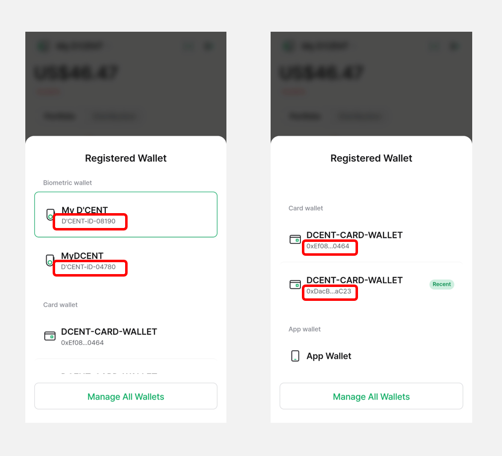

# Multi-Wallet Feature

Starting from **D'CENT Mobile App version 7.5.1**, the **"Multi-Wallet"** feature is now available.

With this new feature, you can easily manage different wallet modes—**Biometric Wallet, Card Wallet**, and **App Wallet**—as well as **multiple Cold Wallets(Biometric Wallet, Card Wallet)** directly from the updated My Wallet tab.

To use the Multi-Wallet feature, **please update your D'CENT Mobile App to the latest version.**



## Wallet Management Button

You can easily switch to another wallet by clicking the **“Wallet Management” button (Registered Wallets)** at the top left of the **My Wallet** tab.

<figure><figcaption></figcaption></figure>

When you press the **"Wallet Management Button",** the following will be displayed depending on the registered wallet:

<figure><figcaption></figcaption></figure>

If no wallets are registered, or if you want to add another wallet (Biometric Wallet, Card Wallet, or App Wallet), you can do so by clicking the **“Manage All Wallets”** button.

<figure><figcaption></figcaption></figure>

For instructions on how to add each type of wallet, please refer to the user guide below.

* [**Biometric Wallet (Android)**](https://userguide.dcentwallet.com/biometric-wallet/android-connect)
* [**Biometric Wallet (iPhone)**](https://userguide.dcentwallet.com/biometric-wallet/iphone-connect)
* [**Card Wallet (All-in-One Wallet)**](https://userguide.dcentwallet.com/card-wallet/intro/set-up-your-all-in-one-wallet#set-up-the-all-in-one-wallet)
* [**App Wallet (Software)**](https://userguide.dcentwallet.com/mobile-app/mobile-app-setting-menu/mobile-app-dcent-walletmode/software-wallet)\

## **Changing to Another Wallet**

When multiple wallets are registered, selecting your desired wallet and clicking the **“Change”** button will **reload the portfolio and account information** in the **"My Wallet"** tab according to the selected wallet mode. Additionally, the "**Wallet Management button"** at the top left will display the **currently active wallet type.**

When **Biometric Wallet** is selected, the Wallet Management button in the top left corner of the **"My Wallet"** tab will display as **"My D’CENT"**.

A Bluetooth icon will also appear in the top right corner, allowing you to **quickly and easily connect your cold wallet.**

<figure><figcaption></figcaption></figure>

If **Card Wallet** is selected, it will be displayed as **"DCENT-CARD-WALLET".**

<figure><figcaption></figcaption></figure>

If **App Wallet** is selected, it will be displayed as **"App Wallet".**

<figure><figcaption></figcaption></figure>

## Managing Multiple Cold Wallets

If multiple **cold wallets (Biometric or Card Wallets)** are registered on a single mobile device, you can quickly switch between them using the **“Wallet Management” button**.

<figure><figcaption></figcaption></figure>

**1)** Tap the **"Wallet Management button"** at the top left corner of the **"My Wallet"** tab.

**2)** From the list of registered wallets, select the **Cold Wallet(Biometric or Card Wallets)** you want to switch to.

<figure><figcaption></figcaption></figure>

3\) When the **"Would you like to switch wallet?"** pop-up appears, tap **"Change"**.

4\) The **"My Wallet"** tab will update to show the portfolio and account information of the selected cold wallet.

For reference, when multiple cold wallets are registered, you can distinguish them by the **Device ID** (for Biometric Wallets) and **Wallet address** (for Card Wallets).

<figure><figcaption></figcaption></figure>

Also, you can manage your cold wallets more efficiently by **changing the device name** based on each wallet’s purpose or owner.

(e.g., **Wallet01, BTConly, MyAssets, ETHwallet**, etc.)

For detailed instructions, please refer to the user guide below.

* [**How to Change the Device Name of a Biometric Wallet**](https://userguide.dcentwallet.com/mobile-app/mobile-app-setting-menu/mobile-app-dcent-walletmode/biometric-wallet#check-device-information)
* [**How to Change the Card Name**](https://userguide.dcentwallet.com/mobile-app/mobile-app-setting-menu/mobile-app-dcent-walletmode/card-wallet#card-info)

<figure><figcaption></figcaption></figure>

