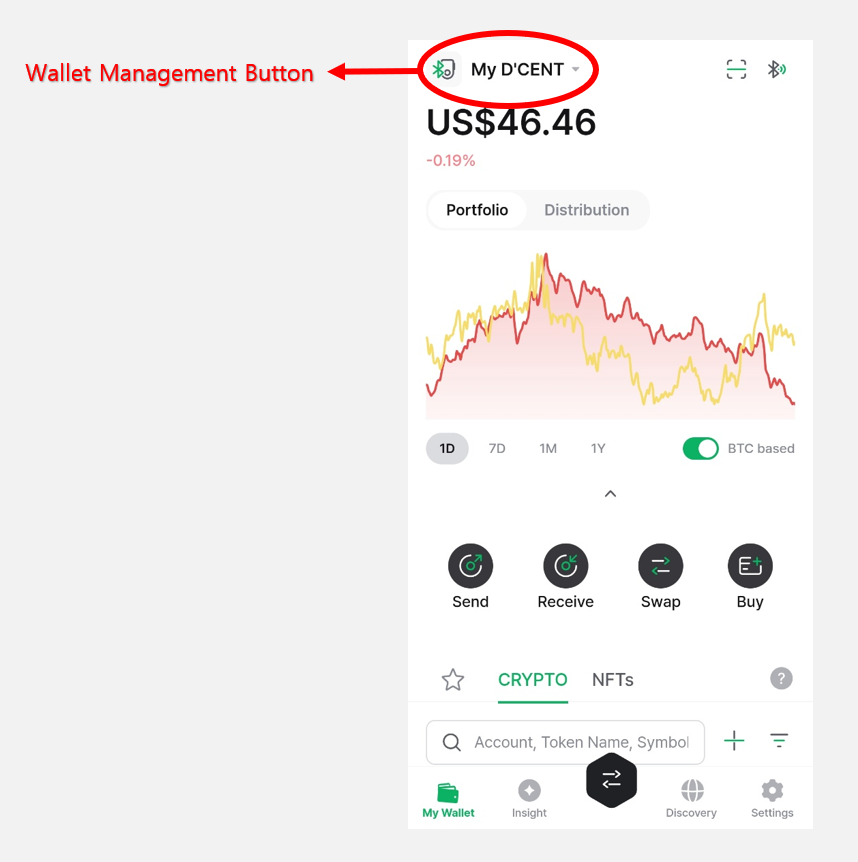
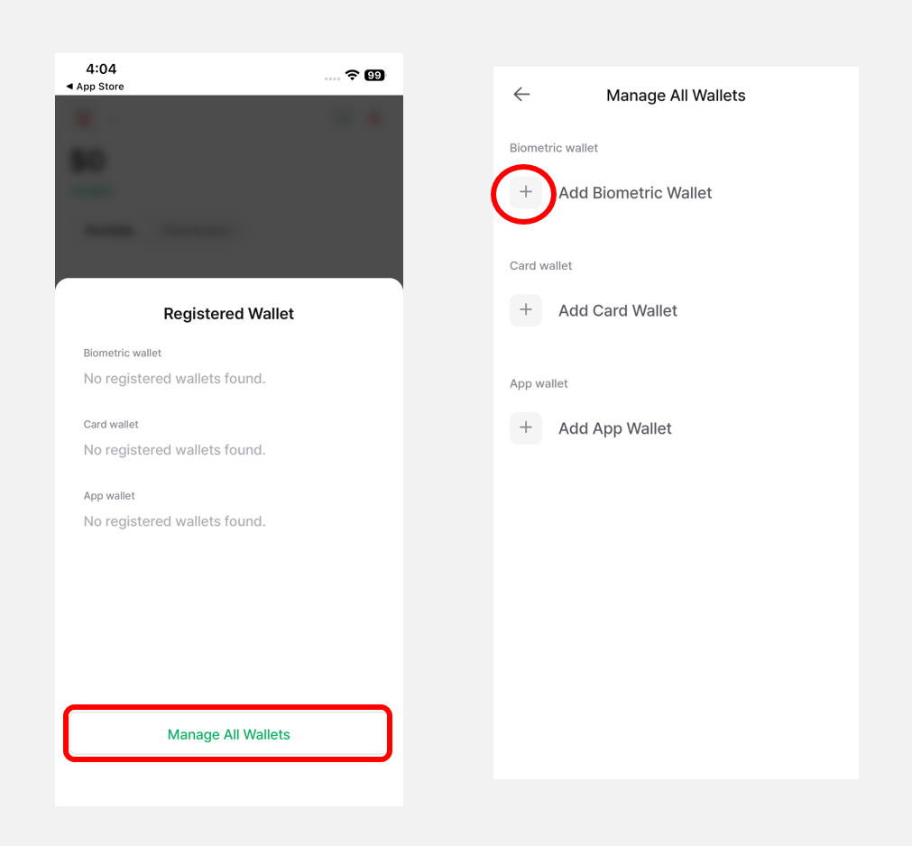
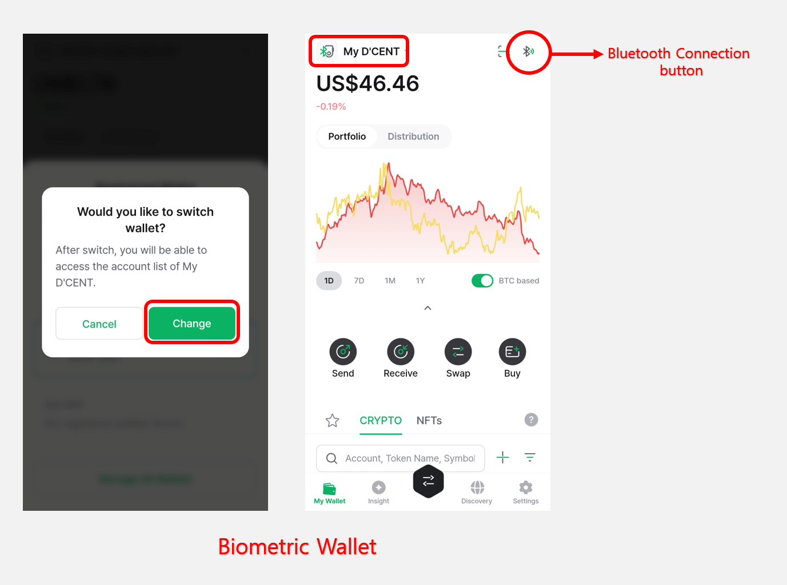
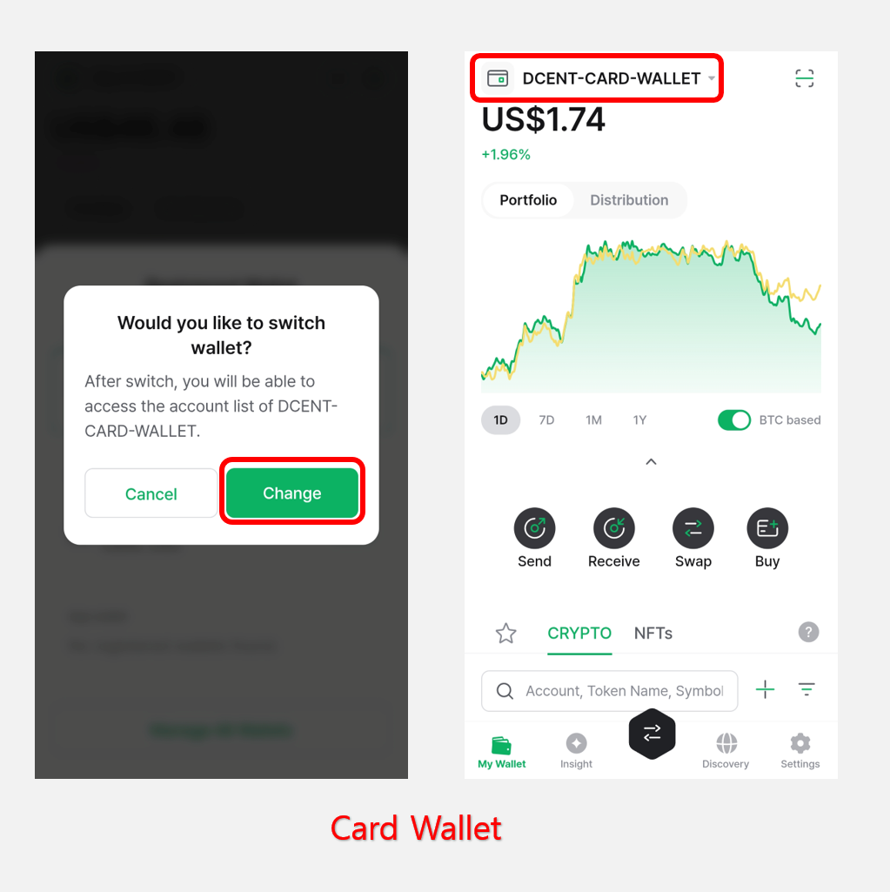
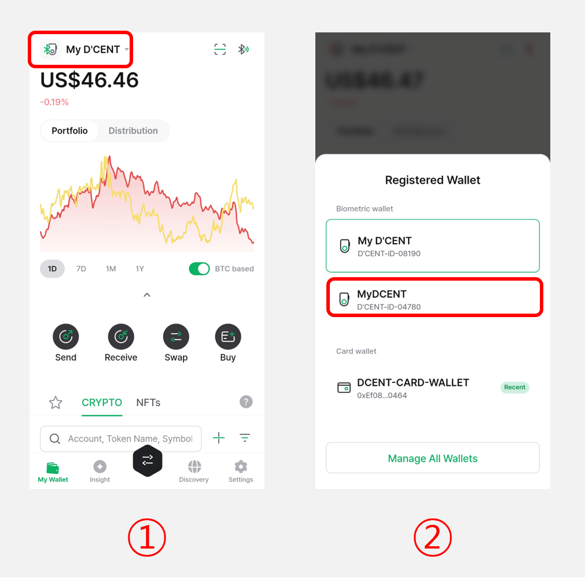
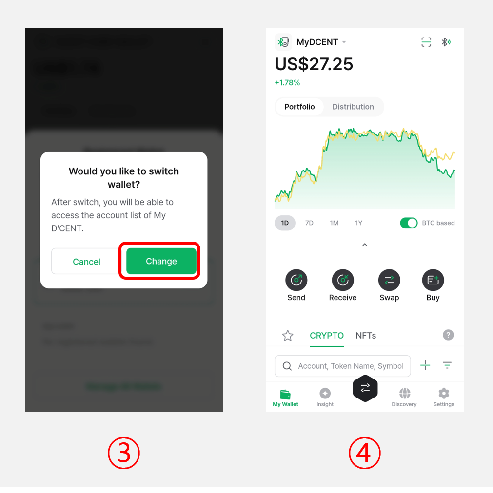
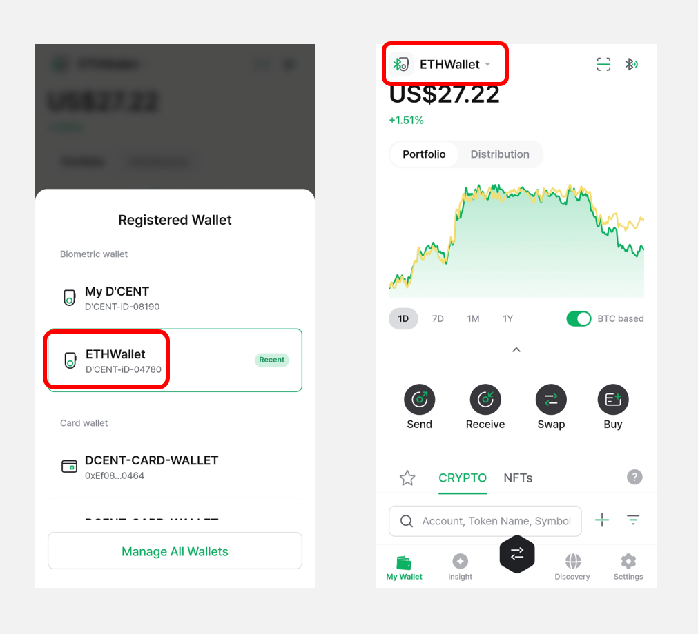
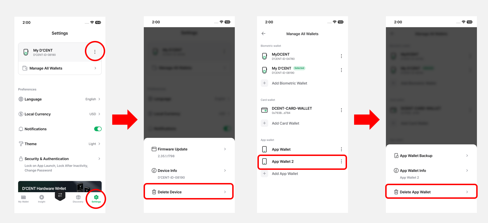
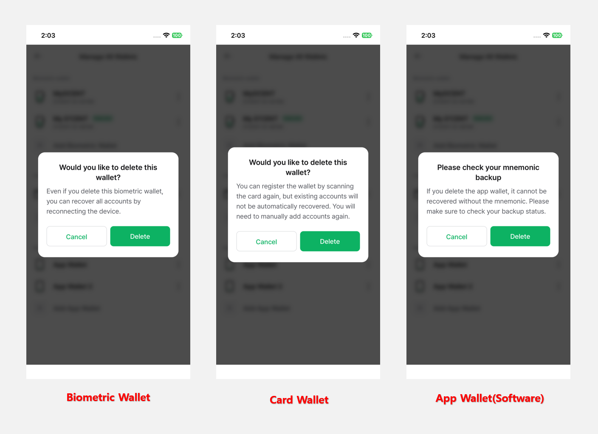

# Multi-Wallet Feature


This guide is based on **D’CENT mobile app version 8.1.0**.

**Please update the D'CENT mobile app to the latest version before using it.**


The **Multi-Wallet feature** allows **you to easily manage multiple cold wallets (Biometric Wallets and Card Wallets) and App Wallets on a single mobile phone.** For example, you can manage 2 Biometric Wallets, 3 Card Wallets, and 2 App Wallets all from one phone.

To use the Multi-Wallet feature, **please update your D'CENT Mobile App to the latest version.**

## Wallet Management Button

You can easily switch to another wallet by clicking the **“Wallet Management” button (Registered Wallets)** at the top left of the **My Wallet** tab.

<figure><figcaption></figcaption></figure>

When you press the **"Wallet Management Button",** the following will be displayed depending on the registered wallet:

<figure><figcaption></figcaption></figure>

If no wallets are registered, or if you want to add another wallet (Biometric Wallet, Card Wallet, or App Wallet), you can do so by clicking the **“Manage All Wallets”** button.

<figure><figcaption></figcaption></figure>

For instructions on how to add each type of wallet, please refer to the user guide below.

* [**Biometric Wallet (Android)**](https://userguide.dcentwallet.com/biometric-wallet/android-connect)
* [**Biometric Wallet (iPhone)**](https://userguide.dcentwallet.com/biometric-wallet/iphone-connect)
* [**Card Wallet (All-in-One Wallet)**](https://userguide.dcentwallet.com/card-wallet/intro/set-up-your-all-in-one-wallet#set-up-the-all-in-one-wallet)
* [**App Wallet (Software)**](https://userguide.dcentwallet.com/mobile-app/mobile-app-setting-menu/mobile-app-dcent-walletmode/software-wallet)\

## **Changing to Another Wallet**

When multiple wallets are registered, selecting your desired wallet and clicking the **“Change”** button will **reload the portfolio and account information** in the **"My Wallet"** tab according to the selected wallet mode. Additionally, the "**Wallet Management button"** at the top left will display the **currently active wallet type.**

When **Biometric Wallet** is selected, the Wallet Management button in the top left corner of the **"My Wallet"** tab will display as **"My D’CENT"**.

A Bluetooth icon will also appear in the top right corner, allowing you to **quickly and easily connect your cold wallet.**

<figure><figcaption></figcaption></figure>

If **Card Wallet** is selected, it will be displayed as **"DCENT-CARD-WALLET".**

<figure><figcaption></figcaption></figure>

If **App Wallet** is selected, it will be displayed as **"App Wallet".**

<figure><figcaption></figcaption></figure>

## Managing Multiple Wallets

If **multiple** **wallets (Biometric, Card Wallets or App Wallets)** are registered on a single mobile device, you can quickly switch between them using the **“Wallet Management” button**.

<figure><figcaption></figcaption></figure>

**1)** Tap the **"Wallet Management button"** at the top left corner of the **"My Wallet"** tab.

**2)** From the list of registered wallets, select the **Cold Wallet(Biometric, Card Wallets or App Wallets)** you want to switch to.

<figure><figcaption></figcaption></figure>

3\) When the **"Would you like to switch wallet?"** pop-up appears, tap **"Change"**.

4\) The **"My Wallet"** tab will update to show the portfolio and account information of the selected cold wallet.

Also, you can manage your wallets more efficiently by **changing the wallet name** based on each wallet’s purpose or owner.

(e.g., **Wallet01, BTConly, MyAssets, ETHwallet**, etc.)

For detailed instructions, please refer to the user guide below.

* [**How to Change the Device Name of a Biometric Wallet**](https://userguide.dcentwallet.com/mobile-app/mobile-app-setting-menu/mobile-app-dcent-walletmode/biometric-wallet#check-device-information)
* [**How to Change the Card Name**](https://userguide.dcentwallet.com/mobile-app/mobile-app-setting-menu/mobile-app-dcent-walletmode/card-wallet#card-info)
* [**How to Change the App Wallet Name**](https://userguide.dcentwallet.com/mobile-app/mobile-app-setting-menu/manage-all-wallets/software-wallet#change-app-wallet-name)

<figure><figcaption></figcaption></figure>

## Deleting Wallets

**Starting from version 8.1.0 of the D'CENT mobile app**, you can now delete any registered wallet directly within the app. This feature allows you to remove unused wallets for better management.

You can access the delete option by tapping the **"More (⋮) button"** in the **"Settings"** tab or by selecting the wallet you want to delete from the **Manage All Wallets** menu.

<figure><figcaption></figcaption></figure>

The warning message shown when deleting a wallet differs depending on the wallet type (Biometric Wallet, Card Wallet, or App Wallet).

<figure><figcaption></figcaption></figure>

**Please refer to the guide below before deleting a wallet to avoid potential asset loss:**

* **Biometric Wallet**: After deleting, **you can reconnect the cold wallet via Bluetooth**, and all previously used accounts will be restored automatically.
* **Card Wallet**: After deleting, you can re-scan the card to register it again, **but you must manually re-add any previously used accounts** to recover assets.
* **App Wallet**: **Before deleting, make sure your mnemonic phrase is backed up.** Without a backup, your wallet and assets cannot be recovered. To recover, use the **Import Wallet** feature and enter the backed-up mnemonic phrase, then re-add your previous accounts.
