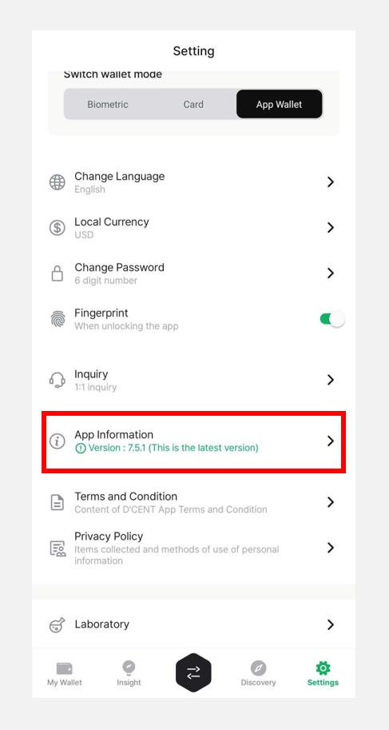
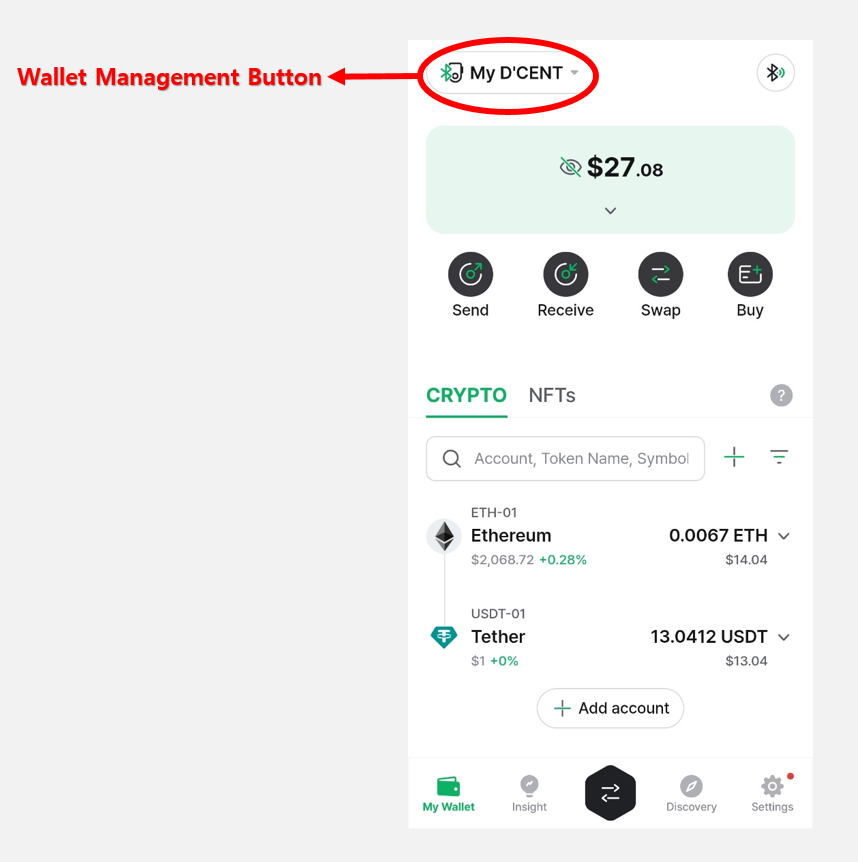
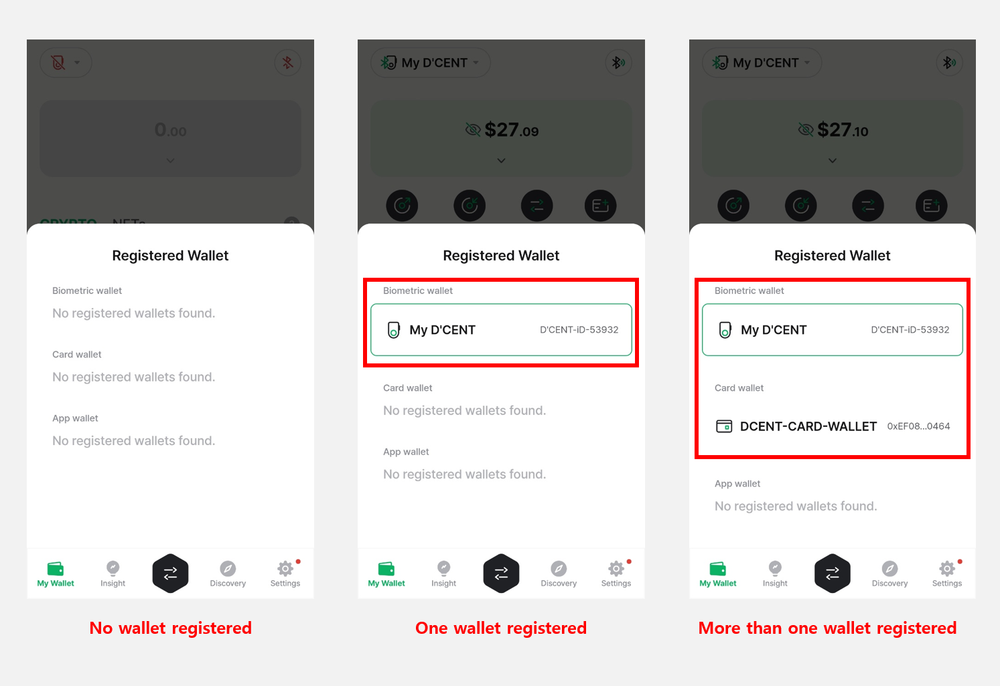
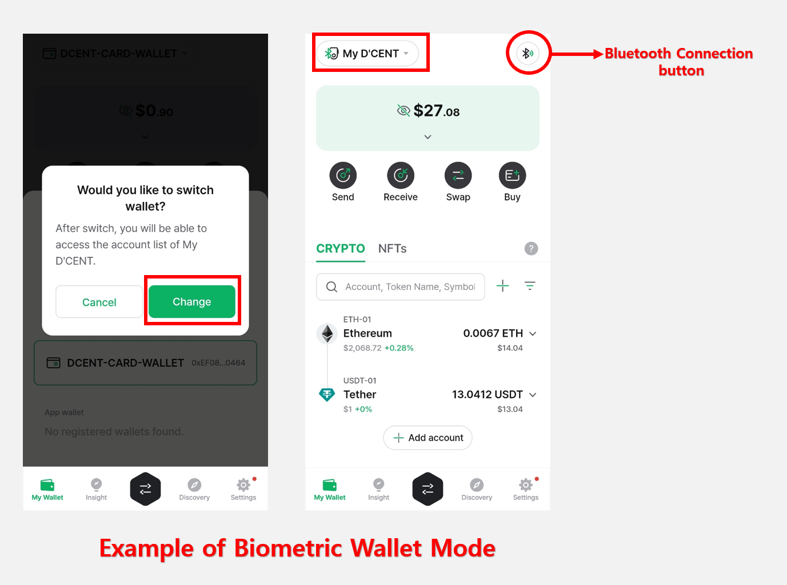
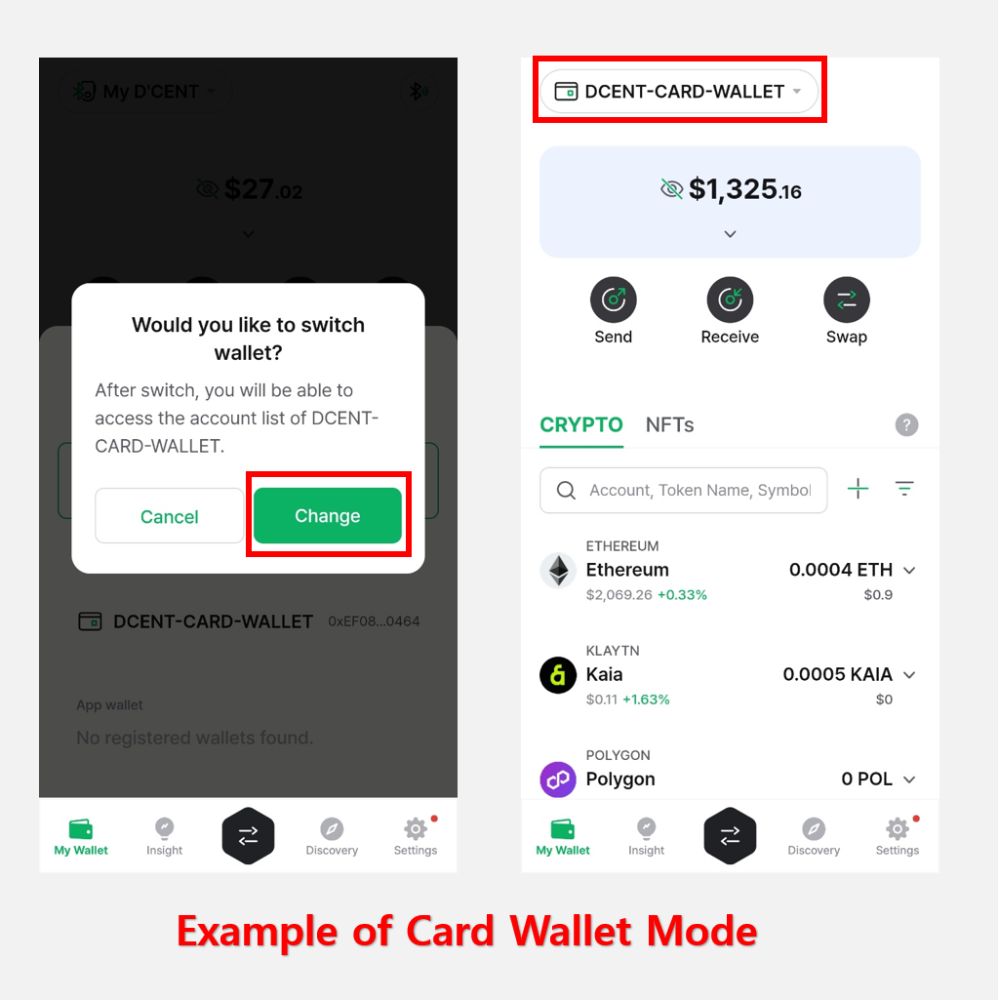
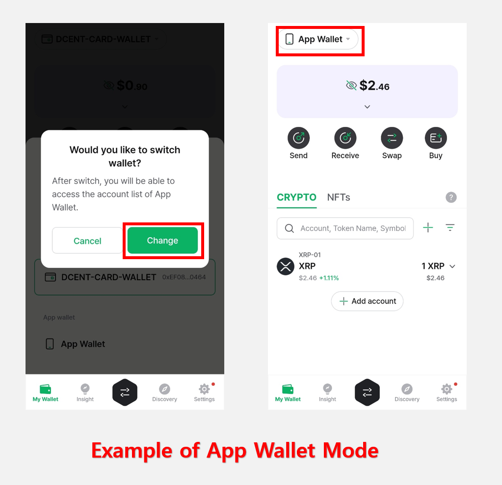
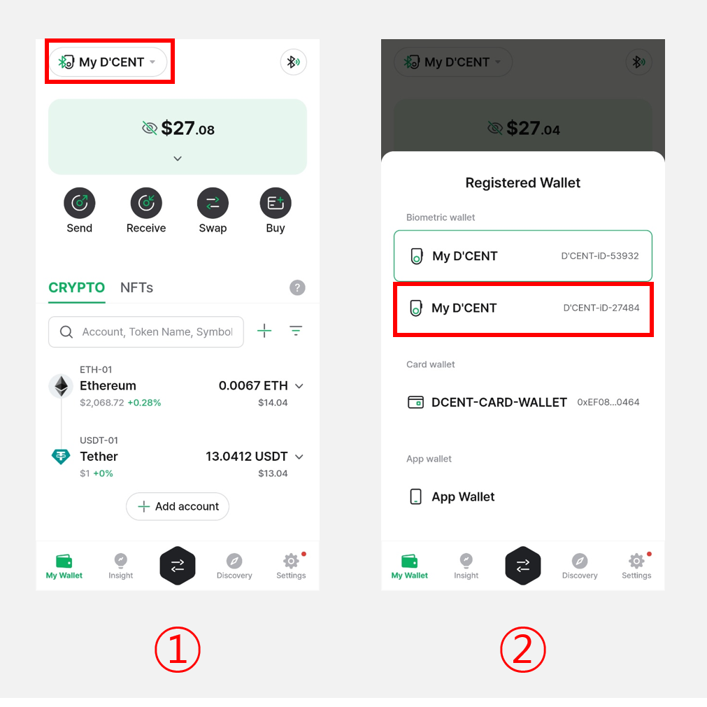
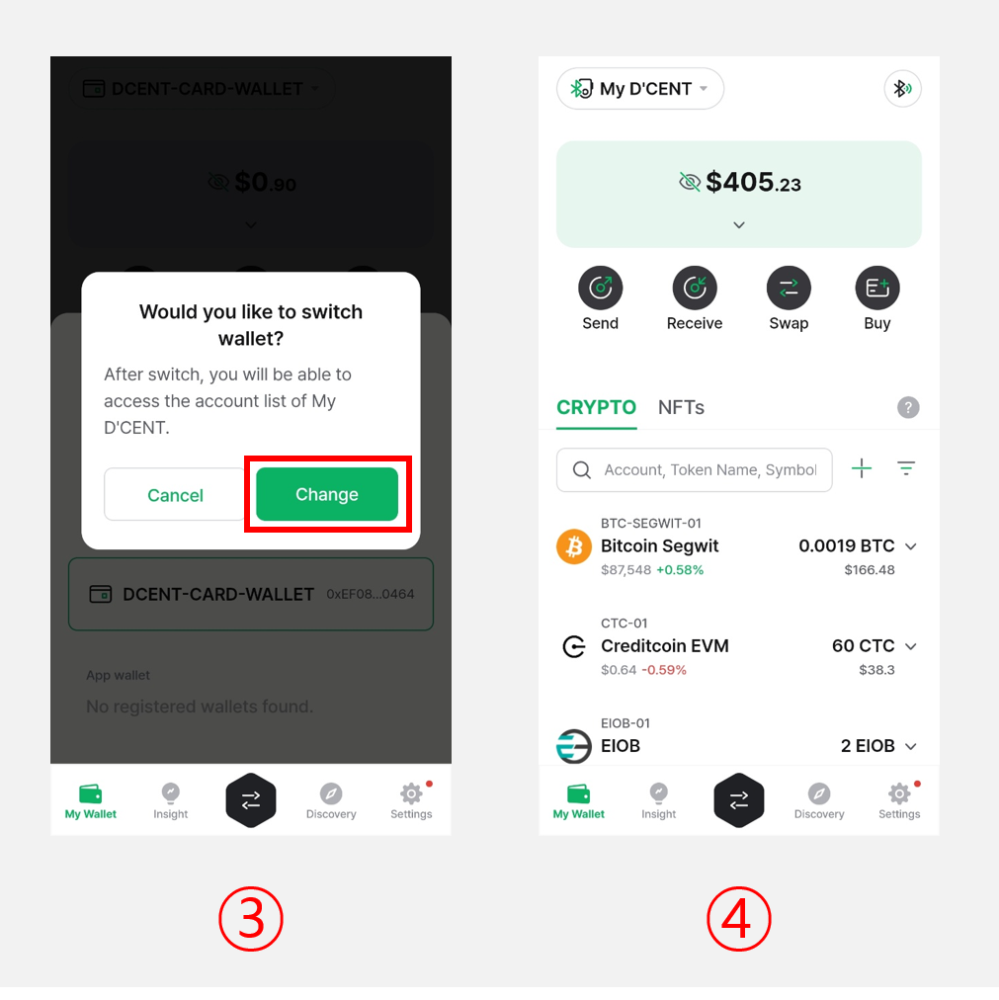
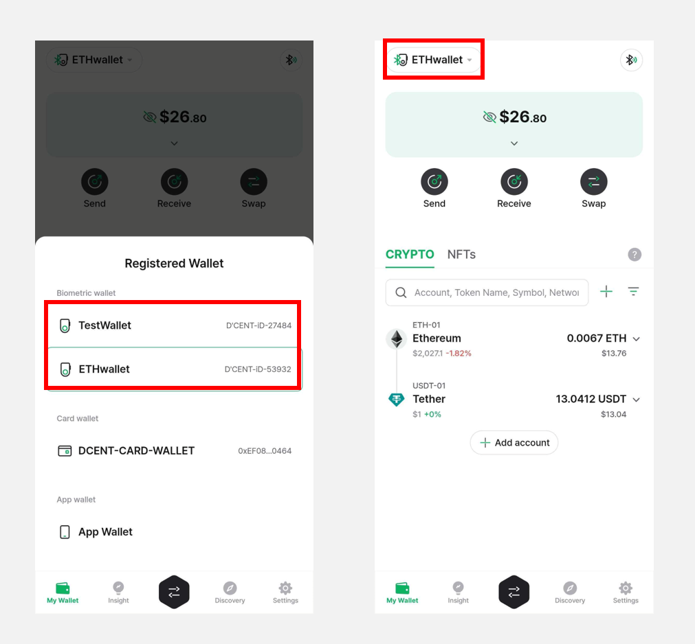
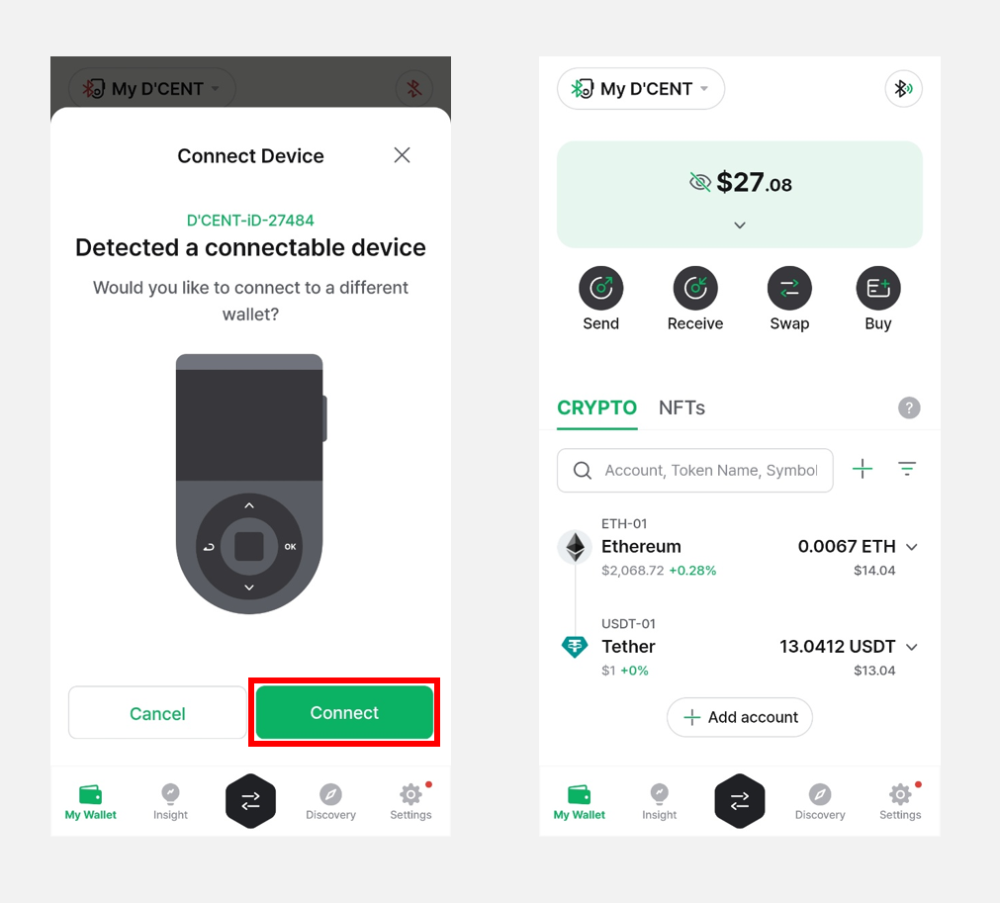

# Multi-Wallet Feature

Starting from **D'CENT Mobile App version 7.5.1**, the **Multi-Wallet** feature is now available.

With this new feature, you can easily manage different wallet modes—**Biometric Wallet, Card-Type Wallet**, and **App Wallet**—as well as **multiple Biometric Cold Wallets** directly from the updated My Wallet tab.

To use the Multi-Wallet feature, please update your D'CENT Mobile App to the latest version.

<figure><figcaption></figcaption></figure>

## New and Improved My Wallet Tab

The top section of the **My Wallet** tab has been redesigned. You can now easily switch between wallets using the **"Wallet Management"** button located at the top left corner of the screen.

<figure><figcaption></figcaption></figure>

## Wallet Management Button

When you press the **"Wallet Management Button",** the following will be displayed depending on the registered wallet:

<figure><figcaption></figcaption></figure>

If one or more wallet types—**Biometric Wallet, Card Wallet,** or **App Wallet**—have been registered, selecting your desired mode will load the account information associated with that wallet mode in the D'CENT app.

To switch to a different wallet mode, **the corresponding wallet must first be registered.**

To register a new wallet, go to the **"Settings"** tab in the D'CENT app and select **"Switch wallet mode"**. For detailed instructions, please refer to the user guide below.

[How to Switch wallet mode](mobile-app-setting-menu/mobile-app-dcent-walletmode/)

**Biometric Wallet connection:**\
[How to connect an Android phone](../biometric-wallet/android-connect/)

[How to connect an iOS phone](../biometric-wallet/iphone-connect.md)

[How to set up the Card Wallet](../card-wallet/intro/set-up-your-all-in-one-wallet.md)

[How to backup App Wallet](mobile-app-setting-menu/mobile-app-dcent-walletmode/software-wallet.md#app-wallet-backup)

When multiple wallets are registered, selecting your desired wallet and clicking the **“Change”** button will **reload the portfolio and account information** in the **My Wallet** tab according to the selected wallet mode. Additionally, the **Wallet Management button** at the top left will display the **currently active wallet type.**

<figure><figcaption></figcaption></figure>

When **Biometric Wallet mode** is selected, the Wallet Management button in the top left corner of the My Wallet tab will display as **“My D’CENT”**.

A Bluetooth icon will also appear in the top right corner, allowing you to **quickly and easily connect your cold wallet.**

<figure><figcaption></figcaption></figure>

If **Card Wallet mode** is selected, it will be displayed as **"DCENT-CARD-WALLET".**

<figure><figcaption></figcaption></figure>

If **App Wallet mode** is selected, it will be displayed as **"App Wallet".**

## Managing Multiple Biometric Cold Wallets

If multiple **Biometric Cold Wallets** are registered on a single mobile device, you can quickly switch between them using the **Wallet Management button.**

<figure><figcaption></figcaption></figure>

**1)** Tap the **Wallet Management button** at the top left corner of the **My Wallet** tab.

**2)** From the list of registered wallets, select the **Biometric Cold Wallet** you want to switch to.

<figure><figcaption></figcaption></figure>

3\) When the **“Would you like to switch wallet?”** pop-up appears, tap **"Change"**.

4\) The My Wallet tab will update to show the portfolio and account information of the selected cold wallet.

You can manage your cold wallets more efficiently by **changing the device name** based on each wallet’s purpose or owner.

(e.g., **Wallet01, BTConly, MyAssets, ETHwallet**, etc.)

For detailed instructions on how to change the device name, please refer to [**this**](mobile-app-setting-menu/mobile-app-dcent-walletmode/biometric-wallet.md#check-device-information)**.**

<figure><figcaption></figcaption></figure>

### Managing Multiple Biometric Cold Wallets on Android

For Android users, when the power is turned on for any previously registered Biometric Cold Wallet, a pop-up message saying **"Detected a connectable device"** will appear, and the app will automatically detect the turned-on cold wallet.

At this point, tapping **"Connect"** will synchronize the selected cold wallet with the app.


The “Detected connectable device” pop-up will appear only when the **blue light at the top right of the Biometric cold wallet turns on.**


<figure><figcaption></figcaption></figure>

