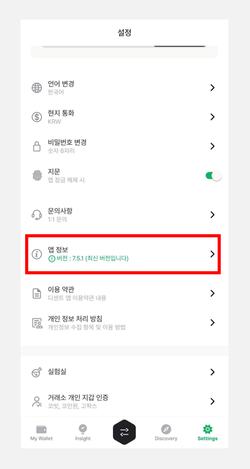
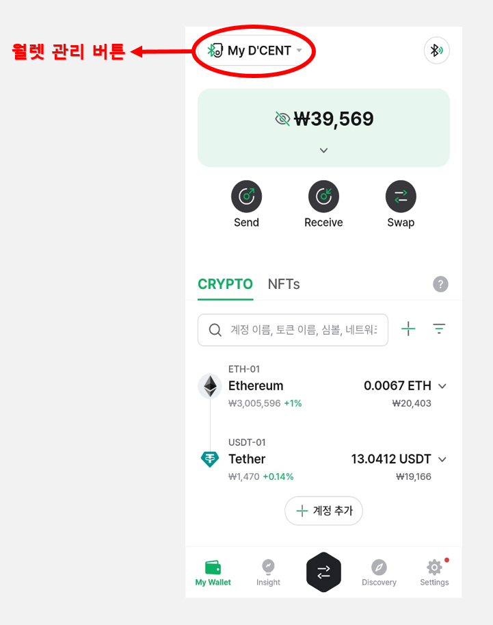
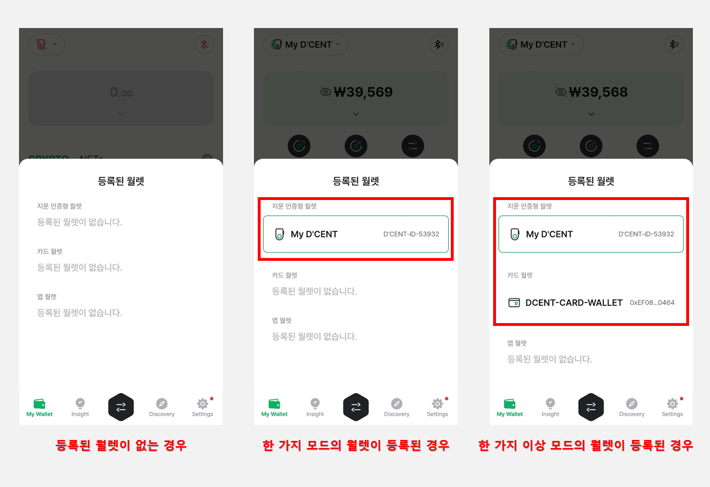
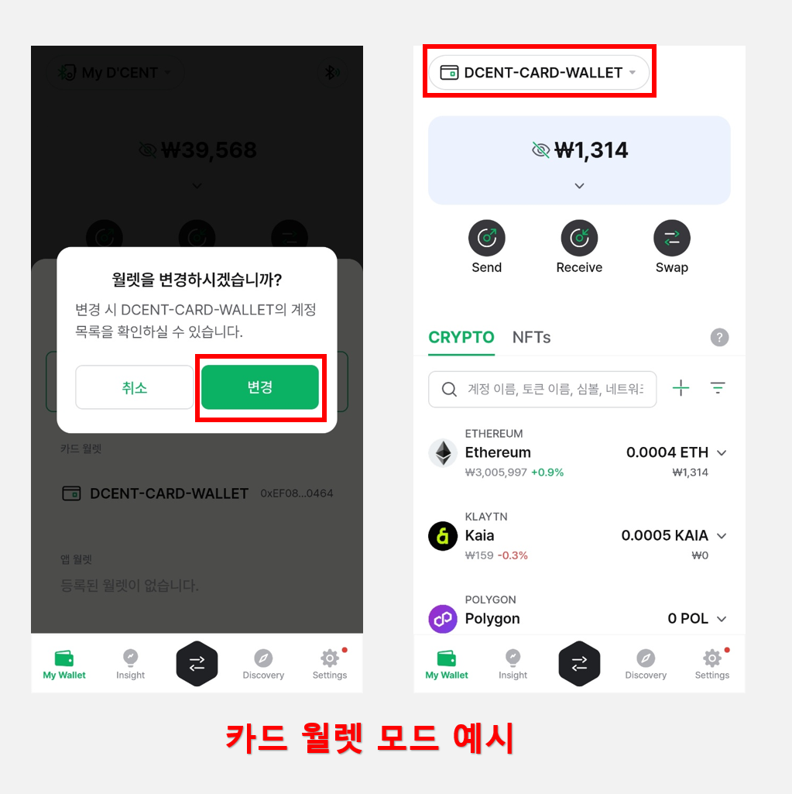
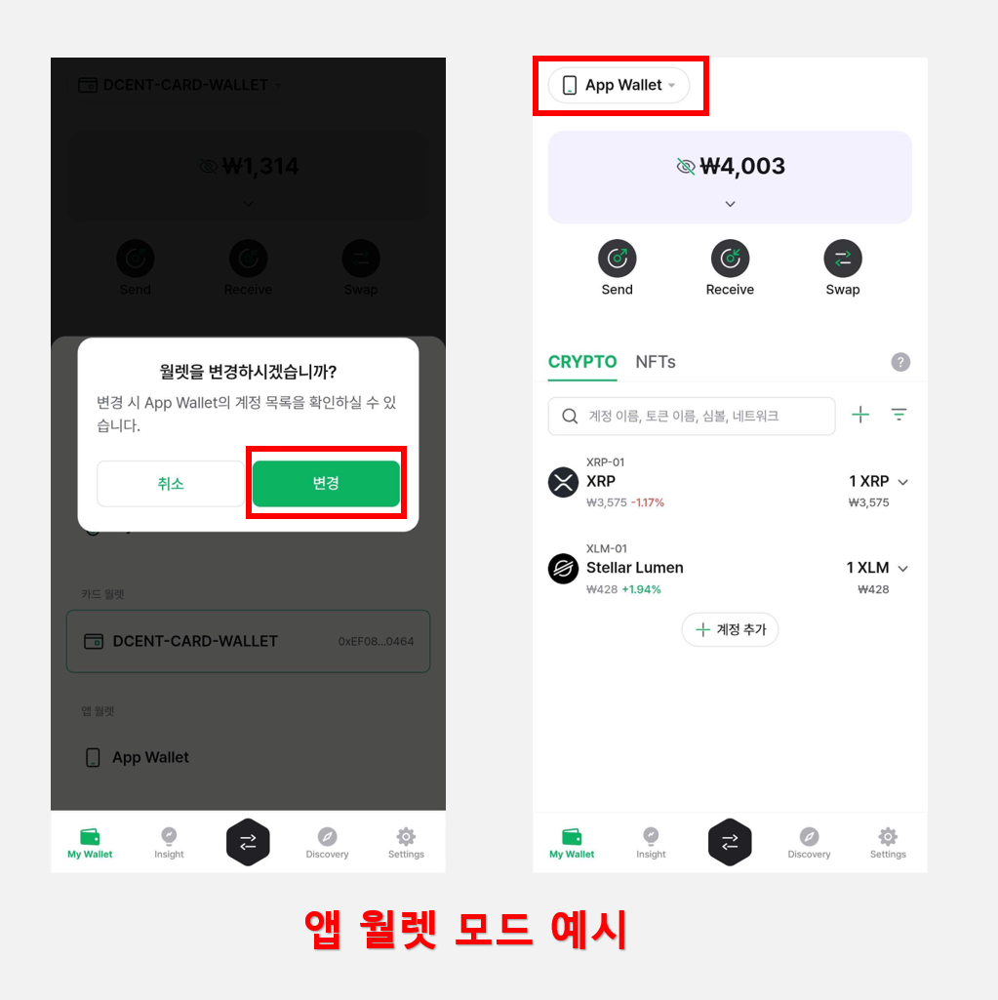
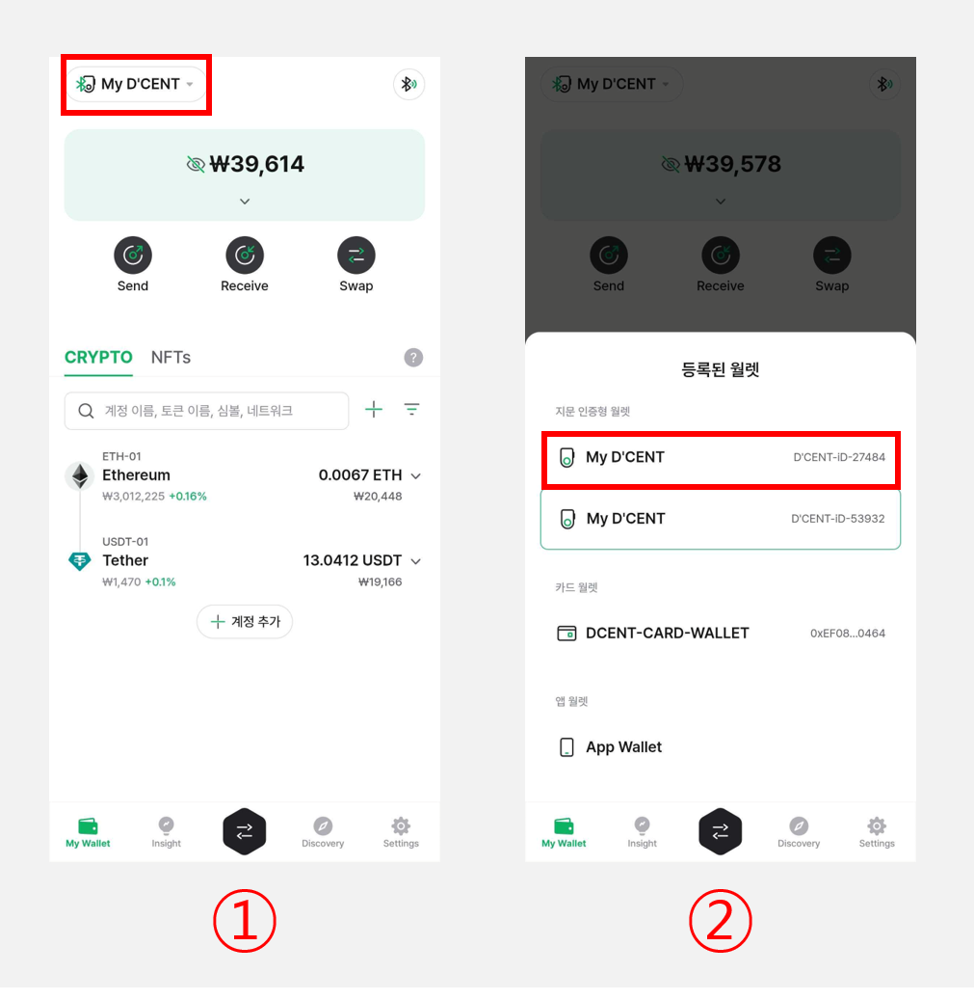
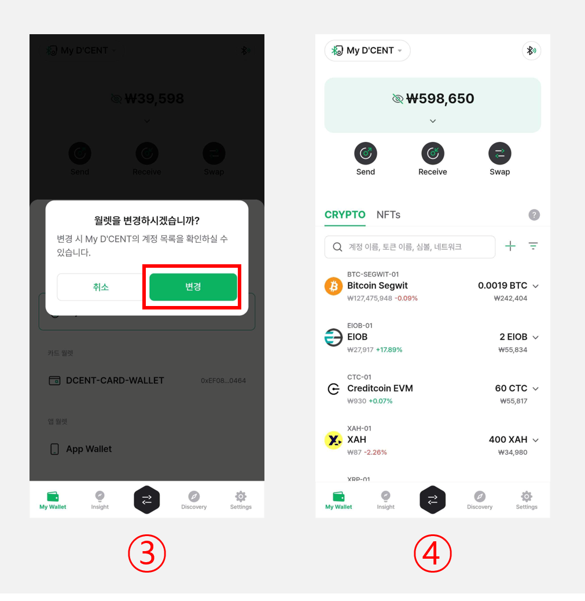
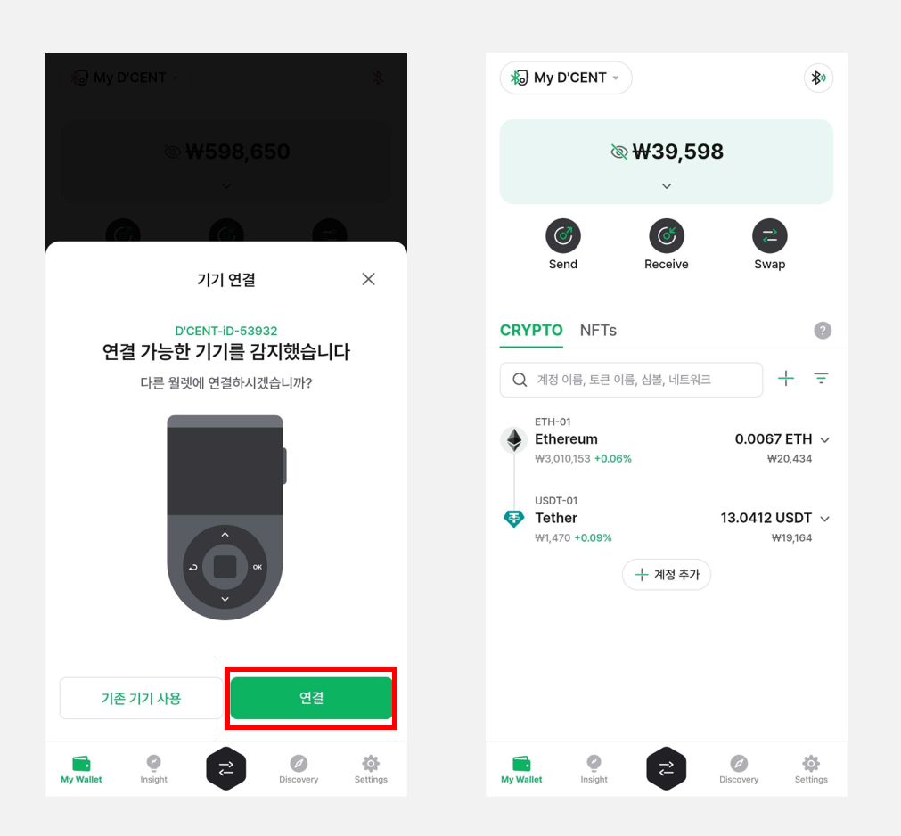

# 멀티월렛 기능

디센트 **모바일 앱 v7.5.1 버전**부터 **"멀티월렛"** 기능이 제공됩니다.

멀티월렛 기능으로 새로워진 My Wallet 탭에서 **원하는 월렛모드(지문인증형, 카드 타입, 앱 월렛)와 여러 개의 지문인증형 콜드월렛을 손쉽게 관리**할 수 있습니다.

멀티월렛 기능 사용을 위해 디센트 모바일 앱을 **최신 버전으로 업데이트** 하여 주시길 바랍니다.

<figure><figcaption></figcaption></figure>

## 새로워진 My Wallet 탭

My Wallet 탭 상단의 UI가 변경되어 좌측 상단의 **"월렛 관리 버튼"**&#xC744; 통해 다른 월렛으로 쉽고 간편하게 변경할 수 있습니다.

<figure><figcaption></figcaption></figure>

## 월렛 관리 버튼

월렛 관리 버튼을 누르면 등록된 월렛 상태에 따라 다음과 같이 표시됩니다.

<figure><figcaption></figcaption></figure>

**"지문인증형", "카드 월렛", "앱 월렛"** 중 하나 이상이 등록된 경우 원하는 모드를 선택하게 되면 디센트 앱에서 선택된 월렛모드의 계정 정보를 불러옵니다.

다른 월렛모드로 변경하기 위해선 **먼저 각 월렛이 등록**되어 있어야 합니다.

월렛을 등록하기 위해 디센트 앱 **"Settings"** 탭의 **"월렛모드 변경"**&#xC744; 통해 다른 모드로 변경해야 하며 자세한 방법은 아래 사용자 가이드를 참고하여 주시길 바랍니다.

[**월렛모드 변경 방법 바로가기**](mobile-app-setting-menu/mobile-app-dcent-walletmode/)

**지문인증형 지갑 연결 방법:**

[**안드로이드 연결 방법 바로가기**](../biometric-wallet/android-connect/)

[**iOS 연결 방법 바로가기**](../biometric-wallet/iphone-connect.md)

[**카드 월렛 등록 방법 바로가기**](../card-wallet/intro/set-up-your-all-in-one-wallet.md)

[**앱 월렛 백업 방법 바로가기**](mobile-app-setting-menu/mobile-app-dcent-walletmode/software-wallet.md)

각 월렛이 등록되어 있는 상태에서 원하는 월렛을 선택하고 **"변경"** 버튼을 클릭하면 My Wallet 탭 화면이 변경된 월렛모드에 맞게 **포트폴리오와 계정 정보를 다시 불러옵니다.**

또한 좌측 상단의 "월렛 관리 버튼"에 현재 사용 중인 월렛 종류가 표시됩니다.

<figure><figcaption></figcaption></figure>

지문인증형 모드로 선택된 경우 My Wallet 탭 좌측 상단의 "월렛 관리 버튼"이 **"My D'CENT"**&#xB85C; 표시됩니다. 우측 상단에는 **블루투스 아이콘**이 표시되어 콜드월렛을 쉽고 빠르게 연결할 수 있습니다.

<figure><figcaption></figcaption></figure>

카드 월렛 모드로 선택되었다면 **"DCENT-CARD-WALLET"**&#xC73C;로 표시됩니다.

<figure><figcaption></figcaption></figure>

앱 월렛 모드로 선택되었다면 **"App Wallet"**&#xC73C;로 표시됩니다.

## 여러 개의 지문인증형 콜드월렛 관리하기

하나의 휴대폰에 여러 개의 지문인증형 콜드월렛이 등록되어 있다면 "월렛 관리 버튼"을 통해 원하는 콜드월렛으로 빠르게 변경할 수 있습니다.

<figure><figcaption></figcaption></figure>

**1)** My Wallet 탭 좌측 상단의 **"월렛 관리 버튼"**&#xC744; 클릭합니다.

**2)** 등록된 월렛 목록에서 원하는 지문인증형 콜드월렛을 선택합니다.

<figure><figcaption></figcaption></figure>

**3) "월렛을 변경하시겠습니까?"** 팝업창이 표시되면 **"변경"**&#xC744; 선택합니다.

**4)** My Wallet 탭이 변경된 콜드월렛의 포트폴리오와 계정 정보를 불러오게 됩니다.

### 안드로이드 폰에서 여러 개의 지문인증형 콜드월렛 관리하기

안드로이드 폰 사용자의 경우 이전에 한번이라도 등록된 지문인증형 콜드월렛의 전원을 켜게 되면 **"연결 가능한 기기를 감지했습니다"** 팝업창이 표시되면서 전원이 켜진 콜드월렛을 자동으로 감지합니다.

이 때 **"연결"** 버튼을 클릭하면 해당 콜드월렛과 동기화가 됩니다.


지문인증형 콜드월렛 **우측 상단의 파란 불빛이 켜져야** 자동 감지 팝업창이 실행됩니다.


<figure><figcaption></figcaption></figure>

