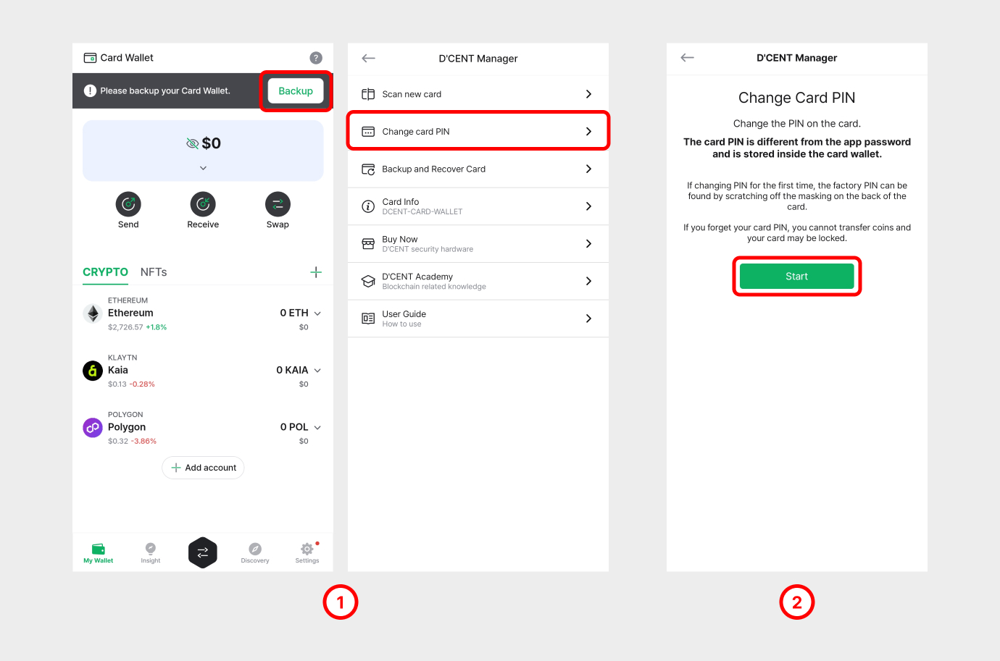

# 다크모드 변경

현재 디센트는 시험적으로 다크모드를 운영중에 있으며, 다음과 같은 방법으로 적용할 수 있습니다.

<figure><figcaption></figcaption></figure>

1. Settings 탭에 방문합니다.
2. 스크롤을 내려 “실험실” 목록을 선택합니다.
3. 테마를 선택합니다.
4. 라이트 또는 다크 중 원하는 테마를 선택시 해당 테마가 적용됩니다. 테마 적용시 서비스가 재부팅될 수 있습니다.
