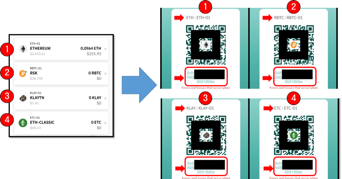
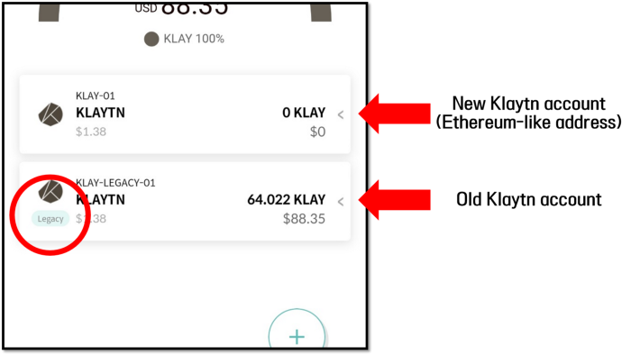
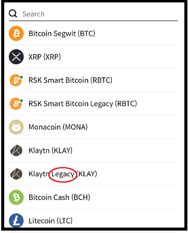

# Wallet Recovery Note

From Mobile App v.5.3.1 or higher, adding a new account for Klaytn, Ethereum Classic, RSK will create an account with the same address as that of an Ethereum account.

Therefore, if you have used the D'CENT App wallet or Biometric wallet before the update, **you must create a "Legacy" account after recovering the wallet to confirm the existing assets.**

### How to add a "Legacy" account:

1\) If there is no "Legacy" label at the bottom of the icon of the new account you have just created, proceed to add the old\(legacy\) account.

2\) Select the account marked "Legacy" from the list by clicking the Add Account button \(+\). e.g\) Klaytn Legacy 3. After creation, an account labeled "Legacy" is created and the assets you have are confirmed.

3\) After creation, an account labeled "Legacy" is created and the assets you have are confirmed.

4\) For accounts that are not marked "Legacy", click the "Hide Account" button to delete the account.

