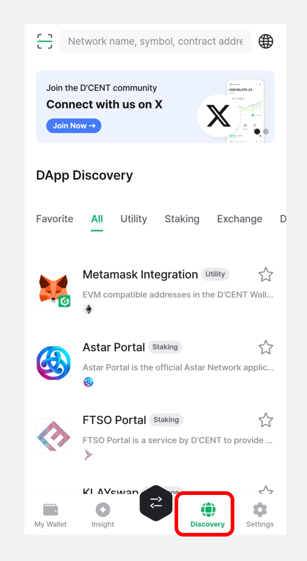
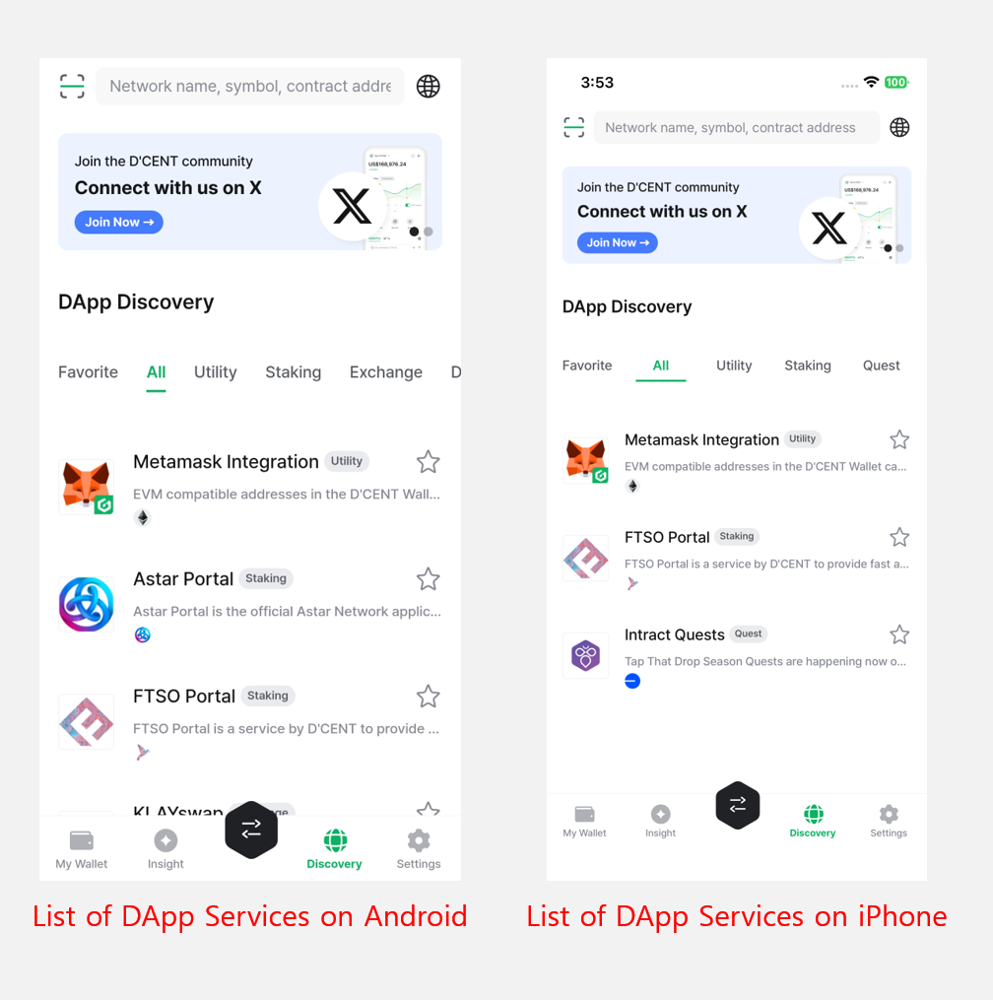
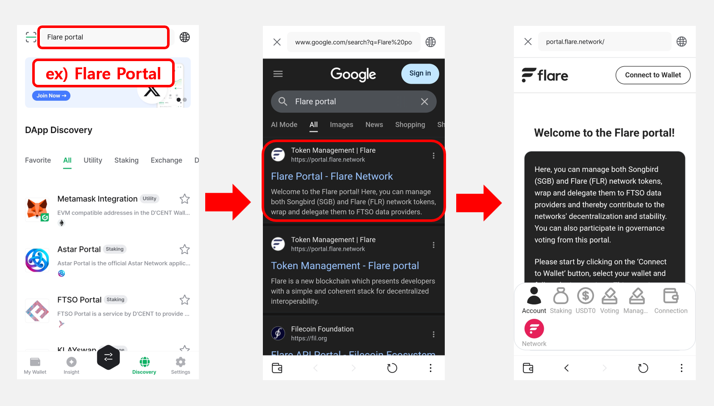
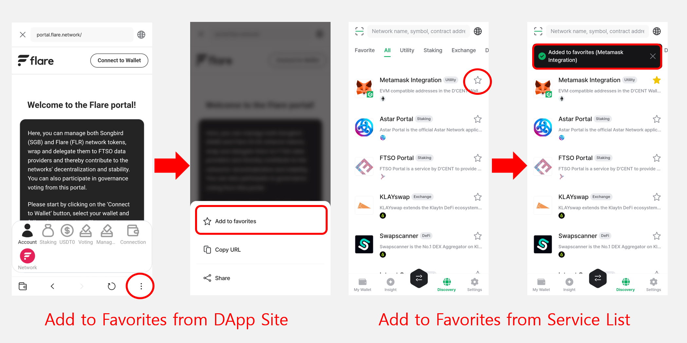
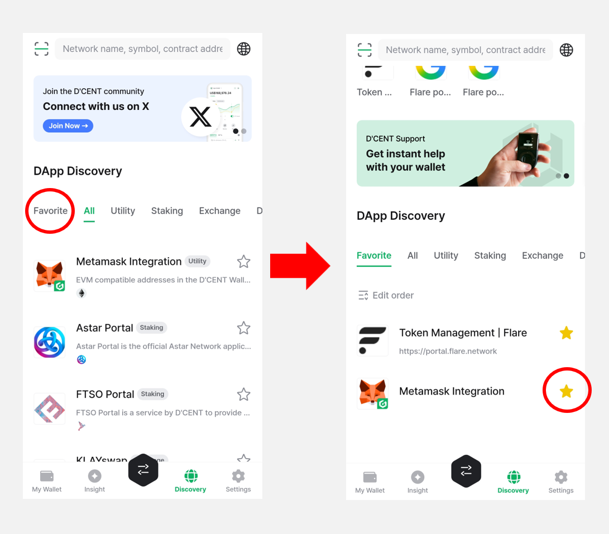

# DApp browser (Discovery)

D’CENT Mobile App features a native DApp browser that is built into the application, which allows accessing web-based blockchain services by connecting a wallet account to log in.

From the DApp browser, you can use **Ethereum-based DApp** such as Maker Dao, Compound, Uniswap, and **Kaia-based BApp** service such as KLAYSTATION.

## Using DApp service on the Discovery tab


This guide is based on **D’CENT mobile app version 8.0.0**.


You can use DApp service in the **"Discovery"** tab located at the bottom menu of the app. Here, it lists various services that can be used in conjunction with D’CENT wallet. You can simply click on a service to access the DApp.&#x20;

<figure><figcaption></figcaption></figure>


D'CENT App for the Android Phone will show a list of various 3rd party operated DApp services.

**For iPhone, the list of third-party DApp services shown in the D'CENT app is limited due to Apple’s policy.**


<figure><figcaption></figcaption></figure>

You can also view the list of DApp services grouped by type, such as **Staking**, **Exchange**, and **DeFi**.

<figure><figcaption></figcaption></figure>

Unlisted DApp services can be accessed by entering the **URL or through Google search.**

### Using the Bookmark function

Users can save the visiting service site as a **"favorite (or bookmark)"**, which creates a **shortcut** for faster access the next time.

Favorites can be added in the following ways:

**1) From the DApp service site**\
Tap the **"More (⋮)" button** at the bottom of the site and select **"Add to favorites."**

**2) From the Discovery tab service list**\
Tap the **star icon** next to a service to add it to your favorites.

Added favorites can be found in the **“Favorite”** section of the **Discovery** tab. You can also remove a favorite by tapping the **star icon** again.

## **Supported Networks**

As of **September, 2025**, following networks are supported on D'CENT wallet's dapp-browser. More networks will be added overtime.

You can see how to switch blockchain network of dapp-browser in the below link.


[switch-dapp-browser-account.md](switch-dapp-browser-account.md)


### Mainnet

* Ethereum
* Binance Smart Chain
* Polygon
* RSK
* Kaia
* Tron
* XDC Network
* Avalanche C-Chain
* Songbird Canary-Network
* Flare Network
* Fantom Opera
* KCC
* Harmony
* Orbit Chain
* Arbitrum
* BOBA L2
* Gnosis Chain
* HECO
* Celo
* Cronos Chain
* OEC
* Kaia-EVM
* Oasys Games
* Optimism
* MEVerse
* BASE
* Kroma
* Astar-EVM
* Astar-zkEVM
* Tezos
* JOC
* Gravity Alpha
* Creditcoin EVM
* Filecoin EVM
* NERO
* Sonic
* Map Protocol
* Soneium
* Scroll
* Edu Chain
* Skate
* Ancient8
* Astar
* Chiliz
* Taiko Alethia
* Berachain
* Story Network
* Camp Mainnet
* Humanity Protocol

### Testnet

* Ethereum Testnet Sepolia
* Binance Smart Chain Testnet
* RSK Testnet
* Flare Testnet Coston
* Kaia Testnet Kairos
* Tron Testnet Shasta
* XDC Testnet APOTHEM
* Harmony Testnet
* Orbit Chain Testnet
* BASE Testnet Goerli
* Kroma Testnet Sepolia
* Tezos Testnet
* JOC Testnet
* Gravity Testnet
* Creditcoin EVM Testnet
* Filecoin EVM Testnet
* Monad Testnet
* Edu Chain Testnet
* XRPL EVM Testnet

## Listed Services

As of **December, 2025,** following services are listed. For detailed information on each services, please visit the services sites.

* **Buy Cryptocurrency**\
  **Topper** ([https://app.topperpay.com](https://app.topperpay.com/)), **MoonPay** ([https://www.moonpay.io/](https://www.moonpay.io/)), **Simplex** ([https://buy.simplex.com/](https://buy.simplex.com/)) : Buy crypto using your payment or credit card
* **Metamask Integreation** ([https://qrbase.dcentwallet.com/](https://qrbase.dcentwallet.com/)) : EVM compatible address in the D'CENT Wallet can be connected with the Metamask
* **Astar portal** ([https://portal.astar.network/](https://portal.astar.network/)) : Astar Portal is the official Astar Network application for using everything that Astar Network offers.
* **FTSO Portal** ([https://ftsoportal.com/](https://ftsoportal.com/)) : A service that allows users to delegate vote power to their preferred FTSO provider and earn rewards
* **KLAYswap** ([https://klayswap.com/](https://klayswap.com/)) : Kaia-based DeFi service that allows for token exchange based on liquidity pool and deposit and staking through liquidity mining
* **SwapScanner** ([https://swapscanner.io/ko](https://swapscanner.io/ko)) : A service that swap exchange token through major DEX aggregators and earns interest through cryptocurrency deposit
* **Orbit Bridge** ([https://bridge.orbitchain.io/](https://bridge.orbitchain.io/)) : Bridge service that supports token conversion between each mainnet
* **XDSea** ([https://xdsea.com/](https://xdsea.com/)) : A peer-to-peer decentralized marketplace for buying and selling NFTs based on the XDC network
* **cBridge** ([https://cbridge.celer.network/](https://cbridge.celer.network/)) : A service that Multiple blockchain bridge service and  transfers assets between blockchains with low fees
* **Tokamak DAO** ([https://dao.tokamak.network/](https://dao.tokamak.network/)) : A service that allows TON coin holders to directly participate in decision-making regarding major agendas that affect the Tokamak network ecosystem.
* **Zapper** ([https://zapper.xyz/](https://zapper.xyz/)) : Ethereum-based DeFi dashboard service
* **Compound** ([https://compound.finance/](https://compound.finance/)) : Stake cryptocurrency and earn interest
* **PoolTogether** ([https://www.pooltogether.com/](https://www.pooltogether.com/)) : No-loss lottery to earn interest gained from the PoolTogether staking pool
* **Uniswap** ([https://uniswap.org/](https://uniswap.org/)) : Swap exchange various cryptocurrency pairs and provide liquidity to pools
* **Yearn.fi** ([https://yearn.fi/](https://yearn.fi/)) : A service that collects various DeFi services and provides a method to obtain maximum profits through automated protocols.
* **1inch.exchange** ([https://app.1inch.io/](https://app.1inch.io/)) : DEX aggregator that provides optimal swap exchange service
* **OpenSea** ([https://opensea.io/](https://opensea.io/)) : NFT market place for Collectibles, Game items, Digital Arts, and more.
* **Rarible** ([https://rarible.com/](https://rarible.com/)) : A creator-centered NFT marketplace service that allows you to easily create, buy, and sell items such as works of art and game items as NFTs.
* **KaiaPotter** ([https://kaiapotter.hashkey.cloud/#/?inApp=true](https://kaiapotter.hashkey.cloud/#/?inApp=true)) : A service that allows you to stake KAIA in a simple and safe way developed by Hashquark
* **Intract Quests** ([https://quest.intract.io/](https://quest.intract.io/)) : A quest-based platform where users can interact with various Web3 projects and earn rewards.
* **Musikhan** ([https://line.khans.io/en](https://line.khans.io/en)) : Play on MusiKhan and step into the future of K-POP and RWA.
* **Stake WCT** ([https://staking.walletconnect.network/](https://staking.walletconnect.network/)) : Stake to earn rewards, participate in governance and support the future decentralization of the network.
* **SynFutures** ([https://oyster.synfutures.com/#/market
  ](https://oyster.synfutures.com/#/market)) : A decentralized derivatives marketplace for everything from crypto to NFTs and Bitcoin hash rates.
*   **MOMO.FUN** ([https://www.momo.fun/

    ](https://www.momo.fun/)) : MOMO.FUN is the world’s first Meme + DeFi platform powered by AI Agent

     

Many more great services will get added to the list over time.
