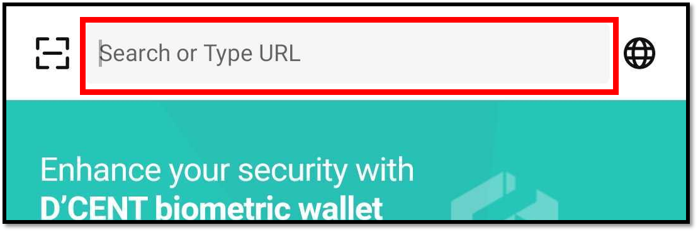
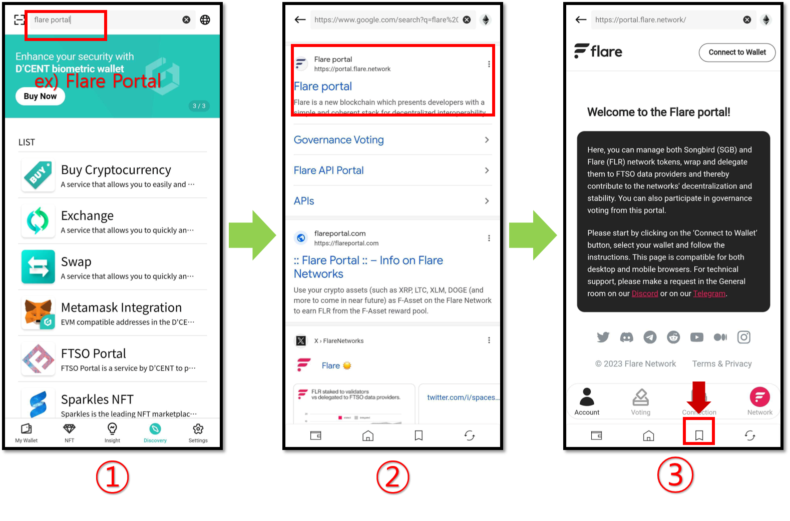
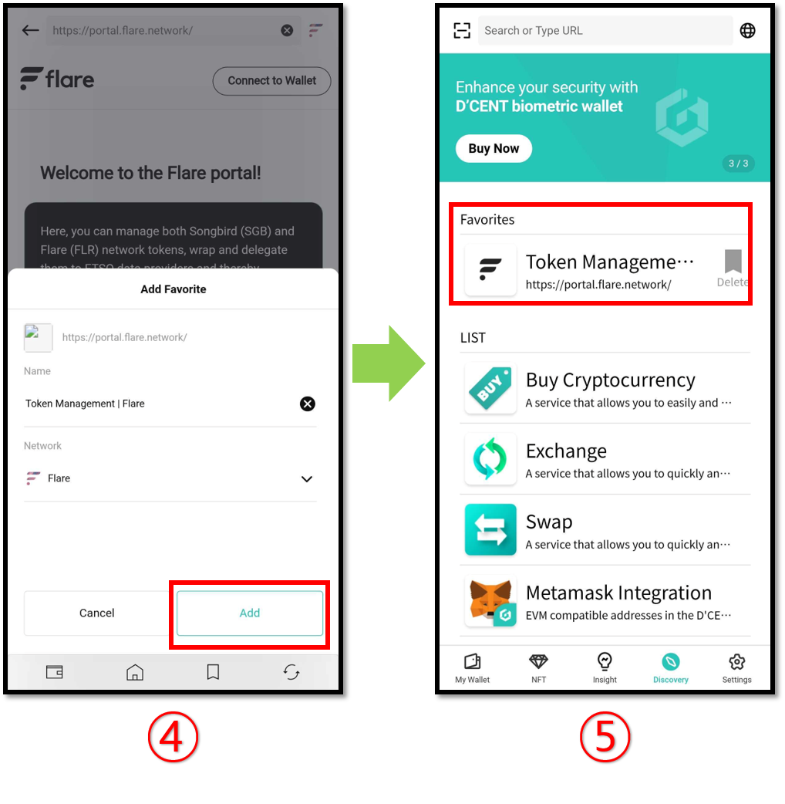

# DApp browser (Discovery)

D’CENT Mobile App features a native DApp browser that is built into the application, which allows accessing web-based blockchain services by connecting a wallet account to log in.

From the DApp browser, you can use **Ethereum-based DApp** such as Maker Dao, Compound, Uniswap, and **Klaytn-based BApp** service such as KLAYSTATION.

## Using DApp service on the Discovery tab

You can use DApp service in the **"Discovery"** tab located at the bottom menu of the app. Here, it lists various services that can be used in conjunction with D’CENT wallet. You can simply click on a service to access the DApp.&#x20;


D'CENT App for the Android Phone will show a list of various 3rd party operated DApp services.

For iPhone, D'CENT App does not show a list of 3rd party DApp service due to Apple's policy.


Unlisted DApp services can be accessed by entering the **URL or through Google search.**

### Using the Bookmark function

Users can save the visiting service site as a favorite (or bookmark), which creates a **shortcut** for faster access the next time.

1\) Search for the name of the DApp service or enter the URL.

2\) Click on the searched site.

3\) From the service site accessed, click on the Bookmark icon located at the bottom.

4\) Double check that the network used for accessing this site is correct and click on **Add** button.

5\) You can find that a new DApp service has been added as a favorite to the list in the Discovery Tab.

## **Supported Networks**

As of December, 2023, following networks are supported on D'CENT wallet's dapp-browser. More networks will be added overtime.

You can see how to switch blockchain network of dapp-browser in the below link.


[switch-blockchain-network.md](switch-blockchain-network.md)


### Mainnet

* Ethereum
* Binance Smart Chain
* Polygon
* RSK
* Klaytn
* Tron
* XDC Network
* Avalanche C-Chain
* Songbird
* Flare
* Fantom Opera
* KCC
* Harmony
* Orbit Chain
* Arbitrum
* BOBA L2
* Gnosis Chain
* HECO
* Celo
* Cronos Chain
* OEC
* Klaytn-EVM
* Oasys Games
* Optimism
* MEVerse
* BASE
* Kroma
* Astar-EVM
* Astar-zkEVM
* Tezos
* Astar

### Testnet

* Ethereum Testnet Ropsten
* Ethereum Testnet Rinkeby
* Ethereum Testnet Goerli
* Ethereum Testnet Kovan
* Ethereum Testnet Sepolia
* Binance Smart Chain Testnet
* Polygon Testnet Mumbai
* RSK Testnet
* Flare Testnet Coston2
* Klaytn Testnet Baobab
* Tron Testnet Shasta
* XDC Testnet APOTHEM
* Arbitrum Testnet Rinkeby
* Harmony Testnet
* Orbit Chain Testnet
* BASE Testnet Goerli
* Kroma Testnet Sepolia
* Tezos Testnet

## Listed Services

As of July, 2024, following services are listed. For detailed information on each services, please visit the services sites.

* **Buy Cryptocurrency**\
  **MoonPay** ([https://www.moonpay.io/](https://www.moonpay.io/)), **Simplex** ([https://buy.simplex.com/](https://buy.simplex.com/)) : Buy crypto using your payment or credit card
* **Exchange** ([https://exchange.dcentwallet.com/](https://exchange.dcentwallet.com/)) : Cryptocurrency coin exchange service
* **Swap** ([https://swap.dcentwallet.com/](https://swap.dcentwallet.com/)) : Token swap exchange service
* **Metamask Integreation** ([https://qrbase.dcentwallet.com/](https://qrbase.dcentwallet.com/)) : EVM compatible address in the D'CENT Wallet can be connected with the Metamask
* **Astar portal** ([https://portal.astar.network/](https://portal.astar.network/)) : The official application service for using everything offered by Astar Network, including staking, cross-chain asset transfers, and bridges
* **FTSO Portal** ([https://ftsoportal.com/](https://ftsoportal.com/)) : A service that allows users to delegate vote power to their preferred FTSO provider and earn rewards
* **Sparkles NFT** ([https://sparklesnft.com/](https://sparklesnft.com/)) : Flare and Songbird network-based NFT marketplace
* **KLAYswap** ([https://klayswap.com/](https://klayswap.com/)) : Klaytn-based DeFi service that allows for token exchange based on liquidity pool and deposit and staking through liquidity mining
* **SwapScanner** ([https://swapscanner.io/ko](https://swapscanner.io/ko)) : A service that swap exchange token through major DEX aggregators and earns interest through cryptocurrency deposit
* **Belt.fi** ([https://belt.fi/](https://belt.fi/)) : A service that deposits cryptocurrency and provides optimized returns based on the AMM (Automated Market Maker) protocol
* **Definix** ([https://definix.com/](https://definix.com/)) : Multichain-based DeFi platform service
* **Orbit Bridge** ([https://bridge.orbitchain.io/](https://bridge.orbitchain.io/)) : Bridge service that supports token conversion between each mainnet
* **XDSea** ([https://xdsea.com/](https://xdsea.com/)) : A peer-to-peer decentralized marketplace for buying and selling NFTs based on the XDC network
* **cBridge** ([https://cbridge.celer.network/](https://cbridge.celer.network/)) : A service that Multiple blockchain bridge service and  transfers assets between blockchains with low fees
* **KlayFi** ([https://klayfi.finance/](https://klayfi.finance/)) : DeFi service that provides maximum returns by providing a user-centered optimized experience
* **KLAYSTATION** ([https://klaystation.io/](https://klaystation.io/)) : Klaytn-based KLAY staking service
* **Tokamak DAO** ([https://dao.tokamak.network/](https://dao.tokamak.network/)) : A service that allows TON coin holders to directly participate in decision-making regarding major agendas that affect the Tokamak network ecosystem.
* **Zapper** ([https://zapper.xyz/](https://zapper.xyz/)) : Ethereum-based DeFi dashboard service
* **Neverlose.money** ([https://neverlose.money/](https://neverlose.money/)) : Ethereum-based cryptocurrency long-term investment promotion service
* **Compound** ([https://compound.finance/](https://compound.finance/)) : Stake cryptocurrency and earn interest
* **PoolTogether** ([https://www.pooltogether.com/](https://www.pooltogether.com/)) : No-loss lottery to earn interest gained from the PoolTogether staking pool
* **Uniswap** ([https://uniswap.org/](https://uniswap.org/)) : Swap exchange various cryptocurrency pairs and provide liquidity to pools
* **Yearn.fi** ([https://yearn.fi/](https://yearn.fi/)) : A service that collects various DeFi services and provides a method to obtain maximum profits through automated protocols.
* **1inch.exchange** ([https://1inch.exchange/](https://1inch.exchange/)) : DEX aggregator that provides optimal swap exchange service
* **OpenSea** ([https://opensea.io/](https://opensea.io/)) : NFT market place for Collectibles, Game items, Digital Arts, and more.
* **Rarible** ([https://rarible.com/](https://rarible.com/)) : A creator-centered NFT marketplace service that allows you to easily create, buy, and sell items such as works of art and game items as NFTs.
* **KLAYportal** ([https://klayportal.hashquark.io/#/?inApp=true](https://klayportal.hashquark.io/#/?inApp=true)) : A service that allows you to stake KLAY in a simple and safe way developed by Hashquark

Many more great services will get added to the list over time.
