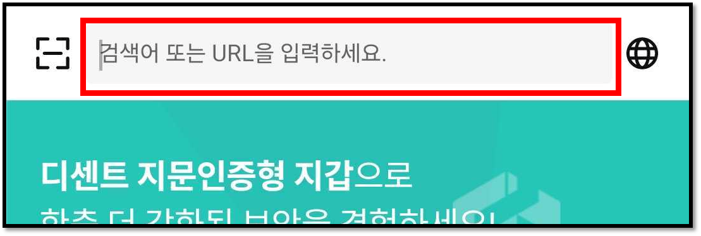
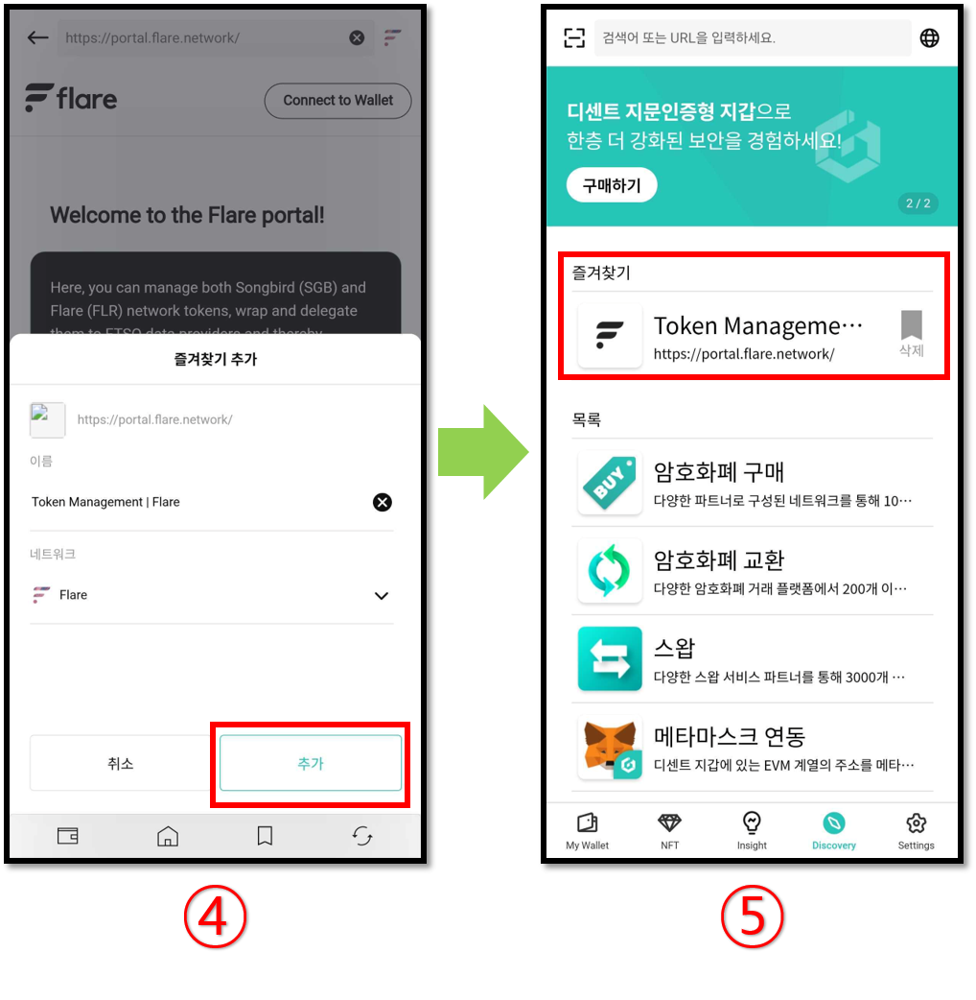

# 댑 브라우저 (Discovery)

디센트 모바일 앱에는 댑 브라우저가 탑재되어 있습니다. 댑 브라우저는 웹기반의 댑 서비스를 지갑과 연동하여 사용할 수 있는 기능입니다.

댑 브라우저를 통하여 메이커다오, 컴파운드, 유니스왑과 같은 **이더리움 기반의 댑**과 클레이스테이션과 같은 **클레이튼 기반의 댑** 서비스를 이용할 수 있습니다.

## 디스커버리 탭에서 댑 서비스 사용

앱 하단에 위치한 “**Discovery**” 탭에서 댑 서비스를 이용할 수 있습니다. 디센트 지갑과 연동하여 사용할 수 있는 서비스 목록이 있습니다. 서비스를 클릭하여 간단히 댑에 접속할 수 있습니다.


안드로이드폰의 경우 디센트앱에서 다양한 제3자의 댑 서비스가 목록에 표시됩니다.

**아이폰의 경우 애플의 정책으로 인하여 디센트앱에서 제3자의 댑 서비스를 표시할 수 없습니다.**


목록에 없는 댑 서비스는 **URL을 직접 입력하거나, 구글 검색**을 통해 접속할 수 있습니다.

### 즐겨찾기(북마크) 사용하기

사용자는 방문한 댑 서비스 사이트를 즐겨찾기 (북마크)로 저장하여 다음에 더 빨리 액세스 할 수 있는 **바로가기**를 만들 수 있습니다. 예를 들어 Flare Portal 서비스를 검색하고 접속한 사이트를 북마크로 저장합니다.

.png>)

1\) 접속하려는 댑 서비스의 이름을 입력합니다.

2\) 검색된 사이트를 클릭합니다.

3\) 접속한 서비스가 표시된 화면에서 하단의 책갈피(북마크) 아이콘을 클릭합니다.

4\) 해당 댑 서비스에서 사용되는 네트워크가 올바른지 반드시 확인하고 추가하기 버튼을 누릅니다.

5\) 디스커버리 탭의 목록에는 댑 서비스 사이트가 즐겨찾기로 추가된것을 확인 가능합니다.&#x20;

## 지원되는 네트워크 목록

2024년 7월 기준으로 현재 지원하는 블록체인 네트워크 기준은 다음과 같습니다. 앞으로도 다양한 블록체인 네트워크가 추가로 지원될 계획입니다.

댑 브라우저에서 네트워크를 선택하는 방법은 아래 링크를 참고하세요.


[switch-network.md](switch-network.md)


### 메인넷

* Ethereum
* Binance Smart Chain
* Polygon
* RSK
* Klaytn
* Tron
* XDC Network
* Avalanche C-Chain
* Songbird
* Flare
* Fantom Opera
* KCC
* Harmony
* Orbit Chain
* Arbitrum
* BOBA L2
* Gnosis Chain
* HECO
* Celo
* Cronos Chain
* OEC
* Klaytn-EVM
* Oasys Games
* Optimism
* MEVerse
* BASE
* Kroma
* Astar-EVM
* Astar-zkEVM
* Tezos
* Astar

### 테스트넷

* Ethereum Testnet Ropsten
* Ethereum Testnet Rinkeby
* Ethereum Testnet Goerli
* Ethereum Testnet Kovan
* Ethereum Testnet Sepolia
* Binance Smart Chain Testnet
* Polygon Testnet Mumbai
* RSK Testnet
* Flare Testnet Coston2
* Klaytn Testnet Baobab
* Tron Testnet Shasta
* XDC Testnet APOTHEM
* Arbitrum Testnet Rinkeby
* Harmony Testnet
* Orbit Chain Testnet
* BASE Testnet Goerli
* Kroma Testnet Sepolia
* Tezos Testnet

## 서비스 목록

2024년 10월 현재 리스팅된 서비스 목록은 다음과 같습니다. 서비스에 대한 보다 명확한 내용은 각 서비스의 웹사이트를 참고하시는 것이 좋습니다.

* **메타마스크 연동** ([https://qrbase.dcentwallet.com/](https://qrbase.dcentwallet.com/)) : 디센트 지갑의 EVM 주소를 메타마스크와 연결하는 기능
* **아스타포탈** ([https://portal.astar.network/](https://portal.astar.network/)) : 스테이킹, 크로스체인 자산 전송, 브릿지 등 Astar Network에서 제공하는 모든 것을 사용하기 위한 공식 애플리케이션 서비스
* **FTSO Portal** ([https://ftsoportal.com/](https://ftsoportal.com/)) : 원하는 FTSO provider 에 Vote Power 를 위임하고 보상을 받을 수 있는 서비스
* **스파클스 NFT** (Sparkles NFT, [https://sparklesnft.com/](https://sparklesnft.com/)) :  Flare, Songbird 네트워크 기반 NFT를 사고 팔 수 있는 마켓플레이스 서비스
* **클레이스왑** (KLAYswap, [https://klayswap.com/](https://klayswap.com/)) : 유동성 풀 기반의 토큰 교환과 유동성 마이닝을 통한  예치, 스테이킹 등을 할 수 있는 DeFi 서비스
* **스왑스캐너** (SwapScanner, [https://swapscanner.io/](https://swapscanner.io/ko)) : 주요 DEX 거래소를 연결하여 토큰 교환과 암호화폐 예치를 통해 이자를 받을 수 있는 서비스
* **벨트파이** (Belt.fi, [https://belt.fi/](https://belt.fi/)) : 암호화폐를 예치하고 AMM(Automated Market Maker) 프로토콜을 기반으로 최적화된 수익률을 제공해주는 서비스
* **디피닉스** (Definix, [https://definix.com/](https://definix.com/)) : 멀티체인 기반의 탈중앙화 금융 플랫폼 서비스&#x20;
* **오르빗 브릿지** (Orbit Bridge, [https://bridge.orbitchain.io/](https://bridge.orbitchain.io/)) : 각 메인넷 간의 토큰 전환을 지원하는 브릿지 서비스&#x20;
* **XDSea** ([https://xdsea.com/](https://xdsea.com/)) : XDC 기반의 NFT를 사고파는 P2P 분산형 시장 서비스
* **Celer cBridge** ([https://cbridge.celer.network/](https://cbridge.celer.network/)) : 다중 블록체인 브릿지 서비스와 블록체인 간에 자산을 저렴한 수수료로 전송할 수 있는 서비스&#x20;
* **클레이파이** (KlayFi, [https://klayfi.finance/](https://klayfi.finance/)) : 사용자 중심의 최적화 된 경험을 제공하여 최대의 수익률을 제공하는 디파이 서비스&#x20;
* **블루웨일 프로토콜** (Bluewhale Protocol, [https://bwpm.io/](https://bwpm.io/)) : 클레이튼 네트워크 기반의 디파이 서비스&#x20;
* **클레이스테이션** (KLAYSTATION, [https://klaystation.io/](https://klaystation.io/)) : 클레이튼 기반 KLAY 스테이킹 서비스
* **토카막 DAO** (Tokamak DAO, [https://dao.tokamak.network/](https://dao.tokamak.network/)) : TON 코인 보유자들이 토카막 네트워크 생태계에 영향을 주는 주요한 의제(Agenda)에 관한 의사결정에 직접 참여할 수 있는 서비스&#x20;
* **네버루즈머니** (Neverlose.money, [https://neverlose.money/](https://neverlose.money/)) : 이더리움 기반의 암호화폐 장기 투자 촉진 서비스&#x20;
* **Zapper** ([https://zapper.xyz/](https://zapper.xyz/)) : 이더리움 기반의 디파이 대시보드 서비스
* **컴파운드** (Compound, [https://compound.finance/](https://compound.finance/)) : 암호화폐를 예치하고 이자를 받을 수 있는 서비스
* **풀투게더** (PoolTogether, [https://www.pooltogether.com/](https://www.pooltogether.com/)) : 예치된 암호화폐의 이자를 모아 당첨자에게 몰아주는 서비스
* **유니스왑** (Uniswap, [https://uniswap.org/](https://uniswap.org/)) : 유동성 공급과 토큰 교환 서비스
* **Yearn.fi** ([https://yearn.fi/](https://yearn.fi/)) : 다양한 디파이 서비스를 모아 자동화된 프로토콜을 통해 최대의 수익을 얻기위한 방법을 제공하는 서비스
* **1inch.exchange** ([https://1inch.exchange/](https://1inch.exchange/)) : 주요 DEX 거래소를 연결하여 토큰을 교환할 수 있는 서비스
* **오픈씨** (OpenSea, [https://opensea.io/](https://opensea.io/)) : 수집품, 게임 아이템, 디지털 아트와 같은 NFT를 사고 팔 수 있는 서비스
* **라리블** (Rarible, [https://rarible.com/](https://rarible.com/)) : 예술 작품, 게임 아이템 등과 같은 아이템을 NFT로 쉽게 만들고 사고 팔 수 있는 크리에이터 중심의 NFT 마켓플레이스 서비스
* **클레이포탈** (KLAYportal, [https://klayportal.hashquark.io/#/?inApp=true](https://klayportal.hashquark.io/#/?inApp=true)) : 해시쿼크에서 개발한 간단하고 안전한 방식으로 KLAY를 스테이킹할 수 있는 서비스

이 밖에도 다양한 서비스를 추가해 나갈 계획입니다.&#x20;
