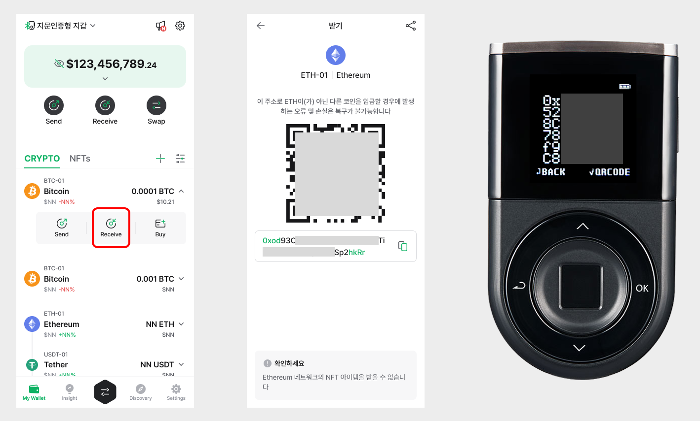

# DApp browser (Discovery)

D’CENT Mobile App features a native DApp browser that is built into the application, which allows accessing web-based blockchain services by connecting a wallet account to log in.

From the DApp browser, you can use **Ethereum-based DApp** such as Maker Dao, Compound, Uniswap, and **Klaytn-based BApp** service such as KLAYSTATION.

## Using DApp service on the Discovery tab

You can use DApp service in the **"Discovery"** tab located at the bottom menu of the app. Here, it lists various services that can be used in conjunction with D’CENT wallet. You can simply click on a service to access the DApp.&#x20;


D'CENT App for the Android Phone will show a list of various 3rd party operated DApp services.

For iPhone, D'CENT App does not show a list of 3rd party DApp service due to Apple's policy.


Unlisted DApp services can be accessed by entering the **URL or through Google search.**

 (1).png>)

### Using the Bookmark function

Users can save the visiting service site as a favorite (or bookmark), which creates a **shortcut** for faster access the next time.

.png>)

1\) Search for the name of the DApp service or enter the URL.

2\) Click on the searched site.

3\) From the service site accessed, click on the Bookmark icon located at the bottom.

 (2).png>)

4\) Double check that the network used for accessing this site is correct and click on **Add** button.

5\) You can find that a new DApp service has been added as a favorite to the list in the Discovery Tab.

## **Supported Networks**

As of May, 2021, following networks are supported on D'CENT wallet's dapp-browser. More networks will be added overtime.

You can see how to switch blockchain network of dapp-browser in the below link.


[switch-blockchain-network.md](switch-blockchain-network.md)


### Mainnet

* Ethereum
* Binance Smart Chain
* Polygon
* RSK
* Klaytn
* Tron
* XDC Network
* Avalanche C-Chain
* Songbird
* Flare
* Fantom Opera
* KCC
* Harmony
* Orbit Chain
* Arbitrum
* BOBA L2
* Gnosis Chain
* HECO
* Celo
* Cronos Chain
* OEC

### Testnet

* Ethereum Testnet Ropsten
* Ethereum Testnet Rinkeby
* Ethereum Testnet Goerli
* Ethereum Testnet Kovan
* Binance Smart Chain Testnet
* Polygon Testnet Mumbai
* RSK Testnet
* Flare Testnet Coston2
* Klaytn Testnet Baobab
* Tron Testnet Shasta
* XDC Testnet APOTHEM
* Arbitrum Testnet Rinkeby
* Harmony Testnet
* Orbit Chain Testnet

## Listed Services

As of September, 2020, following services are listed. For detailed information on each services, please visit the services sites.

* **MoonPay** ([https://www.moonpay.io/](https://www.moonpay.io/)) : Buy crypto using your payment or credit card
* **Compound** ([https://compound.finance/](https://compound.finance/)) : Stake cryptocurrency and earn interest
* **MakerDAO Oasis** ([https://makerdao.com/](https://makerdao.com/)) : Stake cryptocurrency as collateral and borrow DAI stablecoin
* **PoolTogether** ([https://www.pooltogether.com/](https://www.pooltogether.com/)) : No-loss lottery to earn interest gained from the PoolTogether staking pool
* **Uniswap** ([https://uniswap.org/](https://uniswap.org/)) : Swap exchange various cryptocurrency pairs and provide liquidity to pools
* **1inch.exchange** ([https://1inch.exchange/](https://1inch.exchange/)) : DEX aggregator that provides optimal swap exchange service
* **OpenSea** ([https://opensea.io/](https://opensea.io/)) : NFT market place for Collectibles, Game items, Digital Arts, and more.
* **ChangeNOW**, ([https://changenow.io/](https://changenow.io/)) : Easy to use and Lightning fast crypto exchange service
* **KLAYSTATION** ([https://klaystation.io/](https://klaystation.io/)) : Klaytn-based staking service to earn interest on KLAY

Many more great services will get added to the list over time.
