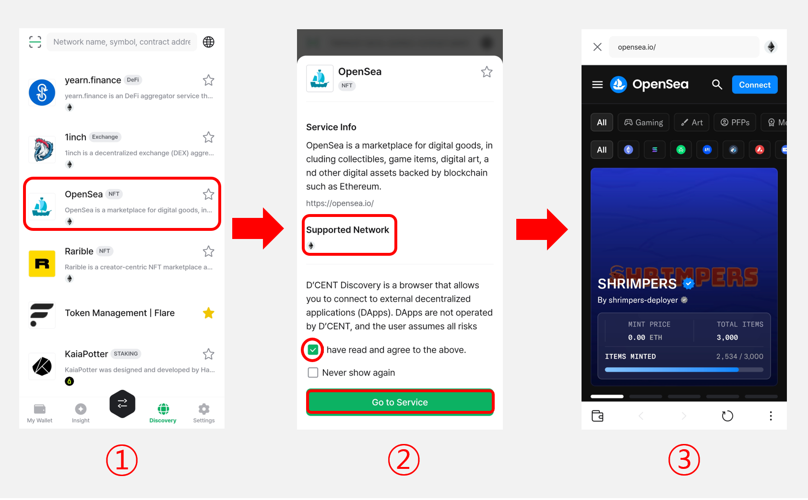
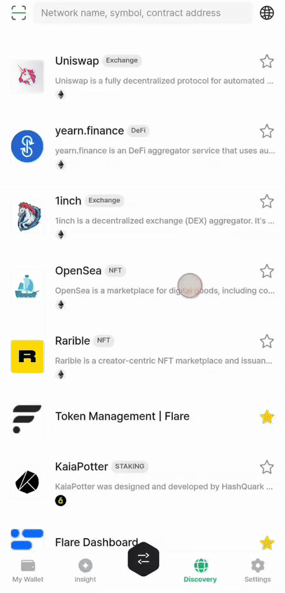
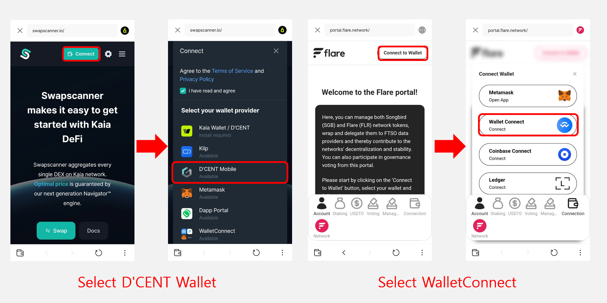

# Connecting your wallet to a dApp site

## Accessing a DApp Site

Follow the steps below to access a DApp site:

<figure><figcaption></figcaption></figure>

**1)** Select your desired service from the list or search for the DApp site using the search bar.

**2)** Check the service information (such as supported network) and the notice. Then, tick the checkbox **"I have read and agree to the above,"** and click the **“Go to Service”** button.

**3)** Once the DApp site opens, click the **“Connect”** button to connect your D'CENT wallet.

## **Connect Wallet to a DApp Site**

When you access a decentralized application (DApp) site, the website typically detects the blockchain wallet in use and automatically triggers a connection request.\
At this point, review the account information being connected, then tap the **“Connect”** button to link your D'CENT wallet to the DApp site.

Wallet connection may not be automatically triggered when visiting a DApp site. In this case, you can manually connect your wallet by clicking the **"Connect"** or **"Connect Wallet"** button from the site’s menu. Then, choose **"D’CENT"** or **"WalletConnect"** from the wallet connection options to link your D’CENT wallet to the DApp site.

