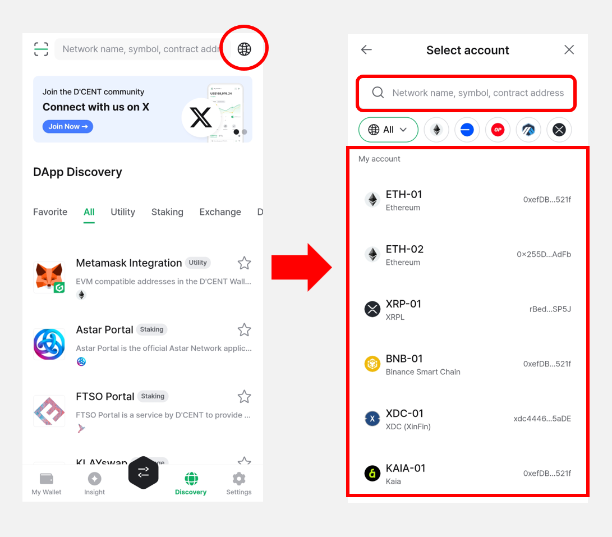

# Switch DApp Browser Account

By clicking the **Network (🌐)** icon on the top right corner of the **"Discovery"** tab, you can change the account and blockchain network used in the DApp browser.

You can either select a different account that has already been added to the wallet from the list, or search and select the desired account and network using the search bar.

For the list of supported networks, please refer to [**here**](https://userguide.dcentwallet.com/native-service/dapp-browser#supported-networks).

The more blockchain networks will be added to the supported list for D'CENT dapp browser.
