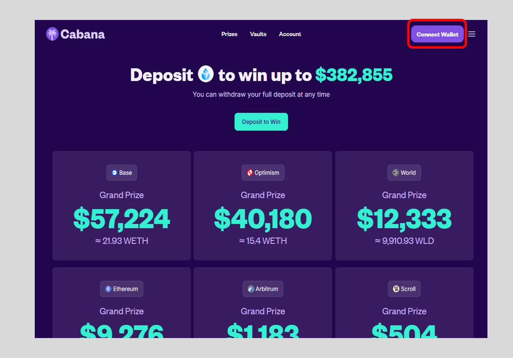
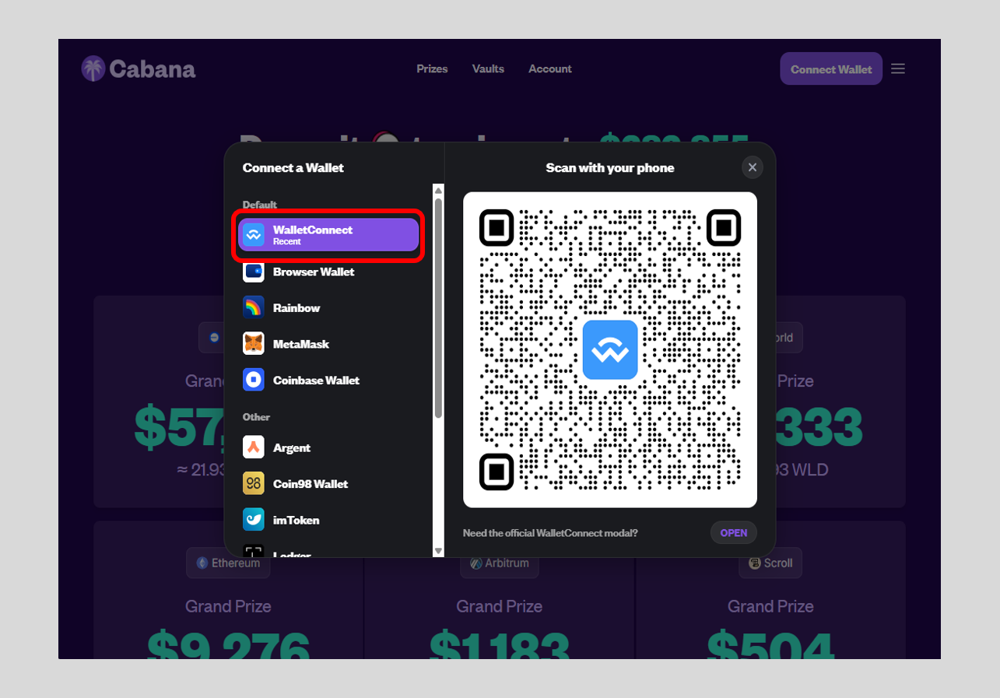
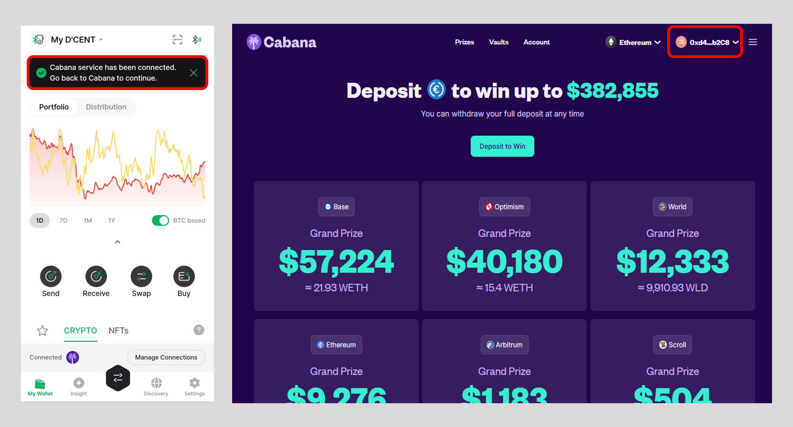
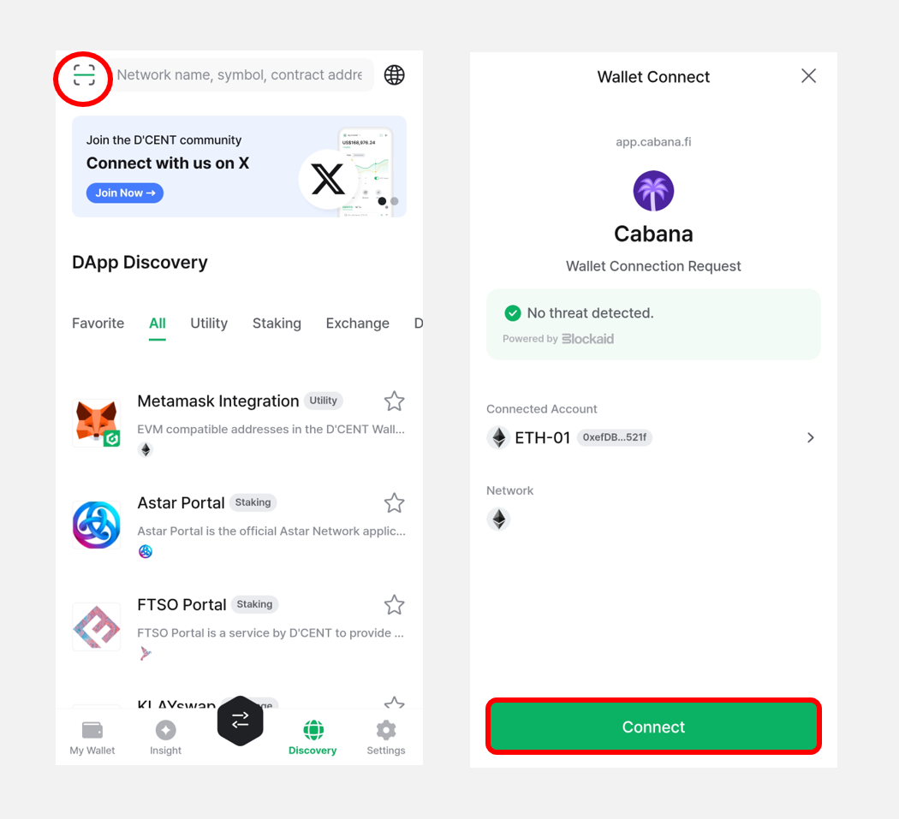
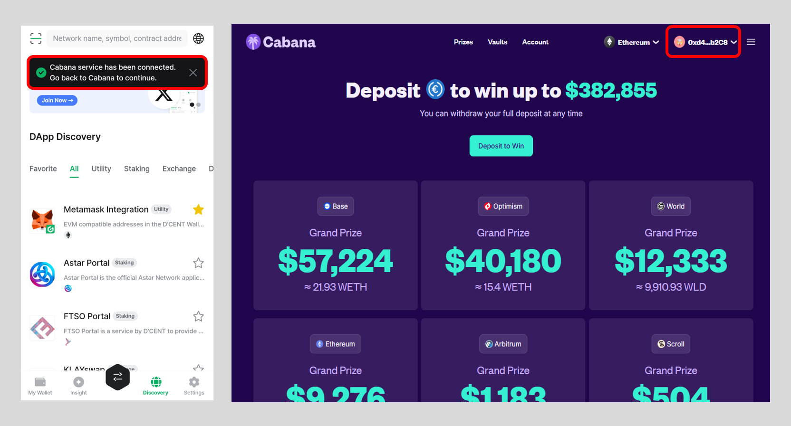
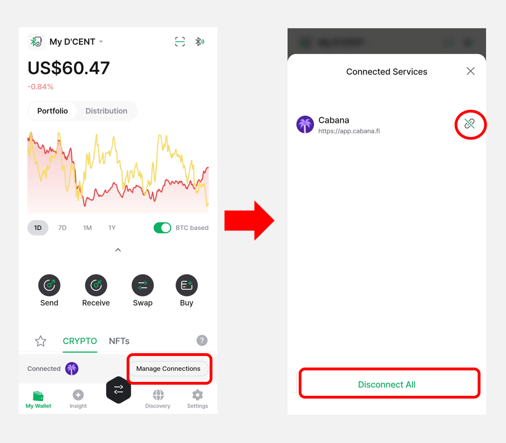
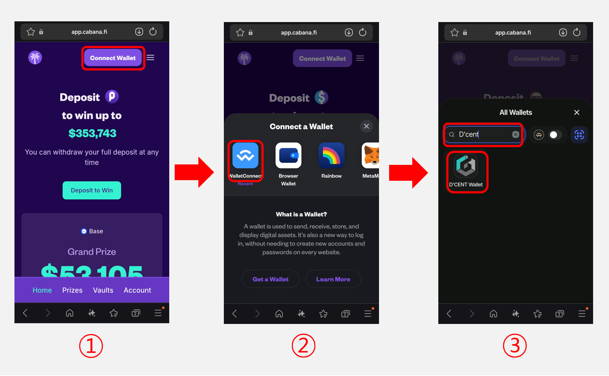
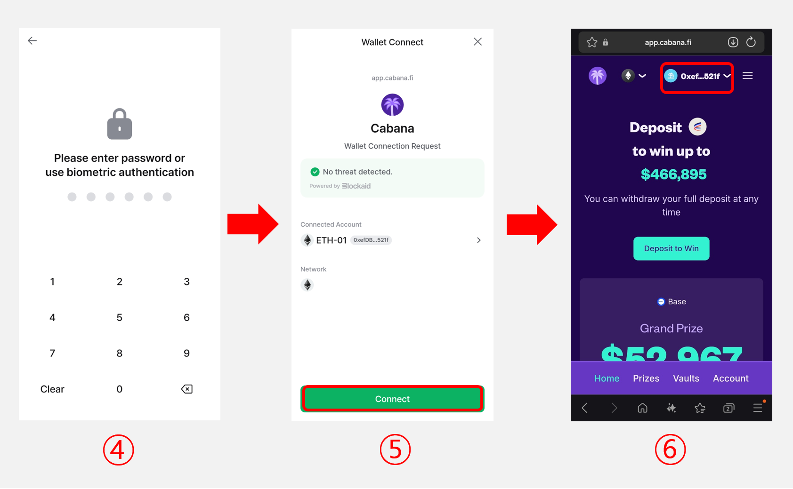
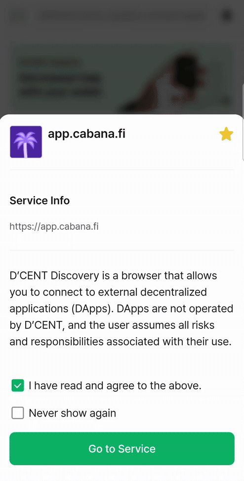

# Using WalletConnect

D’CENT Mobile App has added support for **"WalletConnect"**. You can now connect and access your favorite DApps on PC or Mobile browser using D’CENT wallet addresses.

✅ Full list of DApps supporting WalletConnect can be found here: [https://walletconnect.org/apps](https://walletconnect.org/apps)

## What is WalletConnect?

WalletConnect is an open protocol for connecting DApps on your browser to mobile wallets using end-to-end encryption by scanning a QR code. This allows users to establish connections to websites (DApps) from a browser and carry out transactions securely from D’CENT Wallet without revealing any secret information to the internet.

In this example, we will access a DApp called **PoolTogether**.&#x20;

## Using DApps on PC browser

You will need your [D’CENT Mobile App](https://play.google.com/store/apps/details?id=com.kr.iotrust.dcent.wallet\&utm_source=dcentwallet\&utm_campaign=mobileapp) and PC to access the DApp website.

**1)** Go to the [**PoolTogether**](https://app.cabana.fi/) website from your browser and click on **"Connect Wallet"** button.

**2)** Select **"WalletConnect"** from the list and you will get a **QR-Code**.&#x20;

### Connect from the **My Wallet** tab

<figure><figcaption></figcaption></figure>

**1)** Launch your D’CENT Mobile App, and **QR code scan icon** at the top right of the **"My Wallet"** tab.\
Scan the QR code displayed on the PC screen.

After confirming the DApp site address, account, and network information, tap the **"Connect"** button.

**2)** When your D’CENT Wallet address is connected to PoolTogether DApp, you will see the following screens on your mobile app and PC. **Notice the D’CENT wallet address on the top right corner of the PoolTogether DApp.**

### Connect from the **Discovery** tab

<figure><figcaption></figcaption></figure>

**1)** Launch your D’CENT Mobile App, and **QR code scan icon** at the top left of the **"Discovery"** tab.\
Scan the QR code displayed on the PC screen.

After confirming the DApp site address, account, and network information, tap the **"Connect"** button.

<figure><figcaption></figcaption></figure>

**2)** When your D’CENT Wallet address is connected to PoolTogether DApp, you will see the following screens on your mobile app and PC. **Notice the D’CENT wallet address on the top right corner of the PoolTogether DApp.**

**NOTE :** When you perform a transaction on the DApp service you are using, you will be prompted to confirm the transaction on the D’CENT Wallet.

Make sure to keep D’CENT Wallet running on your mobile phone and stay on this activity. If you switch to other Apps, the current DApp (ie: PoolTogether) will lose connection and you will have to reconnect again.


Make sure to click on **disconnect** after when you finish using the DApp service.


<figure><figcaption></figcaption></figure>

## Using DApps on Mobile browser

**1)** Go to the PoolTogether (App) website from your browser and click on **"Connect Wallet"** button.

**2)** Click **"WalletConnect"** from the wallet connection options.

**3)** Type **"D'CENT"** in the search bar and select **"D'CENT Wallet"**.

**4)** When D’CENT Wallet opens, **authenticate** to the access the D’CENT Mobile App.

**5)** After confirming the DApp site address, account, and network information, tap the **"Connect"** button.

**6)** Now your D’CENT Wallet address is connected to the DApp.

&#x20;**NOTE :** When you perform a transaction on the DApp service you are using, you will be prompted to confirm the transaction on the D’CENT Wallet.


Make sure to click on **disconnect** after when you finish using the DApp service.


<figure><figcaption></figcaption></figure>

## Using DApps via D’CENT DApp browser (Discovery)

D’CENT Wallet has a built-in DApp browser, which supports connecting to DApps much easier by using **Web3 wallet (ie: D’CENT).** Advantage in using the built-in browser is that you only need to use a single application (D’CENT Wallet) to access a DApp service.

When accessing PoolTogether from the **Discovery tab**, a wallet connection request will be automatically triggered, allowing you to connect your **D'CENT Wallet**.

<figure><figcaption></figcaption></figure>

If the DApp service does not support the Web3 interface, you can select **"WalletConnect"** to establish connection to the DApp. Instructions are similar to the previous methods described in the sections above.
